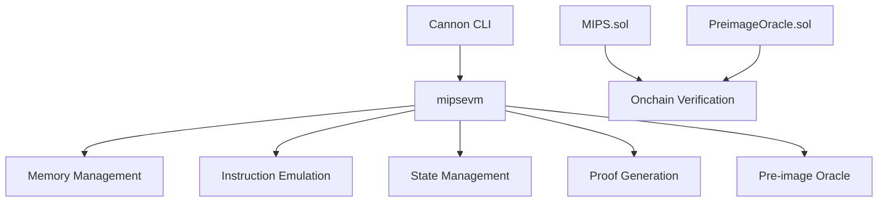

# Cannon Developer Documentation

## Table of Contents

1. [Introduction](#introduction)
2. [Getting Started](#getting-started)
3. [Project Architecture](#project-architecture)
4. [Key Components](#key-components)
5. [Development Workflow](#development-workflow)
6. [Testing](#testing)
7. [Contribution Guidelines](#contribution-guidelines)
8. [Advanced Topics](#advanced-topics)

## 1. Introduction

Cannon is an onchain MIPS instruction emulator designed to support EVM-equivalent fault proofs. It enables Geth to run onchain, one instruction at a time, as part of an interactive dispute game. This project is a critical component of the Optimism stack, providing a novel approach to blockchain scaling and security.

### Key Features

- MIPS32 instruction emulation
- ELF file loading and execution
- Merkleized memory model
- State management and proof generation
- Pre-image oracle integration
- Onchain verification via Solidity contracts

## 2. Getting Started

### Prerequisites

- Go 1.21 or higher
- Solidity compiler (solc) 0.8.x
- Make

### Setup

1. Clone the repository:
   ```
   git clone https://github.com/ethereum-optimism/optimism.git
   cd optimism/cannon
   ```

2. Build the Cannon CLI:
   ```
   make cannon
   ```

3. Build the example programs:
   ```
   make elf
   ```

4. Run tests:
   ```
   make test
   ```

## 3. Project Architecture

Cannon's architecture can be visualized as follows:



The project consists of several key components that work together to provide the MIPS emulation and proof generation capabilities.

## 4. Key Components

### 4.1 mipsevm

The core of the Cannon project, `mipsevm` is a Go package that implements the MIPS emulator. It handles instruction execution, memory management, and state transitions.

Key files:
- `mipsevm/mips.go`: Main MIPS instruction handling
- `mipsevm/memory.go`: Merkleized memory implementation
- `mipsevm/state.go`: State management and encoding

Example usage:

```go
state, err := LoadELF(elfProgram)
if err != nil {
    // Handle error
}

us := NewInstrumentedState(state, oracle, os.Stdout, os.Stderr)

for !us.state.Exited {
    _, err := us.Step(false)
    if err != nil {
        // Handle error
    }
}
```

### 4.2 MIPS.sol

This Solidity contract implements the onchain MIPS instruction execution. It's used to verify individual steps of the computation during a dispute.

Key functions:
- `step`: Execute a single MIPS instruction
- `getMerkleRoot`: Get the current memory merkle root

### 4.3 PreimageOracle.sol

This contract implements the pre-image oracle interface, allowing the emulator to access external data during execution.

Key functions:
- `readPreimage`: Read pre-image data
- `loadKeccak256PreimagePart`: Load part of a Keccak256 pre-image

### 4.4 Cannon CLI

The command-line interface for interacting with the Cannon system. It provides commands for loading ELF files, running the emulator, and generating proofs.

Key commands:
- `load-elf`: Load an ELF file into the initial state
- `run`: Execute the loaded program
- `witness`: Generate a witness for a given state

## 5. Development Workflow

1. Implement or modify features in the `mipsevm` package
2. Update the Cannon CLI if necessary
3. Write tests for new functionality
4. Update Solidity contracts if changes affect onchain verification
5. Run the full test suite
6. Create a pull request with your changes

## 6. Testing

Cannon uses Go's built-in testing framework. Run tests with:

```
make test
```

For fuzzing tests:

```
make fuzz
```

## 7. Contribution Guidelines

1. Fork the repository and create a new branch for your feature or bug fix
2. Follow Go and Solidity best practices and coding standards
3. Write clear, concise commit messages
4. Include tests for new functionality
5. Update documentation as necessary
6. Submit a pull request with a detailed description of your changes

## 8. Advanced Topics

### 8.1 Merkleized Memory Model

Cannon uses a merkleized memory model to efficiently generate proofs for memory accesses. The memory is divided into 4KB pages, and a merkle tree is constructed to represent the entire memory space.

Key concepts:
- Page: 4KB block of memory
- Merkle tree: Binary tree where each non-leaf node is the hash of its children
- Merkle proof: Path from a leaf node to the root, used to prove the contents of a specific memory location

### 8.2 State Encoding

The state of the MIPS emulator is encoded in a compact format for efficient onchain verification. The encoding includes:

- Memory merkle root
- CPU registers
- Program counter
- Other essential state variables

Example state encoding:

```go
func (s *State) EncodeWitness() StateWitness {
    out := make([]byte, 0)
    memRoot := s.Memory.MerkleRoot()
    out = append(out, memRoot[:]...)
    out = append(out, s.PreimageKey[:]...)
    out = binary.BigEndian.AppendUint32(out, s.PreimageOffset)
    // ... (additional state variables)
    return out
}
```

### 8.3 Pre-image Oracle Integration

The pre-image oracle allows the emulator to access external data during execution. This is crucial for handling complex computations that require data not available within the initial state.

Key concepts:
- Local pre-images: Data stored locally
- Keccak256 pre-images: Data retrieved based on Keccak256 hashes
- Pre-image hints: Metadata to help locate pre-images

Example pre-image request:

```go
preimage := m.preimageOracle.GetPreimage(preimage.Keccak256Key(wit.PreimageKey).PreimageKey())
```
