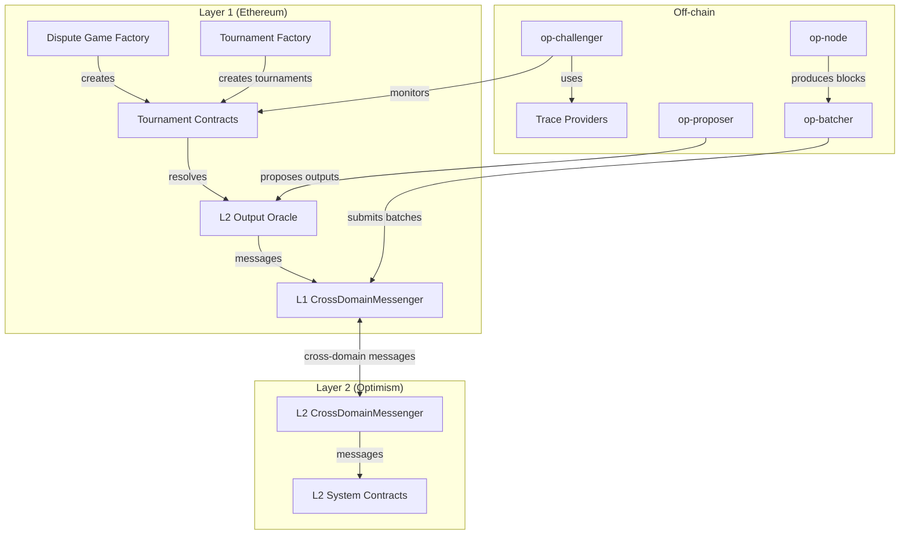
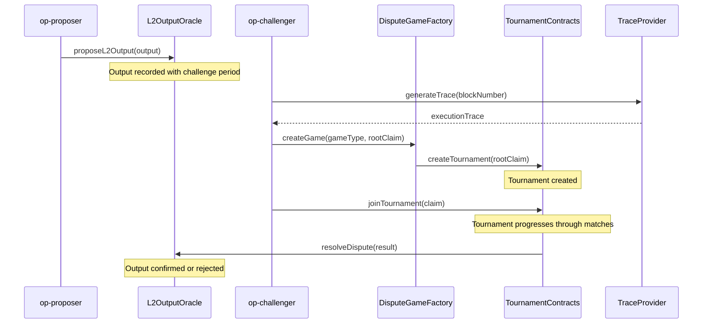
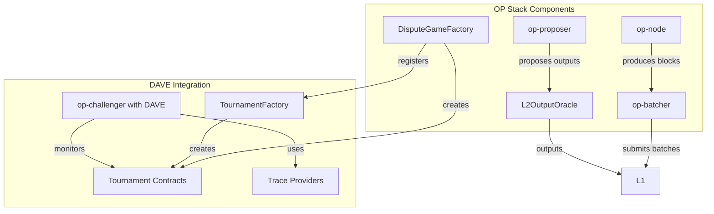
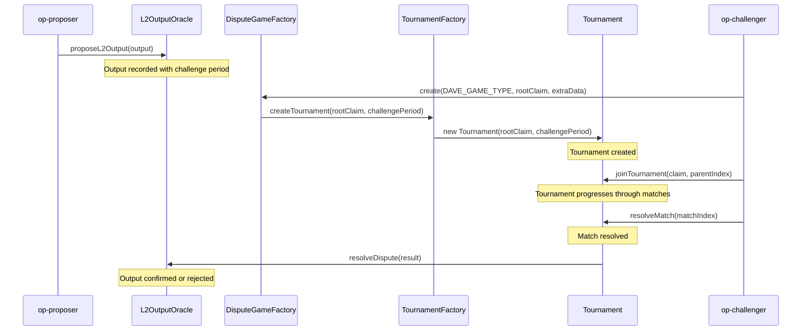

# Cartesi DAVE Integration with OP Stack: System Design and Technical Specification

## Overview

This document outlines the technical specification for integrating Cartesi's DAVE (Dispute Algorithm for Validator Execution) with the OP Stack. The integration leverages DAVE's tournament-based dispute resolution mechanism to enhance the security, decentralization, and liveness properties of Optimism's fault proof system while maintaining compatibility with the existing architecture.

The design accounts for recent OP Stack upgrades, particularly the Isthmus upgrade with its 64-bit MIPS support and plug-and-play proofs system. It provides a comprehensive technical specification including architecture, components, interfaces, and implementation details, along with a migration strategy that considers the current state of the OP Stack.

## Protocol Parameters

| Parameter | Description | Default Value | Latest Value |
|-----------|-------------|--------------|--------------|
| `TOURNAMENT_CHALLENGE_PERIOD` | Time window for tournament challenges | 7 days | 7 days |
| `TOURNAMENT_BOND_SIZE` | Bond required to participate in tournaments | 0.1 ETH | 0.1 ETH |
| `MAX_TOURNAMENT_DEPTH` | Maximum depth of tournament tree | 64 | 64 |
| `TOURNAMENT_MATCH_TIMEOUT` | Timeout for individual tournament matches | 24 hours | 24 hours |
| `TOURNAMENT_MATCH_EFFORT` | Additional time allowance for complex matches | 12 hours | 12 hours |
| `TOURNAMENT_FACTORY_ADDRESS` | Address of the TournamentFactory contract | - | Deployment-specific |
| `DAVE_DISPUTE_GAME_TYPE` | Type identifier for DAVE dispute games | 3 | 3 |

## Architecture

### System Overview

The integration architecture maintains Optimism's existing component structure while incorporating DAVE's tournament-based approach. The system consists of the following high-level components:

1. **On-chain Components**:
   - Tournament Contracts (L1)
   - Dispute Game Factory (L1)
   - L2 Output Oracle (L1)
   - L1 CrossDomainMessenger (L1)
   - L2 System Contracts (L2)

2. **Off-chain Components**:
   - op-challenger (with DAVE integration)
   - op-node
   - op-batcher
   - op-proposer
   - Trace Providers (Cannon64, RISC-V)



### Component Interactions

The following diagram illustrates the interactions between components during a dispute resolution process:



## Components

### 1. Tournament Contracts

The tournament contracts implement DAVE's Permissionless Refereed Tournaments (PRT) primitive on Ethereum L1. These contracts are responsible for managing the tournament-based dispute resolution process.

#### 1.1 TournamentFactory

The `TournamentFactory` contract creates new tournament instances for each dispute. It is registered with the `DisputeGameFactory` as a supported game type.

```solidity
// SPDX-License-Identifier: MIT
pragma solidity ^0.8.15;

import { ITournamentFactory } from "./interfaces/ITournamentFactory.sol";
import { Tournament } from "./Tournament.sol";
import { Ownable } from "@openzeppelin/contracts/access/Ownable.sol";

/**
 * @title TournamentFactory
 * @notice Factory contract for creating Tournament instances
 */
contract TournamentFactory is ITournamentFactory, Ownable {
    /// @notice Mapping of tournament addresses to their validity status
    mapping(address => bool) public isTournament;
    
    /// @notice Event emitted when a new tournament is created
    event TournamentCreated(address indexed tournament, bytes32 rootClaim);
    
    /**
     * @notice Creates a new tournament for dispute resolution
     * @param _rootClaim The root claim being disputed
     * @param _challengePeriod The challenge period duration in seconds
     * @return The address of the newly created tournament
     */
    function createTournament(
        bytes32 _rootClaim,
        uint256 _challengePeriod
    ) external returns (address) {
        Tournament tournament = new Tournament(
            _rootClaim,
            _challengePeriod,
            msg.sender
        );
        
        address tournamentAddr = address(tournament);
        isTournament[tournamentAddr] = true;
        
        emit TournamentCreated(tournamentAddr, _rootClaim);
        
        return tournamentAddr;
    }
}
```

#### 1.2 Tournament

The `Tournament` contract implements the core tournament logic, managing the tournament tree, matches, and dispute resolution.

```solidity
// SPDX-License-Identifier: MIT
pragma solidity ^0.8.15;

import { ITournament } from "./interfaces/ITournament.sol";
import { IDisputeGame } from "./interfaces/IDisputeGame.sol";

/**
 * @title Tournament
 * @notice Implements a tournament-based dispute resolution mechanism
 */
contract Tournament is ITournament, IDisputeGame {
    /// @notice The root claim being disputed
    bytes32 public rootClaim;
    
    /// @notice The challenge period duration in seconds
    uint256 public challengePeriod;
    
    /// @notice The creator of the tournament
    address public creator;
    
    /// @notice The timestamp when the tournament was created
    uint256 public createdAt;
    
    /// @notice The current status of the tournament
    GameStatus public status;
    
    /// @notice The L2 block number associated with this dispute
    uint256 public l2BlockNumber;
    
    /// @notice Tournament node structure
    struct Node {
        bytes32 claim;
        address claimant;
        uint256 timestamp;
        bool challenged;
    }
    
    /// @notice Match structure
    struct Match {
        uint256 nodeIndex1;
        uint256 nodeIndex2;
        uint256 deadline;
        uint256 winner;
    }
    
    /// @notice Array of all nodes in the tournament
    Node[] public nodes;
    
    /// @notice Array of all matches in the tournament
    Match[] public matches;
    
    /// @notice Mapping of claim hashes to their node indices
    mapping(bytes32 => uint256) public claimIndices;
    
    /**
     * @notice Constructor for the Tournament contract
     * @param _rootClaim The root claim being disputed
     * @param _challengePeriod The challenge period duration in seconds
     * @param _creator The creator of the tournament
     */
    constructor(
        bytes32 _rootClaim,
        uint256 _challengePeriod,
        address _creator
    ) {
        rootClaim = _rootClaim;
        challengePeriod = _challengePeriod;
        creator = _creator;
        createdAt = block.timestamp;
        status = GameStatus.IN_PROGRESS;
        
        // Initialize with root node
        nodes.push(Node({
            claim: _rootClaim,
            claimant: _creator,
            timestamp: block.timestamp,
            challenged: false
        }));
        
        claimIndices[_rootClaim] = 0;
    }
    
    /**
     * @notice Join the tournament with a counter-claim
     * @param _claim The claim to submit
     * @param _parentClaimIndex The index of the parent claim being challenged
     * @return The index of the newly created node
     */
    function joinTournament(
        bytes32 _claim,
        uint256 _parentClaimIndex
    ) external returns (uint256) {
        require(status == GameStatus.IN_PROGRESS, "Tournament not in progress");
        require(_parentClaimIndex < nodes.length, "Invalid parent claim index");
        require(!nodes[_parentClaimIndex].challenged, "Claim already challenged");
        
        // Create new node
        uint256 nodeIndex = nodes.length;
        nodes.push(Node({
            claim: _claim,
            claimant: msg.sender,
            timestamp: block.timestamp,
            challenged: false
        }));
        
        claimIndices[_claim] = nodeIndex;
        
        // Mark parent as challenged
        nodes[_parentClaimIndex].challenged = true;
        
        // Create match
        matches.push(Match({
            nodeIndex1: _parentClaimIndex,
            nodeIndex2: nodeIndex,
            deadline: block.timestamp + challengePeriod,
            winner: 0
        }));
        
        return nodeIndex;
    }
    
    /**
     * @notice Resolve a match in the tournament
     * @param _matchIndex The index of the match to resolve
     */
    function resolveMatch(uint256 _matchIndex) external {
        require(_matchIndex < matches.length, "Invalid match index");
        Match storage match = matches[_matchIndex];
        require(match.winner == 0, "Match already resolved");
        
        // Check if deadline has passed
        if (block.timestamp > match.deadline) {
            // Default winner is the first node (defender)
            match.winner = match.nodeIndex1;
        } else {
            // Logic for resolving based on evidence or other criteria
            // For now, this is a placeholder
            // In a real implementation, this would involve verification of claims
            match.winner = determineWinner(match.nodeIndex1, match.nodeIndex2);
        }
        
        // Check if tournament is complete
        checkTournamentCompletion();
    }
    
    /**
     * @notice Determine the winner of a match
     * @param _nodeIndex1 The index of the first node
     * @param _nodeIndex2 The index of the second node
     * @return The index of the winning node
     */
    function determineWinner(
        uint256 _nodeIndex1,
        uint256 _nodeIndex2
    ) internal view returns (uint256) {
        // Placeholder logic - in a real implementation, this would involve
        // verification of claims using the trace provider
        return _nodeIndex1;
    }
    
    /**
     * @notice Check if the tournament is complete
     */
    function checkTournamentCompletion() internal {
        bool allMatchesResolved = true;
        
        for (uint256 i = 0; i < matches.length; i++) {
            if (matches[i].winner == 0) {
                allMatchesResolved = false;
                break;
            }
        }
        
        if (allMatchesResolved) {
            status = GameStatus.COMPLETED;
        }
    }
    
    /**
     * @notice Get the result of the tournament
     * @return The status of the game and the winning claim
     */
    function result() external view returns (GameStatus, bytes32) {
        if (status != GameStatus.COMPLETED) {
            return (status, bytes32(0));
        }
        
        // Find the ultimate winner
        uint256 winnerIndex = 0;
        for (uint256 i = 0; i < matches.length; i++) {
            if (matches[i].nodeIndex1 == winnerIndex || matches[i].nodeIndex2 == winnerIndex) {
                winnerIndex = matches[i].winner;
            }
        }
        
        return (status, nodes[winnerIndex].claim);
    }
    
    /**
     * @notice Resolve the dispute game
     * @return The status of the game after resolution
     */
    function resolve() external returns (GameStatus) {
        require(status == GameStatus.IN_PROGRESS, "Game not in progress");
        
        // Check if challenge period has passed for all matches
        bool canResolve = true;
        for (uint256 i = 0; i < matches.length; i++) {
            if (matches[i].winner == 0 && block.timestamp <= matches[i].deadline) {
                canResolve = false;
                break;
            }
        }
        
        require(canResolve, "Cannot resolve yet");
        
        // Resolve all unresolved matches
        for (uint256 i = 0; i < matches.length; i++) {
            if (matches[i].winner == 0) {
                matches[i].winner = matches[i].nodeIndex1; // Default to defender
            }
        }
        
        status = GameStatus.COMPLETED;
        return status;
    }
    
    /**
     * @notice Get the current status of the game
     * @return The current game status
     */
    function status() external view returns (GameStatus) {
        return status;
    }
    
    /**
     * @notice Get the L2 block number associated with this dispute
     * @return The L2 block number
     */
    function l2BlockNumber() external view returns (uint256) {
        return l2BlockNumber;
    }
}
```

#### 1.3 Interfaces

```solidity
// SPDX-License-Identifier: MIT
pragma solidity ^0.8.15;

/**
 * @title ITournamentFactory
 * @notice Interface for the TournamentFactory contract
 */
interface ITournamentFactory {
    /**
     * @notice Creates a new tournament for dispute resolution
     * @param _rootClaim The root claim being disputed
     * @param _challengePeriod The challenge period duration in seconds
     * @return The address of the newly created tournament
     */
    function createTournament(
        bytes32 _rootClaim,
        uint256 _challengePeriod
    ) external returns (address);
}

/**
 * @title ITournament
 * @notice Interface for the Tournament contract
 */
interface ITournament {
    /**
     * @notice Join the tournament with a counter-claim
     * @param _claim The claim to submit
     * @param _parentClaimIndex The index of the parent claim being challenged
     * @return The index of the newly created node
     */
    function joinTournament(
        bytes32 _claim,
        uint256 _parentClaimIndex
    ) external returns (uint256);
    
    /**
     * @notice Resolve a match in the tournament
     * @param _matchIndex The index of the match to resolve
     */
    function resolveMatch(uint256 _matchIndex) external;
    
    /**
     * @notice Get the result of the tournament
     * @return The status of the game and the winning claim
     */
    function result() external view returns (IDisputeGame.GameStatus, bytes32);
}

/**
 * @title IDisputeGame
 * @notice Interface for dispute games, compatible with Optimism's existing interfaces
 */
interface IDisputeGame {
    /**
     * @notice Enum representing the status of a dispute game
     */
    enum GameStatus {
        IN_PROGRESS,
        COMPLETED,
        CANCELLED
    }
    
    /**
     * @notice Resolve the dispute game
     * @return The status of the game after resolution
     */
    function resolve() external returns (GameStatus);
    
    /**
     * @notice Get the current status of the game
     * @return The current game status
     */
    function status() external view returns (GameStatus);
    
    /**
     * @notice Get the L2 block number associated with this dispute
     * @return The L2 block number
     */
    function l2BlockNumber() external view returns (uint256);
}
```

### 2. op-challenger Modifications

The `op-challenger` component is modified to support the tournament-based approach while maintaining compatibility with the existing architecture.

#### 2.1 TournamentPlayer

```go
package challenger

import (
	"context"
	"fmt"
	"math/big"

	"github.com/ethereum-optimism/optimism/op-challenger/config"
	"github.com/ethereum-optimism/optimism/op-challenger/metrics"
	"github.com/ethereum-optimism/optimism/op-challenger/tournament"
	"github.com/ethereum-optimism/optimism/op-service/sources/batching"
	"github.com/ethereum-optimism/optimism/op-service/txmgr"
	"github.com/ethereum/go-ethereum/common"
	"github.com/ethereum/go-ethereum/log"
)

// TournamentPlayer implements the game player interface for tournament-based disputes
type TournamentPlayer struct {
	logger    log.Logger
	metrics   metrics.Metricer
	txSender  txmgr.TxManager
	
	// Tournament-specific components
	tournamentManager *tournament.Manager
	matchMonitor     *tournament.MatchMonitor
	
	// Existing components
	traceProvider    TraceProvider
	cfg              *config.Config
}

// NewTournamentPlayer creates a new tournament player
func NewTournamentPlayer(
	ctx context.Context,
	logger log.Logger,
	metrics metrics.Metricer,
	txSender txmgr.TxManager,
	traceProvider TraceProvider,
	cfg *config.Config,
) (*TournamentPlayer, error) {
	tournamentManager, err := tournament.NewManager(ctx, logger, cfg)
	if err != nil {
		return nil, fmt.Errorf("failed to create tournament manager: %w", err)
	}
	
	matchMonitor, err := tournament.NewMatchMonitor(ctx, logger, cfg)
	if err != nil {
		return nil, fmt.Errorf("failed to create match monitor: %w", err)
	}
	
	return &TournamentPlayer{
		logger:           logger,
		metrics:          metrics,
		txSender:         txSender,
		tournamentManager: tournamentManager,
		matchMonitor:     matchMonitor,
		traceProvider:    traceProvider,
		cfg:              cfg,
	}, nil
}

// PlayMove determines and plays the next move in the tournament
func (t *TournamentPlayer) PlayMove(ctx context.Context, game Game, claim Claim) (GameAction, error) {
	// Get the tournament state
	tournamentAddr := game.Addr()
	tournamentState, err := t.tournamentManager.GetTournamentState(ctx, tournamentAddr)
	if err != nil {
		return GameAction{}, fmt.Errorf("failed to get tournament state: %w", err)
	}
	
	// Check if we need to join the tournament
	if !tournamentState.IsParticipant(t.cfg.Address) {
		// Generate trace for the disputed block
		trace, err := t.traceProvider.GetTrace(ctx, game.L2BlockNumber())
		if err != nil {
			return GameAction{}, fmt.Errorf("failed to get trace: %w", err)
		}
		
		// Generate our claim
		ourClaim, err := trace.GenerateClaim()
		if err != nil {
			return GameAction{}, fmt.Errorf("failed to generate claim: %w", err)
		}
		
		// Join the tournament
		return GameAction{
			Type:      ActionTypeJoinTournament,
			Claim:     ourClaim,
			ParentIdx: tournamentState.GetRootNodeIndex(),
		}, nil
	}
	
	// Check if we need to respond to a match
	activeMatches := tournamentState.GetActiveMatches(t.cfg.Address)
	if len(activeMatches) > 0 {
		// Prioritize matches that are close to deadline
		match := t.matchMonitor.GetHighestPriorityMatch(activeMatches)
		
		// Generate evidence for the match
		evidence, err := t.generateEvidence(ctx, game, match)
		if err != nil {
			return GameAction{}, fmt.Errorf("failed to generate evidence: %w", err)
		}
		
		return GameAction{
			Type:      ActionTypeSubmitEvidence,
			MatchIdx:  match.Index,
			Evidence:  evidence,
		}, nil
	}
	
	// No action needed
	return GameAction{
		Type: ActionTypeNone,
	}, nil
}

// generateEvidence generates evidence for a match
func (t *TournamentPlayer) generateEvidence(ctx context.Context, game Game, match tournament.Match) ([]byte, error) {
	// Get the trace for the disputed block
	trace, err := t.traceProvider.GetTrace(ctx, game.L2BlockNumber())
	if err != nil {
		return nil, fmt.Errorf("failed to get trace: %w", err)
	}
	
	// Generate evidence based on the match type
	// This is a simplified version - the actual implementation would be more complex
	return trace.GenerateEvidence(match.ClaimA, match.ClaimB)
}

// Start starts the tournament player
func (t *TournamentPlayer) Start(ctx context.Context) error {
	if err := t.tournamentManager.Start(ctx); err != nil {
		return fmt.Errorf("failed to start tournament manager: %w", err)
	}
	
	if err := t.matchMonitor.Start(ctx); err != nil {
		return fmt.Errorf("failed to start match monitor: %w", err)
	}
	
	return nil
}

// Stop stops the tournament player
func (t *TournamentPlayer) Stop() {
	t.tournamentManager.Stop()
	t.matchMonitor.Stop()
}
```

#### 2.2 Tournament Manager

```go
package tournament

import (
	"context"
	"fmt"
	"sync"
	"time"

	"github.com/ethereum-optimism/optimism/op-challenger/config"
	"github.com/ethereum-optimism/optimism/op-challenger/tournament/contracts"
	"github.com/ethereum/go-ethereum/common"
	"github.com/ethereum/go-ethereum/log"
)

// Manager manages tournament state and interactions
type Manager struct {
	logger     log.Logger
	cfg        *config.Config
	client     *contracts.TournamentClient
	
	tournaments map[common.Address]*TournamentState
	mu          sync.RWMutex
	
	ctx        context.Context
	cancelFunc context.CancelFunc
	wg         sync.WaitGroup
}

// NewManager creates a new tournament manager
func NewManager(ctx context.Context, logger log.Logger, cfg *config.Config) (*Manager, error) {
	client, err := contracts.NewTournamentClient(ctx, logger, cfg)
	if err != nil {
		return nil, fmt.Errorf("failed to create tournament client: %w", err)
	}
	
	ctx, cancel := context.WithCancel(ctx)
	
	return &Manager{
		logger:      logger,
		cfg:         cfg,
		client:      client,
		tournaments: make(map[common.Address]*TournamentState),
		ctx:         ctx,
		cancelFunc:  cancel,
	}, nil
}

// GetTournamentState gets the state of a tournament
func (m *Manager) GetTournamentState(ctx context.Context, tournamentAddr common.Address) (*TournamentState, error) {
	m.mu.RLock()
	state, exists := m.tournaments[tournamentAddr]
	m.mu.RUnlock()
	
	if exists {
		return state, nil
	}
	
	// Fetch tournament state from the contract
	state, err := m.fetchTournamentState(ctx, tournamentAddr)
	if err != nil {
		return nil, fmt.Errorf("failed to fetch tournament state: %w", err)
	}
	
	m.mu.Lock()
	m.tournaments[tournamentAddr] = state
	m.mu.Unlock()
	
	return state, nil
}

// fetchTournamentState fetches the state of a tournament from the contract
func (m *Manager) fetchTournamentState(ctx context.Context, tournamentAddr common.Address) (*TournamentState, error) {
	// Create tournament contract binding
	tournament, err := m.client.GetTournament(ctx, tournamentAddr)
	if err != nil {
		return nil, fmt.Errorf("failed to get tournament contract: %w", err)
	}
	
	// Fetch nodes
	nodeCount, err := tournament.GetNodeCount(ctx)
	if err != nil {
		return nil, fmt.Errorf("failed to get node count: %w", err)
	}
	
	nodes := make([]Node, 0, nodeCount)
	for i := uint64(0); i < nodeCount; i++ {
		node, err := tournament.GetNode(ctx, i)
		if err != nil {
			return nil, fmt.Errorf("failed to get node %d: %w", i, err)
		}
		nodes = append(nodes, Node{
			Index:     i,
			Claim:     node.Claim,
			Claimant:  node.Claimant,
			Timestamp: node.Timestamp,
			Challenged: node.Challenged,
		})
	}
	
	// Fetch matches
	matchCount, err := tournament.GetMatchCount(ctx)
	if err != nil {
		return nil, fmt.Errorf("failed to get match count: %w", err)
	}
	
	matches := make([]Match, 0, matchCount)
	for i := uint64(0); i < matchCount; i++ {
		match, err := tournament.GetMatch(ctx, i)
		if err != nil {
			return nil, fmt.Errorf("failed to get match %d: %w", i, err)
		}
		matches = append(matches, Match{
			Index:     i,
			NodeA:     match.NodeIndex1,
			NodeB:     match.NodeIndex2,
			Deadline:  match.Deadline,
			Winner:    match.Winner,
		})
	}
	
	return NewTournamentState(tournamentAddr, nodes, matches), nil
}

// Start starts the tournament manager
func (m *Manager) Start(ctx context.Context) error {
	m.wg.Add(1)
	go m.monitorTournaments()
	return nil
}

// Stop stops the tournament manager
func (m *Manager) Stop() {
	m.cancelFunc()
	m.wg.Wait()
}

// monitorTournaments monitors tournaments for updates
func (m *Manager) monitorTournaments() {
	defer m.wg.Done()
	
	ticker := time.NewTicker(10 * time.Second)
	defer ticker.Stop()
	
	for {
		select {
		case <-m.ctx.Done():
			return
		case <-ticker.C:
			m.updateTournaments()
		}
	}
}

// updateTournaments updates the state of all tracked tournaments
func (m *Manager) updateTournaments() {
	m.mu.RLock()
	tournaments := make([]common.Address, 0, len(m.tournaments))
	for addr := range m.tournaments {
		tournaments = append(tournaments, addr)
	}
	m.mu.RUnlock()
	
	for _, addr := range tournaments {
		ctx, cancel := context.WithTimeout(m.ctx, 30*time.Second)
		state, err := m.fetchTournamentState(ctx, addr)
		cancel()
		
		if err != nil {
			m.logger.Error("Failed to update tournament state", "tournament", addr, "error", err)
			continue
		}
		
		m.mu.Lock()
		m.tournaments[addr] = state
		m.mu.Unlock()
	}
}
```

#### 2.3 Tournament State

```go
package tournament

import (
	"github.com/ethereum/go-ethereum/common"
)

// Node represents a node in the tournament tree
type Node struct {
	Index      uint64
	Claim      common.Hash
	Claimant   common.Address
	Timestamp  uint64
	Challenged bool
}

// Match represents a match in the tournament
type Match struct {
	Index    uint64
	NodeA    uint64
	NodeB    uint64
	Deadline uint64
	Winner   uint64
}

// TournamentState represents the state of a tournament
type TournamentState struct {
	address common.Address
	nodes   []Node
	matches []Match
}

// NewTournamentState creates a new tournament state
func NewTournamentState(address common.Address, nodes []Node, matches []Match) *TournamentState {
	return &TournamentState{
		address: address,
		nodes:   nodes,
		matches: matches,
	}
}

// IsParticipant checks if an address is a participant in the tournament
func (t *TournamentState) IsParticipant(address common.Address) bool {
	for _, node := range t.nodes {
		if node.Claimant == address {
			return true
		}
	}
	return false
}

// GetRootNodeIndex gets the index of the root node
func (t *TournamentState) GetRootNodeIndex() uint64 {
	return 0
}

// GetActiveMatches gets active matches for a participant
func (t *TournamentState) GetActiveMatches(address common.Address) []Match {
	activeMatches := make([]Match, 0)
	
	// Map of node indices owned by the participant
	ownedNodes := make(map[uint64]bool)
	for _, node := range t.nodes {
		if node.Claimant == address {
			ownedNodes[node.Index] = true
		}
	}
	
	// Find matches where the participant is involved and the match is not resolved
	for _, match := range t.matches {
		if (ownedNodes[match.NodeA] || ownedNodes[match.NodeB]) && match.Winner == 0 {
			activeMatches = append(activeMatches, match)
		}
	}
	
	return activeMatches
}

// GetNode gets a node by index
func (t *TournamentState) GetNode(index uint64) (Node, bool) {
	if index >= uint64(len(t.nodes)) {
		return Node{}, false
	}
	return t.nodes[index], true
}

// GetMatch gets a match by index
func (t *TournamentState) GetMatch(index uint64) (Match, bool) {
	if index >= uint64(len(t.matches)) {
		return Match{}, false
	}
	return t.matches[index], true
}
```

### 3. Trace Provider Adaptations

The trace provider interface is extended to support both MIPS64 (Cannon) and RISC-V (Cartesi) architectures.

#### 3.1 Trace Provider Interface

```go
package challenger

import (
	"context"
	"math/big"

	"github.com/ethereum/go-ethereum/common"
)

// TraceProvider is an interface for generating execution traces
type TraceProvider interface {
	// GetTrace generates an execution trace for a given L2 block number
	GetTrace(ctx context.Context, blockNumber *big.Int) (Trace, error)
	
	// VerifyTrace verifies that a trace is valid
	VerifyTrace(ctx context.Context, trace Trace) (bool, error)
	
	// Type returns the type of the trace provider
	Type() string
}

// Trace represents an execution trace
type Trace interface {
	// GenerateClaim generates a claim for the trace
	GenerateClaim() (common.Hash, error)
	
	// GenerateEvidence generates evidence for a dispute between two claims
	GenerateEvidence(claimA, claimB common.Hash) ([]byte, error)
	
	// GetStateAtIndex gets the state at a specific index in the trace
	GetStateAtIndex(index uint64) ([]byte, error)
	
	// GetTraceLength gets the length of the trace
	GetTraceLength() (uint64, error)
}
```

#### 3.2 MIPS64 Trace Provider (Cannon)

```go
package cannon

import (
	"context"
	"fmt"
	"math/big"
	"os/exec"
	"path/filepath"

	"github.com/ethereum-optimism/optimism/op-challenger/challenger"
	"github.com/ethereum-optimism/optimism/op-challenger/config"
	"github.com/ethereum/go-ethereum/common"
	"github.com/ethereum/go-ethereum/log"
)

// MIPS64TraceProvider is a trace provider that uses Cannon to generate MIPS64 execution traces
type MIPS64TraceProvider struct {
	logger     log.Logger
	cfg        *config.Config
	cannonPath string
	dataDir    string
}

// NewMIPS64TraceProvider creates a new MIPS64 trace provider
func NewMIPS64TraceProvider(logger log.Logger, cfg *config.Config) (*MIPS64TraceProvider, error) {
	cannonPath, err := exec.LookPath("cannon")
	if err != nil {
		return nil, fmt.Errorf("cannon binary not found: %w", err)
	}
	
	return &MIPS64TraceProvider{
		logger:     logger,
		cfg:        cfg,
		cannonPath: cannonPath,
		dataDir:    cfg.DataDir,
	}, nil
}

// GetTrace generates an execution trace for a given L2 block number
func (p *MIPS64TraceProvider) GetTrace(ctx context.Context, blockNumber *big.Int) (challenger.Trace, error) {
	// Create trace directory
	traceDir := filepath.Join(p.dataDir, "traces", blockNumber.String())
	
	// Run cannon to generate the trace
	cmd := exec.CommandContext(
		ctx,
		p.cannonPath,
		"run",
		"--input-block", blockNumber.String(),
		"--output-dir", traceDir,
		"--l1-rpc", p.cfg.L1RPC,
		"--l2-rpc", p.cfg.L2RPC,
	)
	
	output, err := cmd.CombinedOutput()
	if err != nil {
		return nil, fmt.Errorf("failed to run cannon: %w, output: %s", err, output)
	}
	
	return NewMIPS64Trace(traceDir), nil
}

// VerifyTrace verifies that a trace is valid
func (p *MIPS64TraceProvider) VerifyTrace(ctx context.Context, trace challenger.Trace) (bool, error) {
	mipsTrace, ok := trace.(*MIPS64Trace)
	if !ok {
		return false, fmt.Errorf("trace is not a MIPS64Trace")
	}
	
	// Run cannon to verify the trace
	cmd := exec.CommandContext(
		ctx,
		p.cannonPath,
		"verify",
		"--trace-dir", mipsTrace.traceDir,
	)
	
	output, err := cmd.CombinedOutput()
	if err != nil {
		p.logger.Error("Trace verification failed", "error", err, "output", string(output))
		return false, nil
	}
	
	return true, nil
}

// Type returns the type of the trace provider
func (p *MIPS64TraceProvider) Type() string {
	return "mips64"
}

// MIPS64Trace represents a MIPS64 execution trace
type MIPS64Trace struct {
	traceDir string
}

// NewMIPS64Trace creates a new MIPS64 trace
func NewMIPS64Trace(traceDir string) *MIPS64Trace {
	return &MIPS64Trace{
		traceDir: traceDir,
	}
}

// GenerateClaim generates a claim for the trace
func (t *MIPS64Trace) GenerateClaim() (common.Hash, error) {
	// In a real implementation, this would read the final state hash from the trace
	// For now, this is a placeholder
	return common.Hash{}, fmt.Errorf("not implemented")
}

// GenerateEvidence generates evidence for a dispute between two claims
func (t *MIPS64Trace) GenerateEvidence(claimA, claimB common.Hash) ([]byte, error) {
	// In a real implementation, this would generate evidence for the dispute
	// For now, this is a placeholder
	return nil, fmt.Errorf("not implemented")
}

// GetStateAtIndex gets the state at a specific index in the trace
func (t *MIPS64Trace) GetStateAtIndex(index uint64) ([]byte, error) {
	// In a real implementation, this would read the state from the trace
	// For now, this is a placeholder
	return nil, fmt.Errorf("not implemented")
}

// GetTraceLength gets the length of the trace
func (t *MIPS64Trace) GetTraceLength() (uint64, error) {
	// In a real implementation, this would read the trace length
	// For now, this is a placeholder
	return 0, fmt.Errorf("not implemented")
}
```

#### 3.3 RISC-V Trace Provider (Cartesi)

```go
package cartesi

import (
	"context"
	"fmt"
	"math/big"
	"os/exec"
	"path/filepath"

	"github.com/ethereum-optimism/optimism/op-challenger/challenger"
	"github.com/ethereum-optimism/optimism/op-challenger/config"
	"github.com/ethereum/go-ethereum/common"
	"github.com/ethereum/go-ethereum/log"
)

// RISCVTraceProvider is a trace provider that uses Cartesi Machine to generate RISC-V execution traces
type RISCVTraceProvider struct {
	logger        log.Logger
	cfg           *config.Config
	cartesiPath   string
	dataDir       string
}

// NewRISCVTraceProvider creates a new RISC-V trace provider
func NewRISCVTraceProvider(logger log.Logger, cfg *config.Config) (*RISCVTraceProvider, error) {
	cartesiPath, err := exec.LookPath("cartesi-machine")
	if err != nil {
		return nil, fmt.Errorf("cartesi-machine binary not found: %w", err)
	}
	
	return &RISCVTraceProvider{
		logger:      logger,
		cfg:         cfg,
		cartesiPath: cartesiPath,
		dataDir:     cfg.DataDir,
	}, nil
}

// GetTrace generates an execution trace for a given L2 block number
func (p *RISCVTraceProvider) GetTrace(ctx context.Context, blockNumber *big.Int) (challenger.Trace, error) {
	// Create trace directory
	traceDir := filepath.Join(p.dataDir, "cartesi-traces", blockNumber.String())
	
	// Run cartesi-machine to generate the trace
	cmd := exec.CommandContext(
		ctx,
		p.cartesiPath,
		"--input-block", blockNumber.String(),
		"--output-dir", traceDir,
		"--l1-rpc", p.cfg.L1RPC,
		"--l2-rpc", p.cfg.L2RPC,
	)
	
	output, err := cmd.CombinedOutput()
	if err != nil {
		return nil, fmt.Errorf("failed to run cartesi-machine: %w, output: %s", err, output)
	}
	
	return NewRISCVTrace(traceDir), nil
}

// VerifyTrace verifies that a trace is valid
func (p *RISCVTraceProvider) VerifyTrace(ctx context.Context, trace challenger.Trace) (bool, error) {
	riscvTrace, ok := trace.(*RISCVTrace)
	if !ok {
		return false, fmt.Errorf("trace is not a RISCVTrace")
	}
	
	// Run cartesi-machine to verify the trace
	cmd := exec.CommandContext(
		ctx,
		p.cartesiPath,
		"verify",
		"--trace-dir", riscvTrace.traceDir,
	)
	
	output, err := cmd.CombinedOutput()
	if err != nil {
		p.logger.Error("Trace verification failed", "error", err, "output", string(output))
		return false, nil
	}
	
	return true, nil
}

// Type returns the type of the trace provider
func (p *RISCVTraceProvider) Type() string {
	return "riscv"
}

// RISCVTrace represents a RISC-V execution trace
type RISCVTrace struct {
	traceDir string
}

// NewRISCVTrace creates a new RISC-V trace
func NewRISCVTrace(traceDir string) *RISCVTrace {
	return &RISCVTrace{
		traceDir: traceDir,
	}
}

// GenerateClaim generates a claim for the trace
func (t *RISCVTrace) GenerateClaim() (common.Hash, error) {
	// In a real implementation, this would read the final state hash from the trace
	// For now, this is a placeholder
	return common.Hash{}, fmt.Errorf("not implemented")
}

// GenerateEvidence generates evidence for a dispute between two claims
func (t *RISCVTrace) GenerateEvidence(claimA, claimB common.Hash) ([]byte, error) {
	// In a real implementation, this would generate evidence for the dispute
	// For now, this is a placeholder
	return nil, fmt.Errorf("not implemented")
}

// GetStateAtIndex gets the state at a specific index in the trace
func (t *RISCVTrace) GetStateAtIndex(index uint64) ([]byte, error) {
	// In a real implementation, this would read the state from the trace
	// For now, this is a placeholder
	return nil, fmt.Errorf("not implemented")
}

// GetTraceLength gets the length of the trace
func (t *RISCVTrace) GetTraceLength() (uint64, error) {
	// In a real implementation, this would read the trace length
	// For now, this is a placeholder
	return 0, fmt.Errorf("not implemented")
}
```

### 4. Dispute Game Factory Integration

The `DisputeGameFactory` contract is extended to support DAVE's tournament-based dispute games.

```solidity
// SPDX-License-Identifier: MIT
pragma solidity ^0.8.15;

import { IDisputeGame } from "./interfaces/IDisputeGame.sol";
import { ITournamentFactory } from "./interfaces/ITournamentFactory.sol";

/**
 * @title DisputeGameFactory
 * @notice Factory contract for creating dispute games
 */
contract DisputeGameFactory {
    /// @notice Mapping of game type to implementation
    mapping(uint8 => address) public gameImpls;
    
    /// @notice Tournament factory address
    address public tournamentFactory;
    
    /// @notice Event emitted when a new game is created
    event GameCreated(address indexed gameProxy, uint8 indexed gameType, bytes32 indexed rootClaim, bytes extraData);
    
    /// @notice Event emitted when a new implementation is set
    event ImplementationSet(uint8 indexed gameType, address indexed impl);
    
    /// @notice Event emitted when the tournament factory is set
    event TournamentFactorySet(address indexed factory);
    
    /**
     * @notice Constructor for the DisputeGameFactory contract
     * @param _tournamentFactory The address of the tournament factory
     */
    constructor(address _tournamentFactory) {
        tournamentFactory = _tournamentFactory;
        emit TournamentFactorySet(_tournamentFactory);
    }
    
    /**
     * @notice Sets the implementation for a game type
     * @param _gameType The game type
     * @param _impl The implementation address
     */
    function setImplementation(uint8 _gameType, address _impl) external {
        gameImpls[_gameType] = _impl;
        emit ImplementationSet(_gameType, _impl);
    }
    
    /**
     * @notice Sets the tournament factory
     * @param _tournamentFactory The address of the tournament factory
     */
    function setTournamentFactory(address _tournamentFactory) external {
        tournamentFactory = _tournamentFactory;
        emit TournamentFactorySet(_tournamentFactory);
    }
    
    /**
     * @notice Creates a new dispute game
     * @param _gameType The type of the game to create
     * @param _rootClaim The root claim of the game
     * @param _extraData Extra data for the game
     * @return The address of the newly created game
     */
    function create(
        uint8 _gameType,
        bytes32 _rootClaim,
        bytes calldata _extraData
    ) external returns (address) {
        // Check if the game type is supported
        address impl = gameImpls[_gameType];
        require(impl != address(0), "Game type not supported");
        
        address gameProxy;
        
        // If this is a tournament-based game, create a tournament
        if (_gameType == 3) { // DAVE_DISPUTE_GAME_TYPE
            require(tournamentFactory != address(0), "Tournament factory not set");
            
            // Decode extra data to get challenge period
            uint256 challengePeriod = abi.decode(_extraData, (uint256));
            
            // Create tournament
            gameProxy = ITournamentFactory(tournamentFactory).createTournament(
                _rootClaim,
                challengePeriod
            );
        } else {
            // Create regular game using the implementation
            // This is a simplified version - the actual implementation would be more complex
            gameProxy = createGameProxy(impl, _rootClaim, _extraData);
        }
        
        emit GameCreated(gameProxy, _gameType, _rootClaim, _extraData);
        
        return gameProxy;
    }
    
    /**
     * @notice Creates a new game proxy
     * @param _impl The implementation address
     * @param _rootClaim The root claim of the game
     * @param _extraData Extra data for the game
     * @return The address of the newly created game proxy
     */
    function createGameProxy(
        address _impl,
        bytes32 _rootClaim,
        bytes calldata _extraData
    ) internal returns (address) {
        // This is a simplified version - the actual implementation would use a proxy pattern
        return _impl;
    }
}
```

## Integration Strategy

### Architecture Integration

The integration of DAVE's tournament-based approach with the OP Stack follows a modular design that leverages the existing architecture while introducing new components for tournament-based dispute resolution.



### Component Interactions

The following sequence diagram illustrates the interactions between components during a dispute resolution process using the tournament-based approach:



## Migration Strategy

The migration from the current fault proof system to the tournament-based approach will be implemented in phases to ensure a smooth transition with minimal disruption to the Optimism network.

### Phase 1: Development and Testing (3 months)

1. **Tournament Contract Development**
   - Implement and test the tournament contracts
   - Integrate with Optimism's existing contracts
   - Deploy to test networks

2. **op-challenger Adaptation**
   - Modify `op-challenger` to support tournament-based disputes
   - Implement the tournament player and monitor
   - Develop trace provider adaptations

3. **Integration Testing**
   - Comprehensive testing of the integrated system
   - Performance and security audits
   - Stress testing with simulated attacks

### Phase 2: Parallel Operation (2 months)

1. **Mainnet Deployment**
   - Deploy tournament contracts to mainnet
   - Register with DisputeGameFactory as a new game type
   - Deploy modified op-challenger

2. **Dual System Operation**
   - Run both the current fault proof system and the tournament-based approach in parallel
   - Monitor performance and security of both systems
   - Collect metrics for comparison

3. **Community Education**
   - Provide documentation and tutorials for validators
   - Host workshops and webinars on the new system
   - Gather feedback from the community

### Phase 3: Gradual Transition (3 months)

1. **Incentive Alignment**
   - Adjust incentives to encourage participation in tournament-based disputes
   - Provide additional rewards for early adopters
   - Gradually reduce incentives for the old system

2. **Monitoring and Optimization**
   - Continuously monitor system performance
   - Optimize based on real-world usage
   - Address any issues that arise

3. **Governance Proposals**
   - Submit governance proposals for official adoption
   - Engage with the community for feedback
   - Adjust parameters based on governance decisions

### Phase 4: Full Adoption (2 months)

1. **Final Transition**
   - Make tournament-based disputes the default mechanism
   - Deprecate the old system
   - Migrate all validators to the new system

2. **Documentation and Support**
   - Update all documentation to reflect the new system
   - Provide ongoing support for validators
   - Maintain backward compatibility where necessary

3. **Future Development**
   - Plan for future enhancements
   - Integrate with other OP Stack components
   - Explore additional use cases for tournament-based disputes

## Security Considerations

### Sybil Resistance

The tournament-based approach provides strong resistance to Sybil attacks through its logarithmic security model:

1. **Logarithmic Resource Growth**: The resources required to defeat an adversary grow only logarithmically with what the adversary loses
2. **Multiple Paths to Victory**: A single honest participant can enforce the correct result even against many adversaries
3. **Minimal Bond Requirements**: Low bond requirements reduce barriers to entry while maintaining security

### Timing Attacks

The system includes mechanisms to prevent timing attacks:

1. **Match Deadlines**: Each match has a deadline to ensure timely responses
2. **Match Effort**: Additional time allowance for complex matches ensures fair participation
3. **Default Resolution**: If a match is not resolved by the deadline, it defaults to the defender

### Economic Security

The tournament-based approach reduces reliance on economic incentives:

1. **Minimal Bond Requirements**: Lower bonds make participation more accessible
2. **Logarithmic Security**: Security against Sybil attacks with lower bonds due to logarithmic scaling of resources
3. **Single Honest Validator**: The system remains secure as long as there is at least one honest validator

## Performance Considerations

### Scalability

The tournament-based approach scales logarithmically with the number of participants:

1. **Logarithmic Complexity**: Resources and delay grow logarithmically with adversarial expenditure
2. **Efficient Resolution**: Disputes complete in 2-5 challenge periods regardless of the number of participants
3. **Parallel Matches**: Multiple matches can be resolved in parallel, increasing throughput

### Gas Efficiency

The tournament contracts are designed for gas efficiency:

1. **Minimal State Updates**: Optimized state updates to reduce gas costs
2. **Batched Operations**: Support for batched operations to amortize gas costs
3. **Efficient Data Structures**: Use of efficient data structures to minimize storage costs

### Trace Provider Performance

The trace provider adaptations are designed for optimal performance:

1. **Caching**: Traces are cached to avoid redundant computation
2. **Parallel Execution**: Support for parallel execution of trace generation
3. **Incremental Verification**: Only the disputed portions of traces are verified

## Conclusion

The integration of Cartesi's DAVE with the OP Stack represents a significant enhancement to Optimism's fault proof system. By leveraging DAVE's tournament-based dispute resolution mechanism, the system achieves improved security, decentralization, and liveness properties while maintaining compatibility with the existing architecture.

The design accounts for recent OP Stack upgrades, particularly the Isthmus upgrade with its 64-bit MIPS support and plug-and-play proofs system. It provides a comprehensive technical specification including architecture, components, interfaces, and implementation details, along with a migration strategy that considers the current state of the OP Stack.

The phased migration strategy ensures a smooth transition with minimal disruption to the Optimism network, while the security and performance considerations address key challenges in the current system. The result is a production-grade design that can be realistically adopted by the Optimism development team.

## References

1. Optimism Isthmus Upgrade Proposal:
   - [Upgrade Proposal #14: Isthmus L1 Contracts + MT-Cannon](https://gov.optimism.io/t/upgrade-proposal-14-isthmus-l1-contracts-mt-cannon/9796)

2. Cartesi's DAVE Fraud Proofs System:
   - [Cartesi DAVE GitHub Repository](https://github.com/cartesi/dave)
   - [DAVE Research Paper](https://arxiv.org/abs/2411.05463)

3. OP Stack Components:
   - [OP-Cannon GitHub Repository](https://github.com/ethereum-optimism/optimism/tree/develop/cannon)
   - [OP-Challenger GitHub Repository](https://github.com/ethereum-optimism/optimism/tree/develop/op-challenger)
   - [OP Stack Repository](https://github.com/ethereum-optimism/optimism)

4. Optimism Specifications:
   - [OP Stack Specification](https://specs.optimism.io/protocol/overview.html)
   - [Optimism Docs Style Guide](https://docs.optimism.io/connect/contribute/style-guide)
