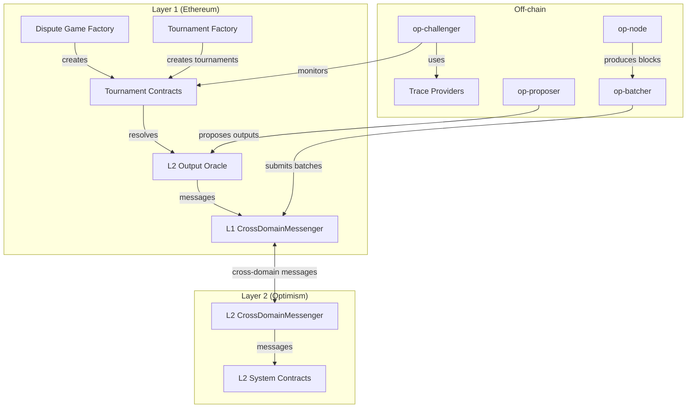
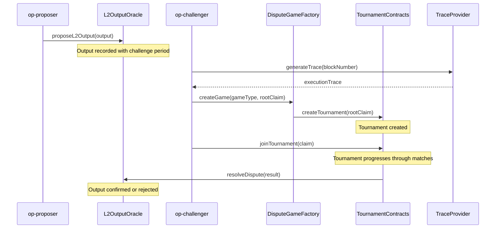

# DAVE Fraud Proofs: Technical Specification

## Overview

This document specifies the integration of Cartesi's DAVE (Dispute Algorithm for Validator Execution) fraud proofs system with the OP Stack. The DAVE fraud proofs component implements a tournament-based dispute resolution mechanism that enhances the security, decentralization, and liveness properties of Optimism's fault proof system while maintaining compatibility with the existing architecture.

The DAVE fraud proofs system leverages Permissionless Refereed Tournaments (PRT) to provide a robust dispute resolution mechanism that is resistant to Sybil attacks and requires minimal economic incentives. This specification details how the tournament-based approach integrates with the OP Stack's recent upgrades, particularly the Isthmus upgrade with its 64-bit MIPS support and plug-and-play proofs system.

## Protocol Parameters

| Parameter | Description | Default Value | Latest Value |
|-----------|-------------|--------------|--------------|
| `TOURNAMENT_CHALLENGE_PERIOD` | Time window for tournament challenges | 7 days | 7 days |
| `TOURNAMENT_BOND_SIZE` | Bond required to participate in tournaments | 0.1 ETH | 0.1 ETH |
| `MAX_TOURNAMENT_DEPTH` | Maximum depth of tournament tree | 64 | 64 |
| `TOURNAMENT_MATCH_TIMEOUT` | Timeout for individual tournament matches | 24 hours | 24 hours |
| `TOURNAMENT_MATCH_EFFORT` | Additional time allowance for complex matches | 12 hours | 12 hours |
| `TOURNAMENT_FACTORY_ADDRESS` | Address of the TournamentFactory contract | - | Deployment-specific |
| `DAVE_DISPUTE_GAME_TYPE` | Type identifier for DAVE dispute games | 3 | 3 |

## Specification

### System Architecture

The DAVE fraud proofs system consists of the following components:

1. **On-chain Components**:
   - Tournament Contracts (L1)
   - Dispute Game Factory (L1)
   - L2 Output Oracle (L1)
   - L1 CrossDomainMessenger (L1)

2. **Off-chain Components**:
   - op-challenger (with DAVE integration)
   - Trace Providers (Cannon64, RISC-V)

### Tournament-Based Dispute Resolution

The DAVE fraud proofs system uses a tournament-based approach for dispute resolution. The process works as follows:

1. **Tournament Creation**:
   - When a dispute arises, a tournament is created through the TournamentFactory
   - The tournament is initialized with a root claim (the disputed output)
   - The tournament is registered with the DisputeGameFactory as a game of type `DAVE_DISPUTE_GAME_TYPE`

2. **Tournament Participation**:
   - Validators can join the tournament by submitting counter-claims
   - Each counter-claim challenges a specific claim in the tournament tree
   - Validators must provide a bond of `TOURNAMENT_BOND_SIZE` to participate

3. **Match Resolution**:
   - The tournament progresses through a series of matches between claims
   - Each match has a deadline of `TOURNAMENT_MATCH_TIMEOUT`
   - Complex matches receive additional time of `TOURNAMENT_MATCH_EFFORT`
   - If a match is not resolved by the deadline, it defaults to the defender

4. **Tournament Completion**:
   - The tournament completes when all matches are resolved
   - The final result determines whether the disputed output is valid
   - The result is reported to the L2OutputOracle

### Tournament Contracts

The tournament contracts implement the core tournament logic on Ethereum L1. The main contracts are:

1. **TournamentFactory**:
   - Creates new tournament instances for each dispute
   - Registers tournaments with the DisputeGameFactory
   - Manages tournament parameters and configuration

2. **Tournament**:
   - Implements the core tournament logic
   - Manages the tournament tree, nodes, and matches
   - Handles claim submission and match resolution
   - Implements the IDisputeGame interface for compatibility with the OP Stack

### op-challenger Integration

The op-challenger component is modified to support the tournament-based approach. The main changes include:

1. **TournamentPlayer**:
   - Replaces the current game player to participate in tournaments
   - Monitors tournaments and determines appropriate actions
   - Generates and submits claims and evidence

2. **Tournament Manager**:
   - Manages tournament state and interactions
   - Tracks active tournaments and their progress
   - Coordinates responses to tournament events

3. **Match Monitor**:
   - Monitors match deadlines and prioritizes responses
   - Ensures timely participation in matches
   - Coordinates evidence generation and submission

### Trace Provider Adaptations

The trace provider interface is extended to support both MIPS64 (Cannon) and RISC-V (Cartesi) architectures:

1. **MIPS64 Trace Provider (Cannon)**:
   - Generates execution traces using the 64-bit MIPS architecture
   - Compatible with the Isthmus upgrade
   - Supports multithreaded execution

2. **RISC-V Trace Provider (Cartesi)**:
   - Generates execution traces using the RISC-V architecture
   - Provides a Linux-compatible execution environment
   - Supports advanced features like ELF loading and system calls

### Integration with OP Stack Upgrades

The DAVE fraud proofs system integrates with recent OP Stack upgrades:

1. **64-bit MIPS Support**:
   - The trace provider interface supports the 64-bit MIPS architecture
   - Tournament contracts can handle claims and evidence from 64-bit MIPS traces
   - The system maintains compatibility with the Isthmus upgrade

2. **Plug-and-Play Proofs System**:
   - The DAVE fraud proofs system is implemented as a new game type in the DisputeGameFactory
   - The system follows the plug-and-play design of the OP Stack
   - Multiple proof systems can coexist and be selected based on requirements

## Rationale

### Tournament-Based Approach

The tournament-based approach offers several advantages over traditional binary search methods:

1. **Logarithmic Security**:
   - Resources required to defeat an adversary grow only logarithmically with what the adversary loses
   - A single honest participant can enforce the correct result even against many adversaries
   - This provides strong resistance to Sybil attacks

2. **Minimal Bond Requirements**:
   - Lower bonds make participation more accessible
   - Security is maintained through the logarithmic security model
   - This promotes decentralization by allowing more validators to participate

3. **Efficient Resolution**:
   - Disputes complete in 2-5 challenge periods regardless of the number of participants
   - The system scales logarithmically with the number of participants
   - This ensures timely resolution of disputes

### Integration with OP Stack

The integration with the OP Stack follows a modular design that leverages the existing architecture:

1. **Compatibility**:
   - The Tournament contract implements the IDisputeGame interface
   - This ensures compatibility with the existing OP Stack components
   - No changes are required to the L2OutputOracle or other core contracts

2. **Extensibility**:
   - The system is designed to be extensible and support future upgrades
   - New trace providers can be added without changing the core tournament logic
   - The system can adapt to changes in the OP Stack architecture

3. **Gradual Migration**:
   - The system supports a gradual migration from the current fault proof system
   - Both systems can operate in parallel during the transition
   - This minimizes disruption to the Optimism network

## Security Considerations

### Sybil Resistance

The tournament-based approach provides strong resistance to Sybil attacks:

1. **Logarithmic Resource Growth**:
   - The resources required to defeat an adversary grow only logarithmically with what the adversary loses
   - This makes it economically infeasible for attackers to overwhelm honest participants
   - Even with many Sybil identities, attackers cannot gain an advantage

2. **Single Honest Validator**:
   - The system remains secure as long as there is at least one honest validator
   - This reduces reliance on economic incentives and assumptions about validator behavior
   - The system can tolerate a large number of malicious validators

3. **Multiple Paths to Victory**:
   - A single honest participant can enforce the correct result through multiple paths in the tournament tree
   - This provides redundancy and resilience against targeted attacks
   - Attackers must control all paths to success to compromise the system

### Timing Attacks

The system includes mechanisms to prevent timing attacks:

1. **Match Deadlines**:
   - Each match has a deadline to ensure timely responses
   - If a match is not resolved by the deadline, it defaults to the defender
   - This prevents attackers from delaying the dispute resolution process

2. **Match Effort**:
   - Additional time allowance for complex matches ensures fair participation
   - This prevents attackers from exploiting complexity to force timeouts
   - The system balances timeliness with fairness

3. **Prioritization**:
   - The match monitor prioritizes matches based on deadlines and complexity
   - This ensures efficient use of resources and timely responses
   - Critical matches receive higher priority to prevent timeout attacks

### Economic Security

The tournament-based approach reduces reliance on economic incentives:

1. **Minimal Bond Requirements**:
   - Lower bonds make participation more accessible
   - This promotes decentralization by allowing more validators to participate
   - The system remains secure even with lower bond requirements

2. **Logarithmic Security**:
   - Security against Sybil attacks with lower bonds due to logarithmic scaling of resources
   - This reduces the economic barriers to participation
   - The system can operate with minimal economic assumptions

3. **Incentive Alignment**:
   - The system aligns incentives for honest participation
   - Honest validators can earn rewards by challenging invalid claims
   - The cost of attacking the system grows logarithmically with the number of honest validators

## Implementation Considerations

### Performance Optimization

The implementation should consider the following performance optimizations:

1. **Caching**:
   - Traces should be cached to avoid redundant computation
   - Tournament state should be cached to reduce RPC calls
   - Evidence generation should reuse intermediate results when possible

2. **Parallel Execution**:
   - Trace generation should support parallel execution
   - Multiple matches can be processed in parallel
   - Evidence generation can be parallelized for efficiency

3. **Gas Efficiency**:
   - Tournament contracts should be optimized for gas efficiency
   - Batch operations should be used when possible
   - State updates should be minimized to reduce gas costs

### Deployment Strategy

The deployment of the DAVE fraud proofs system should follow a phased approach:

1. **Phase 1: Development and Testing**:
   - Implement and test the tournament contracts
   - Modify op-challenger to support tournament-based disputes
   - Deploy to test networks for validation

2. **Phase 2: Parallel Operation**:
   - Deploy to mainnet alongside the existing fault proof system
   - Run both systems in parallel for a period
   - Monitor performance and security of both systems

3. **Phase 3: Gradual Transition**:
   - Adjust incentives to encourage participation in tournament-based disputes
   - Gradually reduce incentives for the old system
   - Monitor and optimize based on real-world usage

4. **Phase 4: Full Adoption**:
   - Make tournament-based disputes the default mechanism
   - Deprecate the old system
   - Migrate all validators to the new system

### Monitoring and Maintenance

The system should include comprehensive monitoring and maintenance capabilities:

1. **Metrics Collection**:
   - Track tournament creation, participation, and resolution
   - Monitor match deadlines and resolution times
   - Measure resource usage and performance

2. **Alerting**:
   - Alert on critical events like tournament creation and completion
   - Notify operators of approaching match deadlines
   - Warn about potential issues or anomalies

3. **Upgradability**:
   - Design contracts for upgradability
   - Plan for future enhancements and optimizations
   - Maintain backward compatibility where possible

## Conclusion

The DAVE fraud proofs system enhances the OP Stack with a tournament-based dispute resolution mechanism that provides improved security, decentralization, and liveness properties. By leveraging Permissionless Refereed Tournaments, the system offers strong resistance to Sybil attacks, requires minimal economic incentives, and ensures efficient dispute resolution.

The integration with the OP Stack's recent upgrades, particularly the Isthmus upgrade with its 64-bit MIPS support and plug-and-play proofs system, ensures compatibility and extensibility. The phased deployment strategy allows for a smooth transition with minimal disruption to the Optimism network.

The DAVE fraud proofs system represents a significant advancement in the security and decentralization of the OP Stack, aligning with Optimism's vision of a secure, scalable, and decentralized Layer 2 solution.
