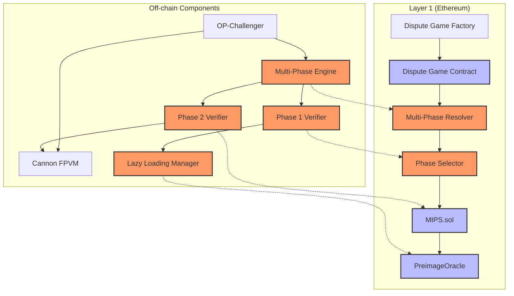
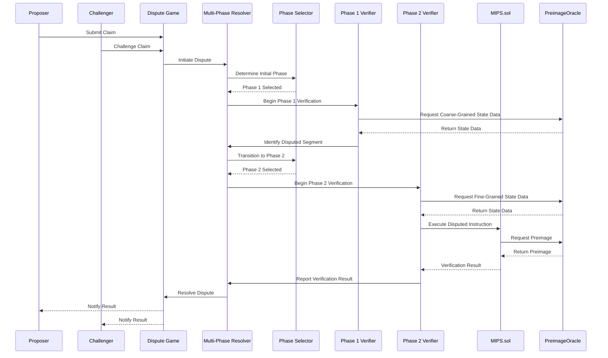

# System Design: Incorporating Multi-Phase Dispute Resolution into Optimism's Fault-Proof System

## 1. Executive Summary

This document outlines a system design for enhancing Optimism's fault proof system by incorporating a multi-phase dispute resolution mechanism inspired by opML, but without any machine learning components or native execution requirements. The proposed design aims to improve the efficiency, scalability, and resource utilization of Optimism's existing fault proof system while maintaining its security guarantees.

The current Optimism fault proof system relies on a single-phase dispute resolution process using the Cannon Fault Proof Virtual Machine (FPVM), which can be resource-intensive and less efficient for complex disputes. By adapting the multi-phase approach from opML, we can segment the dispute resolution process into distinct phases with different granularities, allowing for more efficient resolution of disputes without requiring the full execution trace to be processed in the VM for every dispute.

This design maintains compatibility with existing components of the OP Stack, including Cannon, the Dispute Game Protocol, and the PreimageOracle, while introducing new components and modifications to support the multi-phase approach. The implementation roadmap provides a clear path forward, with defined milestones and integration points.

## 2. System Overview and Goals

### 2.1 System Goals

The primary goals of this system design are to:

1. Improve the efficiency of dispute resolution in Optimism's fault proof system
2. Reduce computational and memory overhead during dispute resolution
3. Enhance scalability for complex state transitions
4. Maintain or improve security guarantees
5. Ensure compatibility with the existing OP Stack components


### 2.3 Key Design Principles

1. **Modularity**: Maintain the modular design of Optimism's fault proof system
2. **Backward Compatibility**: Ensure compatibility with existing OP Stack components
3. **Efficiency**: Optimize resource utilization during dispute resolution
4. **Security**: Maintain or enhance security guarantees
5. **Scalability**: Improve handling of complex state transitions

## 3. Current Architecture Analysis

### 3.1 Optimism's Current Fault Proof System

Optimism's current fault proof system employs a modular design centered around the Cannon Fault Proof Virtual Machine (FPVM) and a dispute game protocol. The key components include:

#### 3.1.1 Fault Proof Program (FPP)

The FPP is responsible for executing and verifying the correctness of state transitions. It identifies discrepancies between claimed and actual states, serving as the core logic for fault detection.

#### 3.1.2 Cannon FPVM

Cannon is the default FPVM used in Optimism's dispute resolution process. It emulates a minimal Linux environment on the MIPS32 architecture to generate execution traces and witness proofs for disputed instructions. It consists of:

- **Onchain `MIPS.sol`**: A Solidity-based verifier that executes a single MIPS instruction to confirm the correctness of the offchain proof
- **Offchain `mipsevm`**: A Go implementation that emulates the MIPS environment, capable of producing proofs for any MIPS instruction

#### 3.1.3 Dispute Game Protocol

The current dispute game protocol involves a single-phase bisection process where disputes over state transitions are bisected down to a single instruction. The process includes:

1. Identifying the root instruction of disagreement via a bisection game
2. Generating a witness proof containing all data needed for onchain execution
3. Executing the instruction onchain in `MIPS.sol` to verify the result

#### 3.1.4 PreimageOracle

The PreimageOracle interface maps hash-based claims to their corresponding preimages, which are essential for validating the correctness of state transitions. It supports various key types and provides preimages for hash claims used in dispute games.

### 3.2 Relevant Aspects of opML's Multi-Phase Dispute Resolution

The opML framework introduces a multi-phase dispute resolution protocol that divides the verification process into multiple stages, each optimized for different computational environments and data granularities. Key aspects relevant to our design include:

#### 3.2.1 Phase Segmentation

The dispute resolution process is segmented into multiple phases:
- **Phase 1**: Conducts coarse-grained verification of large computation segments
- **Phase 2**: Pinpoints the exact erroneous step within a smaller, verified segment

#### 3.2.2 Enhanced Bisection Protocol

An iterative process that narrows down the disputed computation segment:
- In Phase 1, the verifier challenges large computation chunks
- When a discrepancy is detected, the challenge is refined to a smaller segment
- The process continues until the dispute is localized to a single instruction or micro-operation

#### 3.2.3 State Transition and Merkle Trees

The system models computation as a state transition function, with Merkle trees representing the VM states at each step, enabling efficient verification of complex state transitions.

#### 3.2.4 Lazy Loading and Memory Efficiency

Techniques for handling large datasets without exceeding VM memory limits, including lazy loading and Merkle tree expansion.

## 4. Proposed Architecture

### 4.1 High-Level Architecture Diagram



### 4.2 Component Specifications

#### 4.2.1 New Components

1. **Multi-Phase Resolver (MPR)**
   - Purpose: Coordinates the multi-phase dispute resolution process
   - Responsibilities:
     - Manages phase transitions
     - Tracks dispute state across phases
     - Coordinates with the Phase Selector
   - Interfaces:
     - Dispute Game Contract
     - Phase Selector
     - PreimageOracle

2. **Phase Selector (PS)**
   - Purpose: Determines the appropriate phase for a given dispute
   - Responsibilities:
     - Analyzes dispute complexity
     - Selects appropriate resolution phase
     - Routes disputes to the correct verification mechanism
   - Interfaces:
     - Multi-Phase Resolver
     - MIPS.sol
     - PreimageOracle

3. **Multi-Phase Engine (MPE)**
   - Purpose: Off-chain component that manages the multi-phase dispute resolution process
   - Responsibilities:
     - Coordinates between Phase 1 and Phase 2 Verifiers
     - Manages dispute state transitions
     - Communicates with the on-chain Multi-Phase Resolver
   - Interfaces:
     - OP-Challenger
     - Phase 1 Verifier
     - Phase 2 Verifier
     - Multi-Phase Resolver

4. **Phase 1 Verifier (P1V)**
   - Purpose: Handles coarse-grained verification of large state segments
   - Responsibilities:
     - Verifies high-level state transitions
     - Identifies segments with discrepancies
     - Prepares data for Phase 2 verification
   - Interfaces:
     - Multi-Phase Engine
     - Lazy Loading Manager
     - Phase Selector

5. **Phase 2 Verifier (P2V)**
   - Purpose: Performs fine-grained verification of specific instructions
   - Responsibilities:
     - Executes detailed bisection on identified segments
     - Generates witness proofs for disputed instructions
     - Communicates with Cannon FPVM
   - Interfaces:
     - Multi-Phase Engine
     - Cannon FPVM
     - MIPS.sol

6. **Lazy Loading Manager (LLM)**
   - Purpose: Optimizes memory usage during dispute resolution
   - Responsibilities:
     - Manages on-demand loading of state data
     - Coordinates with PreimageOracle for efficient data retrieval
     - Optimizes memory usage during verification
   - Interfaces:
     - Phase 1 Verifier
     - PreimageOracle

#### 4.2.2 Modified Components

1. **Dispute Game Contract**
   - Modifications:
     - Integration with Multi-Phase Resolver
     - Support for phase-specific challenge periods
     - Enhanced state tracking for multi-phase disputes

2. **MIPS.sol**
   - Modifications:
     - Support for phase-specific verification
     - Optimized instruction execution for Phase 2
     - Enhanced interaction with PreimageOracle

3. **PreimageOracle**
   - Modifications:
     - Support for phase-specific preimage retrieval
     - Optimized data access patterns for multi-phase verification
     - Enhanced caching mechanisms for frequently accessed preimages

### 4.3 Component Interactions

The following sequence diagram illustrates the interaction between components during a multi-phase dispute resolution process:



## 5. Multi-Phase Dispute Resolution Design

### 5.1 Phase Definition and Boundaries

#### 5.1.1 Phase 1: Coarse-Grained Verification

**Purpose**: Efficiently identify the general area of disagreement in large state transitions.

**Characteristics**:
- Operates on larger chunks of state transitions
- Uses Merkle tree-based state representation
- Focuses on identifying segments with discrepancies
- Minimizes computational overhead

**Boundaries**:
- Begins when a dispute is initiated
- Ends when a specific segment with a discrepancy is identified
- Transitions to Phase 2 when the segment size reaches a predefined threshold

**Data Structures**:
```solidity
struct Phase1Claim {
    bytes32 stateRoot;
    uint256 startIndex;
    uint256 endIndex;
    bytes32 claimHash;
}

struct Phase1Challenge {
    uint256 challengeIndex;
    bytes32 expectedStateRoot;
    bytes32 challengerBond;
}
```

#### 5.1.2 Phase 2: Fine-Grained Verification

**Purpose**: Precisely identify and verify the specific instruction causing the disagreement.

**Characteristics**:
- Operates on individual instructions or small groups of instructions
- Uses the existing Cannon FPVM for instruction-level verification
- Generates detailed witness proofs for onchain verification
- Provides conclusive evidence for dispute resolution

**Boundaries**:
- Begins when Phase 1 identifies a specific segment with a discrepancy
- Ends when the exact instruction causing the disagreement is verified
- Results in final dispute resolution

**Data Structures**:
```solidity
struct Phase2Claim {
    bytes32 preStateRoot;
    bytes32 postStateRoot;
    uint256 instructionIndex;
    bytes32 witnessHash;
}

struct Phase2Challenge {
    uint256 instructionIndex;
    bytes32 expectedPostStateRoot;
    bytes32 challengerBond;
}
```

### 5.2 Transition Between Phases

#### 5.2.1 Phase Transition Criteria

The transition from Phase 1 to Phase 2 occurs when:
1. A specific segment with a discrepancy is identified in Phase 1
2. The segment size reaches a predefined threshold (e.g., 1000 instructions)
3. The Phase Selector determines that Phase 2 verification is more efficient

#### 5.2.2 Phase Transition Protocol

```solidity
function transitionToPhase2(
    uint256 disputeId,
    uint256 segmentStart,
    uint256 segmentEnd,
    bytes32 segmentStateRoot
) external {
    require(
        disputes[disputeId].currentPhase == DisputePhase.PHASE_1,
        "Not in Phase 1"
    );
    require(
        isValidSegment(disputeId, segmentStart, segmentEnd),
        "Invalid segment"
    );

    // Verify segment state root
    require(
        verifySegmentStateRoot(disputeId, segmentStart, segmentEnd, segmentStateRoot),
        "Invalid segment state root"
    );

    // Transition to Phase 2
    disputes[disputeId].currentPhase = DisputePhase.PHASE_2;
    disputes[disputeId].phase2Data.segmentStart = segmentStart;
    disputes[disputeId].phase2Data.segmentEnd = segmentEnd;
    disputes[disputeId].phase2Data.segmentStateRoot = segmentStateRoot;

    emit PhaseTransition(disputeId, DisputePhase.PHASE_1, DisputePhase.PHASE_2);
}
```

#### 5.2.3 State Preservation

During phase transitions, the system must preserve:
1. The dispute context and history
2. The identified segment boundaries
3. The state roots at segment boundaries
4. The bonds and stakes of participants

### 5.3 Dispute Resolution at Each Phase

#### 5.3.1 Phase 1 Resolution

In Phase 1, dispute resolution follows these steps:
1. The proposer submits a claim about a state transition
2. The challenger challenges the claim, specifying the expected state
3. The system performs bisection on the state transition
4. Participants exchange Merkle proofs for state segments
5. When a discrepancy is found in a specific segment, the dispute transitions to Phase 2

```solidity
function resolvePhase1Dispute(
    uint256 disputeId,
    uint256 bisectionPoint,
    bytes32 leftStateRoot,
    bytes32 rightStateRoot
) external {
    Phase1Dispute storage dispute = phase1Disputes[disputeId];

    // Verify bisection point is valid
    require(
        bisectionPoint > dispute.startIndex && bisectionPoint < dispute.endIndex,
        "Invalid bisection point"
    );

    // Verify state roots
    require(
        verifyStateRoot(dispute.startIndex, bisectionPoint, leftStateRoot) &&
        verifyStateRoot(bisectionPoint, dispute.endIndex, rightStateRoot),
        "Invalid state roots"
    );

    // Update dispute state
    if (dispute.challengedSide == Side.LEFT) {
        dispute.endIndex = bisectionPoint;
        dispute.endStateRoot = leftStateRoot;
    } else {
        dispute.startIndex = bisectionPoint;
        dispute.startStateRoot = rightStateRoot;
    }

    // Check if ready for Phase 2
    if (dispute.endIndex - dispute.startIndex <= PHASE_TRANSITION_THRESHOLD) {
        initiatePhase2(disputeId);
    }
}
```

#### 5.3.2 Phase 2 Resolution

In Phase 2, dispute resolution follows these steps:
1. The system performs instruction-level bisection within the identified segment
2. Participants exchange witness proofs for specific instructions
3. When the exact disputed instruction is identified, it is executed in MIPS.sol
4. The execution result determines the outcome of the dispute

```solidity
function resolvePhase2Dispute(
    uint256 disputeId,
    uint256 instructionIndex,
    bytes calldata witnessData
) external {
    Phase2Dispute storage dispute = phase2Disputes[disputeId];

    // Verify instruction index is within the disputed segment
    require(
        instructionIndex >= dispute.segmentStart && instructionIndex < dispute.segmentEnd,
        "Instruction out of bounds"
    );

    // Execute the instruction in MIPS.sol
    (bool success, bytes32 postStateRoot) = MIPS.executeInstruction(
        dispute.preStateRoot,
        instructionIndex,
        witnessData
    );

    // Resolve the dispute
    if (success && postStateRoot == dispute.claimedPostStateRoot) {
        // Proposer wins
        resolveInFavorOfProposer(disputeId);
    } else {
        // Challenger wins
        resolveInFavorOfChallenger(disputeId);
    }
}
```

## 6. Additional Improvements

### 6.1 Lazy Loading for State Access

#### 6.1.1 Design

The Lazy Loading Manager optimizes memory usage by loading state data on-demand, rather than loading the entire state upfront. This is particularly beneficial during Phase 1, where only high-level state segments are needed.

```solidity
contract LazyLoadingManager {
    PreimageOracle public preimageOracle;

    mapping(bytes32 => bool) public loadedPreimages;
    mapping(bytes32 => uint256) public preimageAccessCount;

    function loadStateSegment(bytes32 stateRoot, uint256 startIndex, uint256 endIndex)
        external
        returns (bytes memory stateData)
    {
        bytes32 segmentKey = keccak256(abi.encodePacked(stateRoot, startIndex, endIndex));

        if (!loadedPreimages[segmentKey]) {
            // Load the state segment from the PreimageOracle
            stateData = preimageOracle.getPreimage(segmentKey);
            loadedPreimages[segmentKey] = true;
            preimageAccessCount[segmentKey] = 1;
        } else {
            // Retrieve from cache
            stateData = getCachedStateSegment(segmentKey);
            preimageAccessCount[segmentKey]++;
        }

        return stateData;
    }

    function unloadRarelyUsedSegments() external {
        // Unload segments that are rarely accessed to free up memory
        // Implementation details omitted for brevity
    }
}
```

#### 6.1.2 Benefits

- Reduced memory overhead during dispute resolution
- Faster initialization of the dispute process
- More efficient use of PreimageOracle resources
- Improved scalability for large state transitions

### 6.2 Optimized Memory Management

#### 6.2.1 Merkle Tree Optimization

The system uses an optimized Merkle tree structure for state representation, with the following enhancements:

1. **Sparse Merkle Trees**: Only store and process the branches that are relevant to the dispute
2. **Incremental Verification**: Verify only the changed parts of the state tree
3. **Caching**: Cache frequently accessed nodes to reduce redundant computations

```solidity
contract OptimizedMerkleTree {
    struct Node {
        bytes32 hash;
        bool isLoaded;
        uint256 lastAccessed;
    }

    mapping(bytes32 => Node) public nodes;
    mapping(bytes32 => mapping(uint256 => bytes32)) public children;

    function getNode(bytes32 root, bytes32[] calldata path)
        external
        view
        returns (bytes32)
    {
        bytes32 currentNode = root;

        for (uint256 i = 0; i < path.length; i++) {
            require(nodes[currentNode].isLoaded, "Node not loaded");
            currentNode = children[currentNode][uint256(path[i])];
        }

        return currentNode;
    }

    function loadNode(bytes32 nodeHash, bytes32[] calldata childrenHashes)
        external
    {
        nodes[nodeHash].hash = nodeHash;
        nodes[nodeHash].isLoaded = true;
        nodes[nodeHash].lastAccessed = block.timestamp;

        for (uint256 i = 0; i < childrenHashes.length; i++) {
            children[nodeHash][i] = childrenHashes[i];
        }
    }
}
```

#### 6.2.2 Memory Pooling

The system implements memory pooling to reduce allocation overhead and memory fragmentation:

1. **Preallocated Buffers**: Use preallocated buffers for common operations
2. **Buffer Reuse**: Reuse buffers for similar operations
3. **Garbage Collection**: Implement a simple garbage collection mechanism to free unused memory

```solidity
contract MemoryPool {
    struct Buffer {
        uint256 size;
        bool inUse;
        uint256 lastUsed;
    }

    mapping(uint256 => Buffer) public buffers;
    uint256 public nextBufferId;

    function allocateBuffer(uint256 size)
        external
        returns (uint256 bufferId)
    {
        // Try to find an existing buffer of appropriate size
        for (uint256 i = 0; i < nextBufferId; i++) {
            if (!buffers[i].inUse && buffers[i].size >= size) {
                buffers[i].inUse = true;
                buffers[i].lastUsed = block.timestamp;
                return i;
            }
        }

        // Create a new buffer
        bufferId = nextBufferId++;
        buffers[bufferId] = Buffer({
            size: size,
            inUse: true,
            lastUsed: block.timestamp
        });

        return bufferId;
    }

    function releaseBuffer(uint256 bufferId)
        external
    {
        require(buffers[bufferId].inUse, "Buffer not in use");
        buffers[bufferId].inUse = false;
    }

    function collectGarbage()
        external
    {
        // Release buffers that haven't been used for a while
        // Implementation details omitted for brevity
    }
}
```

### 6.3 Enhanced Bisection Protocol

#### 6.3.1 Adaptive Bisection

The system implements an adaptive bisection protocol that adjusts the bisection strategy based on the dispute characteristics:

1. **Dynamic Bisection Points**: Adjust bisection points based on historical dispute patterns
2. **Heuristic-Based Bisection**: Use heuristics to predict likely areas of disagreement
3. **Parallel Bisection**: Explore multiple bisection paths in parallel to speed up resolution

```solidity
contract AdaptiveBisection {
    struct BisectionStrategy {
        uint256 initialSegmentSize;
        uint256 minSegmentSize;
        uint256 bisectionRatio; // 1-99, representing percentage
    }

    mapping(uint256 => BisectionStrategy) public disputeStrategies;

    function getBisectionPoint(
        uint256 disputeId,
        uint256 startIndex,
        uint256 endIndex
    )
        external
        view
        returns (uint256)
    {
        BisectionStrategy storage strategy = disputeStrategies[disputeId];

        uint256 segmentSize = endIndex - startIndex;

        if (segmentSize <= strategy.minSegmentSize) {
            return startIndex + segmentSize / 2;
        }

        // Apply the bisection ratio
        uint256 bisectionPoint = startIndex + (segmentSize * strategy.bisectionRatio) / 100;

        return bisectionPoint;
    }

    function updateStrategy(
        uint256 disputeId,
        uint256 newBisectionRatio
    )
        external
    {
        require(newBisectionRatio > 0 && newBisectionRatio < 100, "Invalid ratio");
        disputeStrategies[disputeId].bisectionRatio = newBisectionRatio;
    }
}
```

#### 6.3.2 Bisection Caching

The system caches bisection results to avoid redundant computations:

1. **Result Caching**: Cache the results of previous bisection steps
2. **Path Prediction**: Predict likely bisection paths based on historical patterns
3. **Precomputation**: Precompute bisection results for common scenarios

```solidity
contract BisectionCache {
    struct CacheEntry {
        bytes32 stateRoot;
        uint256 timestamp;
        bool isValid;
    }

    mapping(bytes32 => CacheEntry) public cache;

    function getCachedStateRoot(
        uint256 startIndex,
        uint256 endIndex
    )
        external
        view
        returns (bytes32 stateRoot, bool found)
    {
        bytes32 key = keccak256(abi.encodePacked(startIndex, endIndex));
        CacheEntry storage entry = cache[key];

        if (entry.isValid) {
            return (entry.stateRoot, true);
        }

        return (bytes32(0), false);
    }

    function cacheStateRoot(
        uint256 startIndex,
        uint256 endIndex,
        bytes32 stateRoot
    )
        external
    {
        bytes32 key = keccak256(abi.encodePacked(startIndex, endIndex));

        cache[key] = CacheEntry({
            stateRoot: stateRoot,
            timestamp: block.timestamp,
            isValid: true
        });
    }

    function invalidateCache(
        uint256 startIndex,
        uint256 endIndex
    )
        external
    {
        bytes32 key = keccak256(abi.encodePacked(startIndex, endIndex));
        cache[key].isValid = false;
    }
}
```

## 7. API Specifications

### 7.1 Interface Definitions

#### 7.1.1 Multi-Phase Resolver Interface

```solidity
interface IMultiPhaseResolver {
    enum DisputePhase { PHASE_1, PHASE_2 }
    enum DisputeStatus { PENDING, PHASE_1_ACTIVE, PHASE_2_ACTIVE, RESOLVED }

    struct Dispute {
        uint256 id;
        address proposer;
        address challenger;
        DisputePhase currentPhase;
        DisputeStatus status;
        bytes32 claimedStateRoot;
        bytes32 challengedStateRoot;
        uint256 timestamp;
    }

    event DisputeCreated(uint256 indexed disputeId, address proposer, address challenger);
    event PhaseTransition(uint256 indexed disputeId, DisputePhase fromPhase, DisputePhase toPhase);
    event DisputeResolved(uint256 indexed disputeId, address winner);

    function createDispute(bytes32 claimedStateRoot, bytes32 challengedStateRoot) external returns (uint256 disputeId);
    function getCurrentPhase(uint256 disputeId) external view returns (DisputePhase);
    function transitionToPhase2(uint256 disputeId, uint256 segmentStart, uint256 segmentEnd, bytes32 segmentStateRoot) external;
    function resolveDispute(uint256 disputeId, address winner) external;
    function getDisputeStatus(uint256 disputeId) external view returns (DisputeStatus);
    function getDisputeDetails(uint256 disputeId) external view returns (Dispute memory);
}
```

#### 7.1.2 Phase Selector Interface

```solidity
interface IPhaseSelector {
    enum Phase { PHASE_1, PHASE_2 }

    struct PhaseConfig {
        uint256 maxSegmentSize;
        uint256 minSegmentSize;
        uint256 timeoutDuration;
    }

    event PhaseSelected(uint256 indexed disputeId, Phase selectedPhase);
    event PhaseConfigUpdated(Phase phase, PhaseConfig config);

    function selectInitialPhase(uint256 disputeId, uint256 stateSize) external returns (Phase);
    function shouldTransitionToPhase2(uint256 disputeId, uint256 segmentSize) external view returns (bool);
    function getPhaseConfig(Phase phase) external view returns (PhaseConfig memory);
    function updatePhaseConfig(Phase phase, PhaseConfig calldata config) external;
}
```

#### 7.1.3 Lazy Loading Manager Interface

```solidity
interface ILazyLoadingManager {
    event StateSegmentLoaded(bytes32 indexed stateRoot, uint256 startIndex, uint256 endIndex);
    event StateSegmentUnloaded(bytes32 indexed stateRoot, uint256 startIndex, uint256 endIndex);

    function loadStateSegment(bytes32 stateRoot, uint256 startIndex, uint256 endIndex) external returns (bytes memory stateData);
    function unloadStateSegment(bytes32 stateRoot, uint256 startIndex, uint256 endIndex) external;
    function isStateSegmentLoaded(bytes32 stateRoot, uint256 startIndex, uint256 endIndex) external view returns (bool);
    function getLoadedSegmentsCount() external view returns (uint256);
    function getSegmentAccessCount(bytes32 stateRoot, uint256 startIndex, uint256 endIndex) external view returns (uint256);
}
```

### 7.2 Data Structures

#### 7.2.1 Dispute Data Structure

```solidity
struct Dispute {
    uint256 id;
    address proposer;
    address challenger;
    DisputePhase currentPhase;
    DisputeStatus status;
    bytes32 claimedStateRoot;
    bytes32 challengedStateRoot;
    uint256 timestamp;

    // Phase 1 specific data
    Phase1Data phase1Data;

    // Phase 2 specific data
    Phase2Data phase2Data;
}

struct Phase1Data {
    uint256 startIndex;
    uint256 endIndex;
    bytes32 startStateRoot;
    bytes32 endStateRoot;
    uint256 bisectionCount;
    mapping(uint256 => BisectionStep) bisectionSteps;
}

struct Phase2Data {
    uint256 segmentStart;
    uint256 segmentEnd;
    bytes32 segmentStateRoot;
    uint256 instructionIndex;
    bytes32 preStateRoot;
    bytes32 postStateRoot;
    bytes32 witnessHash;
}

struct BisectionStep {
    uint256 bisectionPoint;
    bytes32 leftStateRoot;
    bytes32 rightStateRoot;
    uint256 timestamp;
}
```

#### 7.2.2 State Segment Data Structure

```solidity
struct StateSegment {
    bytes32 stateRoot;
    uint256 startIndex;
    uint256 endIndex;
    bytes32 merkleRoot;
    bool isLoaded;
    uint256 accessCount;
    uint256 lastAccessed;
}

struct StateNode {
    bytes32 nodeHash;
    bytes32[] childrenHashes;
    bool isLeaf;
    bytes data; // Only for leaf nodes
}
```

#### 7.2.3 Witness Data Structure

```solidity
struct WitnessData {
    bytes32 preStateRoot;
    bytes32 postStateRoot;
    uint256 instructionIndex;
    bytes instructionData;
    bytes32[] memoryProof;
    bytes32[] registerProof;
    bytes32[] preimageKeys;
}
```

### 7.3 Function Signatures

#### 7.3.1 Multi-Phase Resolver Functions

```solidity
// Create a new dispute
function createDispute(
    bytes32 claimedStateRoot,
    bytes32 challengedStateRoot
) external returns (uint256 disputeId);

// Get the current phase of a dispute
function getCurrentPhase(
    uint256 disputeId
) external view returns (DisputePhase);

// Transition a dispute from Phase 1 to Phase 2
function transitionToPhase2(
    uint256 disputeId,
    uint256 segmentStart,
    uint256 segmentEnd,
    bytes32 segmentStateRoot
) external;

// Resolve a dispute
function resolveDispute(
    uint256 disputeId,
    address winner
) external;

// Get the status of a dispute
function getDisputeStatus(
    uint256 disputeId
) external view returns (DisputeStatus);

// Get the details of a dispute
function getDisputeDetails(
    uint256 disputeId
) external view returns (Dispute memory);
```

#### 7.3.2 Phase 1 Verification Functions

```solidity
// Submit a claim in Phase 1
function submitPhase1Claim(
    uint256 disputeId,
    uint256 startIndex,
    uint256 endIndex,
    bytes32 stateRoot
) external;

// Challenge a claim in Phase 1
function challengePhase1Claim(
    uint256 disputeId,
    uint256 challengeIndex,
    bytes32 expectedStateRoot
) external;

// Perform bisection in Phase 1
function bisectPhase1Claim(
    uint256 disputeId,
    uint256 bisectionPoint,
    bytes32 leftStateRoot,
    bytes32 rightStateRoot
) external;

// Verify a state root in Phase 1
function verifyPhase1StateRoot(
    uint256 disputeId,
    uint256 startIndex,
    uint256 endIndex,
    bytes32 stateRoot
) external view returns (bool);
```

#### 7.3.3 Phase 2 Verification Functions

```solidity
// Submit a claim in Phase 2
function submitPhase2Claim(
    uint256 disputeId,
    uint256 instructionIndex,
    bytes32 preStateRoot,
    bytes32 postStateRoot,
    bytes32 witnessHash
) external;

// Challenge a claim in Phase 2
function challengePhase2Claim(
    uint256 disputeId,
    uint256 instructionIndex,
    bytes32 expectedPostStateRoot
) external;

// Execute a disputed instruction in Phase 2
function executeDisputedInstruction(
    uint256 disputeId,
    uint256 instructionIndex,
    bytes calldata witnessData
) external returns (bool success, bytes32 postStateRoot);

// Verify a witness in Phase 2
function verifyPhase2Witness(
    uint256 disputeId,
    uint256 instructionIndex,
    bytes calldata witnessData
) external view returns (bool);
```

## 8. Integration Points

### 8.1 Cannon Integration

The multi-phase dispute resolution system integrates with Cannon FPVM primarily during Phase 2, when instruction-level verification is required. The integration points include:

#### 8.1.1 Cannon FPVM Interface

```solidity
interface ICannonFPVM {
    function executeInstruction(
        bytes32 preStateRoot,
        uint256 instructionIndex,
        bytes calldata witnessData
    ) external returns (bool success, bytes32 postStateRoot);

    function verifyWitness(
        bytes32 preStateRoot,
        uint256 instructionIndex,
        bytes calldata witnessData,
        bytes32 expectedPostStateRoot
    ) external view returns (bool);

    function getInstructionDetails(
        bytes32 stateRoot,
        uint256 instructionIndex
    ) external view returns (bytes memory);
}
```

#### 8.1.2 Integration Flow

1. Phase 2 Verifier identifies the disputed instruction
2. Phase 2 Verifier requests witness data from Cannon FPVM
3. Cannon FPVM generates the witness data
4. Phase 2 Verifier submits the witness data to MIPS.sol for verification
5. MIPS.sol executes the instruction and returns the result
6. Phase 2 Verifier reports the result to the Multi-Phase Resolver

### 8.2 Dispute Game Integration

The multi-phase dispute resolution system integrates with the existing Dispute Game Protocol, enhancing it with phase-specific functionality. The integration points include:

#### 8.2.1 Dispute Game Interface

```solidity
interface IDisputeGame {
    enum GameStatus { PENDING, ACTIVE, RESOLVED }

    struct Game {
        uint256 id;
        address proposer;
        address challenger;
        GameStatus status;
        bytes32 claimedStateRoot;
        bytes32 challengedStateRoot;
        uint256 timestamp;
    }

    event GameCreated(uint256 indexed gameId, address proposer, address challenger);
    event GameResolved(uint256 indexed gameId, address winner);

    function createGame(bytes32 claimedStateRoot) external returns (uint256 gameId);
    function challengeGame(uint256 gameId, bytes32 challengedStateRoot) external;
    function resolveGame(uint256 gameId, address winner) external;
    function getGameStatus(uint256 gameId) external view returns (GameStatus);
    function getGameDetails(uint256 gameId) external view returns (Game memory);
}
```

#### 8.2.2 Integration Flow

1. Dispute Game Factory creates a new Dispute Game
2. Multi-Phase Resolver is initialized with the Dispute Game details
3. Multi-Phase Resolver manages the phase-specific dispute resolution process
4. When the dispute is resolved, Multi-Phase Resolver reports the result to the Dispute Game
5. Dispute Game finalizes the result and distributes rewards/penalties

### 8.3 PreimageOracle Integration

The multi-phase dispute resolution system integrates with the PreimageOracle for efficient preimage retrieval during both phases. The integration points include:

#### 8.3.1 PreimageOracle Interface

```solidity
interface IPreimageOracle {
    function getPreimage(bytes32 key) external view returns (bytes memory);
    function hasPreimage(bytes32 key) external view returns (bool);
    function updatePreimage(bytes32 key, bytes calldata data) external;
    function updatePreimageWithOffset(bytes32 key, uint256 offset, bytes calldata data) external;
    function getPreimageType(bytes32 key) external pure returns (uint8);
}
```

#### 8.3.2 Integration Flow

1. Lazy Loading Manager requests preimages from PreimageOracle as needed
2. Phase 1 Verifier uses preimages for coarse-grained verification
3. Phase 2 Verifier uses preimages for instruction-level verification
4. MIPS.sol requests preimages during instruction execution
5. PreimageOracle provides the requested preimages

## 10. Trade-offs Analysis

### 10.1 Performance vs. Security

#### 10.1.1 Trade-offs

1. **Multi-Phase Approach**:
   - **Pro**: Improved performance by avoiding full VM execution for every dispute
   - **Con**: Introduces complexity in phase transitions and state management
   - **Mitigation**: Rigorous testing and formal verification of phase transition logic

2. **Lazy Loading**:
   - **Pro**: Reduced memory overhead and faster initialization
   - **Con**: Potential for state inconsistencies if not properly managed
   - **Mitigation**: Robust validation of loaded state segments and comprehensive testing

3. **Enhanced Bisection**:
   - **Pro**: Faster dispute resolution through optimized bisection strategies
   - **Con**: More complex implementation with potential for bugs
   - **Mitigation**: Extensive testing of edge cases and formal verification of bisection logic

### 10.2 Complexity vs. Efficiency

#### 10.2.1 Trade-offs

1. **Component Modularity**:
   - **Pro**: Improved maintainability and flexibility
   - **Con**: Increased system complexity and potential for integration issues
   - **Mitigation**: Clear interface definitions and comprehensive integration testing

2. **Optimized Memory Management**:
   - **Pro**: Reduced memory overhead and improved performance
   - **Con**: More complex memory management logic
   - **Mitigation**: Robust memory management implementation with extensive testing

3. **Phase-Specific Verification**:
   - **Pro**: Tailored verification approaches for different dispute phases
   - **Con**: Increased complexity in verification logic
   - **Mitigation**: Clear separation of concerns and comprehensive testing of each phase

### 10.3 Compatibility vs. Innovation

#### 10.3.1 Trade-offs

1. **Integration with Existing Components**:
   - **Pro**: Leverages proven components and reduces development effort
   - **Con**: Constrains design options and may limit optimization potential
   - **Mitigation**: Careful design of integration points to minimize constraints

2. **New Component Introduction**:
   - **Pro**: Enables innovative approaches and optimizations
   - **Con**: Increases development effort and potential for bugs
   - **Mitigation**: Phased introduction of new components with comprehensive testing

3. **Protocol Extensions**:
   - **Pro**: Enables new functionality and optimizations
   - **Con**: May require updates to existing clients and tools
   - **Mitigation**: Backward compatibility layers and clear migration paths


## Conclusion

This system design document outlines a comprehensive approach to incorporating multi-phase dispute resolution into Optimism's fault proof system, without introducing ML components or native execution. The design leverages the strengths of opML's multi-phase approach while maintaining compatibility with Optimism's existing architecture.

By segmenting the dispute resolution process into distinct phases, optimizing memory management, and enhancing the bisection protocol, the proposed system aims to improve efficiency, scalability, and resource utilization while maintaining or enhancing security guarantees.

The implementation roadmap provides a clear path forward, with defined milestones and integration points. The trade-offs analysis acknowledges the challenges and proposes mitigation strategies, while the testing and validation approach ensures comprehensive verification of the system's correctness and performance.

With this design, Optimism's fault proof system can benefit from the efficiency improvements of multi-phase dispute resolution while maintaining its core security properties and compatibility with the existing OP Stack.
