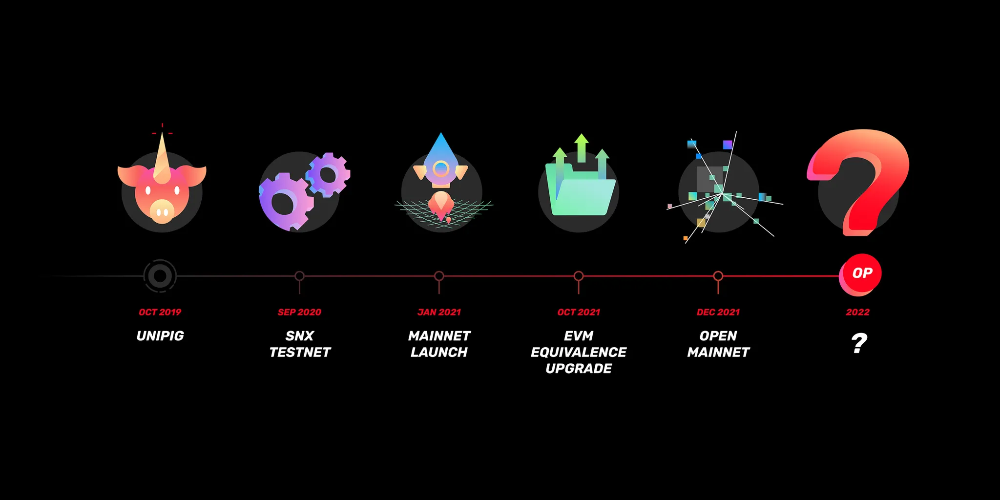
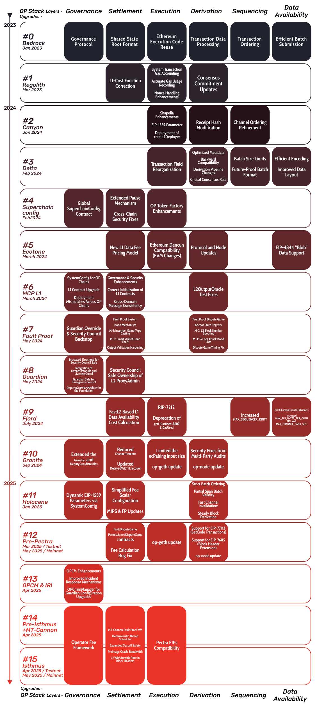

Ethereum has long envisioned itself as the World Computer—a shared global platform for registering and verifying the state of public goods, collective decisions, and decentralized markets. By embedding trust directly into code and consensus, Ethereum enables a new kind of programmable legitimacy. Yet for these values to reach governments, organizations, and everyday people, the technology must scale.

Layer 2 (L2) rollups have emerged as a practical solution to Ethereum’s scalability challenges, addressing issues such as cost, capacity, and transaction throughput. Among these, optimistic rollups allow transactions to be executed off-chain while posting minimal data on-chain, thereby preserving decentralization and network security.

The OP Stack, developed by OP Labs and coordinated by the Optimism Foundation, is one of the most widely adopted open-source frameworks for deploying dedicated L2 rollups. Its minimal,  and modular architecture allows chains to post periodic state roots to Ethereum (or alternative L1s), relying on optimistic validation. These state roots can be challenged within a seven-day window using Fault Proof mechanisms. A robust and permissionless implementation of these mechanisms is essential to achieving Stage 1 requirements in L2BEAT’s state validation maturity framework.

This research report examines the evolution and implementation of fault proof systems in the OP Stack. It builds on our earlier work, [OP City: Research and Optimization of OP Stack Deployments and Canon Fault Proofs VM](https://mirror.xyz/zenbit.eth/atHQ_Nz1--bQbY6Vx7NzYO-aOtXibcQi70aLl_WhTzY), and presents findings across three milestones: [(1)](#milestone-0-op-stack-research) a comprehensive review of OP Stack upgrades and their impact for fault proofs; [(2)](#milestone-1-fault-proofs-mechanisms-research) a technical analysis of emerging mechanisms like Canon FPVM, opML, oppAI, and DAVE; and [(3)]() a comparative benchmark to assess readiness, performance, and integration paths. Together, these contributions aim to advance the decentralization and resilience of the OP Stack—and, by extension, Ethereum as a truly global computational engine.

# Milestone 0: OP stack research

## OP stack background

Before the OP Stack was formalized as a unified, modular framework, its architecture evolved through iterative stages that laid the groundwork for scalable Layer 2 execution. The journey began with the **Unipig Demo** in October 2019, a proof-of-concept developed in collaboration with Uniswap that showcased the power of Optimistic Rollups. It demonstrated a ~10× increase in throughput and significant reductions in gas fees compared to Ethereum mainnet, proving the concept’s viability. 

This was followed by the lauch of **SNX Testnet** in September 2020, which introduced general-purpose smart contract execution on Layer 2. Transactions ran at approximately ~10% of L1’s cost, with improved latency and faster confirmation times.

In January 2021, the network transitioned into its first mainnet phase—often referred to as the **OVM Era**—with a version of the Optimistic Virtual Machine that relied on a custom Solidity transpiler. While functional, this setup introduced significant inefficiencies: over 25,000 lines of bespoke code, complex tooling, and inflated state transition costs. 

By October 2021, Optimism rolled out the **EVM Equivalence Upgrade**, a major step forward that removed the transpiler, drastically simplified the execution layer, and brought the network into full compatibility with Ethereum tooling. Throughput increased to ~100 TPS, and developer experience improved significantly. Just two months later, in December 2021, the launch of OP mainnet enable public contract deployment and catalyzing adoption by removing whitelists. This major achievment on open access marked a turning point in Optimism’s growth. 

The culmination of these early experiments arrived with the **Bedrock Upgrade** in june 2023, which replaced legacy OVM components with a leaner, modular, and Ethereum-equivalent design. Bedrock slashed code complexity by ~90%, cut transaction costs by ~30%, and boosted throughput to ~450 TPS—ushering in the era of the OP Stack and laying the foundation for a Superchain of standardized, interoperable rollups.

<figure>
  
</figure>

*From Optimism Collective Mirror*

## OP stack protocol upgrades
*All referenced documents are available in our open repository for transparency and further review:* 🔗 [OP Stack Protocol Upgrades Review – Zenbit GitHub](https://github.com/zenbitETH/OPcity/tree/main/Op-stack-research/Protocol-Updates)
Since the formalization of the OP Stack, the protocol has undergone **15 official upgrades**, ranging from foundational architectural transitions to fine-grained feature releases across the OP Stack’s modular layers. Our review spanned **62 curated sources**, including governance forum proposals, developer documentation, audit reports, and OP Stack specification entries. These materials were analyzed to trace the evolution of the OP Stack’s dispute system—from the launch of permissionless Cannon-based fault proofs in Protocol Upgrade #7, to the infrastructure pre-requisites for multi-threaded MIPS64 fault games in Upgrades #14 and #15. Sources such as governance threads, public audit reports, and design documents not only clarified technical intent, but also allowed us to assess how each upgrade contributed to meeting **Stage 1 decentralization criteria** from the L2BEAT framework.

Through this analysis, we identified **13 upgrades** with direct impact on the **settlement layer**,  including **7 upgrades** that significantly advanced the **fault proof system** —transforming it from a trusted fallback into a fully modular, permissionless verification layer.

| Protocol Upgrade | Testnet Release Date | Mainnet Release Date | Upgrade Proposal ID | OP Gov Author | Author Affiliation | GH PR | OP Gov Voting | Audit Reports |
| --- | --- | --- | --- | --- | --- | --- | --- | --- |
| [**UNIPIG Plasma**](https://github.com/zenbitETH/OPcity/blob/0e9d1e752806b5ee00dadaa5df58cbed360b9b80/Op-stack-research/Protocol-Updates/readme.md#-op-stack-background) |  | Oct 2019 |  |  |  |  |  |  |
| [**SNX**](https://github.com/zenbitETH/OPcity/blob/0e9d1e752806b5ee00dadaa5df58cbed360b9b80/Op-stack-research/Protocol-Updates/readme.md#-op-stack-background) |  | Sep 2020 |  |  |  |  |  |  |
| [**Mainnet launch**](https://github.com/zenbitETH/OPcity/blob/0e9d1e752806b5ee00dadaa5df58cbed360b9b80/Op-stack-research/Protocol-Updates/readme.md#-op-stack-background) |  | Jan 2021 |  |  |  |  |  |  |
| [**OVM (EVM Equivalence)**](https://github.com/zenbitETH/OPcity/blob/0e9d1e752806b5ee00dadaa5df58cbed360b9b80/Op-stack-research/Protocol-Updates/readme.md#-op-stack-background) |  | Oct 2022 |  |  |  |  |  | [Open Zeppelin 🔗](https://github.com/ethereum-optimism/optimism/blob/develop/docs/security-reviews/2021_03-OVM_and_Rollup-OpenZeppelin.pdf) |
| [**Bedrock**](https://github.com/zenbitETH/OPcity/blob/0e9d1e752806b5ee00dadaa5df58cbed360b9b80/Op-stack-research/Protocol-Updates/readme.md#bedrock) |  | Jan 6, 2023 |  |  |  |  |  |  |
| [**Regolith**](https://github.com/zenbitETH/OPcity/blob/0e9d1e752806b5ee00dadaa5df58cbed360b9b80/Op-stack-research/Protocol-Updates/readme.md#protocol-upgrade1-regolith) |  | Mar 17, 2023 | [**UP #1** 🔗](https://gov.optimism.io/t/final-upgrade-1-bedrock-protocol-upgrade-v2/5548) | [ben-chain](https://gov.optimism.io/u/ben-chain) | `OP Foundation` | [#5010](https://github.com/ethereum-optimism/optimism/pull/5010) | [✅ Succeeded](https://vote.optimism.io/proposals/114732572201709734114347859370226754519763657304898989580338326275038680037913) |  |
| [**Canyon**](https://github.com/zenbitETH/OPcity/blob/0e9d1e752806b5ee00dadaa5df58cbed360b9b80/Op-stack-research/Protocol-Updates/readme.md#protocol-upgrade-2-canyon) | Nov 2023 | Jan 11, 2024 | [**UP #2** 🔗](https://gov.optimism.io/t/final-upgrade-proposal-2-canyon-network-upgrade/7088) | [triangleshere](https://gov.optimism.io/u/trianglesphere/summary) | `OP Labs` | [#8569](https://github.com/ethereum-optimism/optimism/pull/8569) | [✅ Succeeded](https://vote.optimism.io/proposals/20327152654308054166942093105443920402082671769027198649343468266910325783863) |  |
| [**Delta**](https://github.com/zenbitETH/OPcity/blob/0e9d1e752806b5ee00dadaa5df58cbed360b9b80/Op-stack-research/Protocol-Updates/readme.md#protocol-upgrade-3-delta) | Dec 2023 | Feb 22, 2024 | [**UP #3** 🔗](https://gov.optimism.io/t/final-upgrade-proposal-3-delta-network-upgrade/7310) | [testinprod_io](https://gov.optimism.io/u/testinprod_io) | `Test in Prod` | [#7454](https://github.com/ethereum-optimism/optimism/pull/7454) | [✅ Succeeded](https://vote.optimism.io/proposals/64861580915106728278960188313654044018229192803489945934331754023009986585740) |  |
| [**Superchain Config**](https://github.com/zenbitETH/OPcity/blob/0e9d1e752806b5ee00dadaa5df58cbed360b9b80/Op-stack-research/Protocol-Updates/readme.md#protocol-upgrade-4-superchain-config) | Jan 2024 |  | [**UP #4** 🔗](https://gov.optimism.io/t/upgrade-proposal-4/7534) | [maurelian](https://gov.optimism.io/u/maurelian) | `OP Labs` | [#9109](https://github.com/ethereum-optimism/optimism/pull/9109) | [✅ Succeeded](https://vote.optimism.io/proposals/110376471005925230990107796624328147348746431603727026291575353089698990280147) | [Trust Security 🔗](https://github.com/ethereum-optimism/optimism/blob/develop/docs/security-reviews/2023_12_SuperchainConfigUpgrade_Trust.pdf) |
| [**Ecotone**](https://github.com/zenbitETH/OPcity/blob/0e9d1e752806b5ee00dadaa5df58cbed360b9b80/Op-stack-research/Protocol-Updates/readme.md#protocol-upgrade-5-ecotone) | Feb 2024 | Mar 2024 | [**UP #5** 🔗](https://gov.optimism.io/t/upgrade-proposal-5-ecotone-network-upgrade/7669) | [bayardo](https://gov.optimism.io/u/bayardo) | `Base` | [#9695](https://github.com/ethereum-optimism/optimism/pull/9695) | [✅ Succeeded](https://vote.optimism.io/proposals/95119698597711750186734377984697814101707190887694311194110013874163880701970) |  |
| [**Multi-Chain Prep (MCP) L1**](https://github.com/zenbitETH/OPcity/blob/0e9d1e752806b5ee00dadaa5df58cbed360b9b80/Op-stack-research/Protocol-Updates/readme.md#protocol-upgrade-6-multi-chain-prep-mcp-l1) | Jan 2024 |  | [**UP #6** 🔗](https://gov.optimism.io/t/upgrade-proposal-6-multi-chain-prep-mcp-l1/7677) | [Diego](https://gov.optimism.io/u/Diego) | `OP Labs` | [#9476](https://github.com/ethereum-optimism/optimism/pull/9476) | [✅ Succeeded](https://vote.optimism.io/proposals/47253113366919812831791422571513347073374828501432502648295761953879525315523) | [Cantina 🔗](https://github.com/ethereum-optimism/optimism/blob/develop/docs/security-reviews/2024_02-MCP_L1-Cantina.pdf) |
| [**Fault Proofs**](https://github.com/zenbitETH/OPcity/blob/0e9d1e752806b5ee00dadaa5df58cbed360b9b80/Op-stack-research/Protocol-Updates/readme.md#protocol-upgrade-7-fault-proofs) | May 2024 | Jun 2024 | [**UP #7** 🔗](https://gov.optimism.io/t/final-protocol-upgrade-7-fault-proofs/8161) | [ajustton](https://gov.optimism.io/u/ajsutton/summary) | `OP Labs` | [#10544](https://github.com/ethereum-optimism/optimism/pull/10544) | [✅ Succeeded](https://vote.optimism.io/proposals/72085170435228531173144599119267762084652443676555508407874836206178427511368) | [1 🔗](https://audits.sherlock.xyz/contests/205?filter=questions) / [2 🔗](https://github.com/ethereum-optimism/optimism/blob/develop/docs/security-reviews/2024_05-FaultProofs-Sherlock.pdf) |
| [**Guardian**](https://github.com/zenbitETH/OPcity/blob/0e9d1e752806b5ee00dadaa5df58cbed360b9b80/Op-stack-research/Protocol-Updates/readme.md#protocol-upgrade-8-guardian) | May 2024 | Jun 2024 | [**UP #8** 🔗](https://gov.optimism.io/t/final-protocol-upgrade-8-guardian-security-council-threshold-and-l2-proxyadmin-ownership-changes-for-stage-1-decentralization/8157) | [maurelian](https://gov.optimism.io/u/maurelian) | `OP Labs` | [#10616](https://github.com/ethereum-optimism/optimism/pull/10616) | [✅ Succeeded](https://vote.optimism.io/proposals/89250535338859095270968116984279971013811713632639468811376241520756760598962) | [Cantina 🔗](https://github.com/ethereum-optimism/optimism/blob/develop/docs/security-reviews/2024_05_SafeLivenessExtensions-Cantina.pdf) |
| [**Fjord**](https://github.com/zenbitETH/OPcity/blob/0e9d1e752806b5ee00dadaa5df58cbed360b9b80/Op-stack-research/Protocol-Updates/readme.md#protocol-upgrade-9-fjord) | May 2024 | Jul 2024 | [**UP #9** 🔗](https://gov.optimism.io/t/upgrade-proposal-9-fjord-network-upgrade/8236) | [bayardo](https://gov.optimism.io/u/bayardo) | `Base` | [#10735](https://github.com/ethereum-optimism/optimism/pull/10735) | [✅ Succeeded](https://vote.optimism.io/proposals/19894803675554157870919000647998468859257602050917884642551010462863037711179) |  |
| [**Granite**](https://github.com/zenbitETH/OPcity/blob/0e9d1e752806b5ee00dadaa5df58cbed360b9b80/Op-stack-research/Protocol-Updates/readme.md#protocol-upgrade-10-granite) | Aug 2024 | Sep 2024 | [**UP #10**🔗](https://gov.optimism.io/t/upgrade-proposal-10-granite-network-upgrade/8733) | [inphi](https://gov.optimism.io/u/inphi/summary) | `OP Labs` | [#11531](https://github.com/ethereum-optimism/optimism/pull/11531) | [✅ Succeeded](https://vote.optimism.io/proposals/46514799174839131952937755475635933411907395382311347042580299316635260952272) | [1 🔗](https://github.com/ethereum-optimism/optimism/blob/develop/docs/security-reviews/2024_08_Fault-Proofs-No-MIPS_Spearbit.pdf) / [2 🔗](https://github.com/ethereum-optimism/optimism/blob/develop/docs/security-reviews/2024_08_Fault-Proofs-MIPS_Cantina.pdf) / [3 🔗](https://github.com/code-423n4/2024-07-optimism-findings) / [4 🔗](https://immunefi.com/bug-bounty/optimism/information/) |
| [**Holocene**](https://github.com/zenbitETH/OPcity/blob/0e9d1e752806b5ee00dadaa5df58cbed360b9b80/Op-stack-research/Protocol-Updates/readme.md#protocol-upgrade-11-holocene) | Nov 2024 | Jan 2025 | [**UP #11**🔗](https://gov.optimism.io/t/upgrade-proposal-11-holocene-network-upgrade/9313) | [Dragan_ZzZ](https://gov.optimism.io/u/Dragan_ZzZ/summary) | `OP Labs` | [#13334](https://github.com/ethereum-optimism/optimism/pull/13334) | [✅ Succeeded](https://vote.optimism.io/proposals/20127877429053636874064552098716749508236019236440427814457915785398876262515) | [3DOC 🔗](https://github.com/ethereum-optimism/optimism/blob/7719c8538b8d911519f861fc70085e7a3b4e6787/docs/security-reviews/2024_10-Cannon-FGETFD-3DocSecurity.md) |
| [**L1 Pectra Readiness**](https://github.com/zenbitETH/OPcity/blob/0e9d1e752806b5ee00dadaa5df58cbed360b9b80/Op-stack-research/Protocol-Updates/readme.md#protocol-upgrade-12-l1-pectra-readiness) | Feb 2025 | Apr 2025 | [**UP #12**🔗](https://gov.optimism.io/t/upgrade-proposal-12-l1-pectra-readiness/9706) | geoknee | `OP Labs` | [#13958](https://github.com/ethereum-optimism/optimism/pull/13958) | [✅ Succeeded](https://vote.optimism.io/proposals/38506287861710446593663598830868940900144818754960277981092485594195671514829) |  |
| [**OPCM & ICI**](https://github.com/zenbitETH/OPcity/blob/0e9d1e752806b5ee00dadaa5df58cbed360b9b80/Op-stack-research/Protocol-Updates/readme.md#protocol-upgrade-12-l1-pectra-readiness) |  | Apr 2025 | [**UP #13**🔗](https://gov.optimism.io/t/upgrade-proposal-13-opcm-and-incident-response-improvements/9739) | [maurelian](https://gov.optimism.io/u/maurelian) | `OP Labs` | [#14858](https://github.com/ethereum-optimism/optimism/pull/14858) | [✅ Succeeded](https://vote.optimism.io/proposals/84511922734478887667300419900648701566511387783615524992018614345859900443455) |  |
| [**Isthmus L1 Contracts + MT-Cannon**](https://github.com/zenbitETH/OPcity/blob/0e9d1e752806b5ee00dadaa5df58cbed360b9b80/Op-stack-research/Protocol-Updates/readme.md#protocol-upgrade-12-l1-pectra-readiness) | Apr 2025 | ~May 2025 | [**UP #14**🔗](https://gov.optimism.io/t/upgrade-proposal-14-isthmus-l1-contracts-mt-cannon/9796) | [0xEscanor](https://gov.optimism.io/u/0xescanor/summary) | `OP Labs` | [#15363](https://github.com/ethereum-optimism/optimism/pull/15363) | [✅ Succeeded](https://github.com/zenbitETH/OPcity/blob/0e9d1e752806b5ee00dadaa5df58cbed360b9b80/Op-stack-research/Protocol-Updates) |  |
| [**Isthmus**](https://github.com/zenbitETH/OPcity/blob/0e9d1e752806b5ee00dadaa5df58cbed360b9b80/Op-stack-research/Protocol-Updates/readme.md#protocol-upgrade-12-l1-pectra-readiness) | Apr 2025 | ~May 2025 | [**UP #15**🔗](https://gov.optimism.io/t/upgrade-proposal-15-isthmus-hard-fork/9804) | [0xEscanor](https://gov.optimism.io/u/0xescanor/summary) | `OP Labs` | [#15363](https://github.com/ethereum-optimism/optimism/pull/15363) | [✅ Succeeded](https://github.com/zenbitETH/OPcity/blob/0e9d1e752806b5ee00dadaa5df58cbed360b9b80/Op-stack-research/Protocol-Updates) |  |

### **Protocol Upgrade #4 Superchain Config**

**Protocol Upgrade #4: Superchain Config** laid the groundwork for coordinated multi-chain security by introducing a global SuperchainConfig contract on L1. This enabled the Security Council to pause cross-chain operations via an expanded emergency mechanism, extending control beyond withdrawals to include message relays and token bridges. It also included critical fixes—such as closing reentrancy attack vectors—and enhanced L2 token compatibility through deterministic CREATE2 deployments. While not altering fault proof logic directly, this upgrade provided a crucial **fallback security layer** for fault proof systems, strengthening the OP Stack’s operational resilience.

### Protocol Upgrade #7 Fault Proof

The state validation improvements began with **Protocol Upgrade #7: Fault Proofs**, which marked a foundational shift in the OP Stack’s security model by replacing the previously trusted state root proposer mechanism with a permissionless fault proof system. This upgrade introduced a modular, on-chain binary bisection game powered by the Cannon VM, allowing any participant to propose or challenge state roots. Supporting this dispute flow, key components such as the DisputeGameFactory, AnchorStateRegistry, and bonding mechanisms were deployed. Together, these features enabled the OP Stack to meet the **Stage 1 decentralization milestone** set by L2BEAT, especially through the integration of a **Security Council override** to pause withdrawals in emergencies.

### Protocol Upgrade #8 Guardian

To solidify this backstop, **Protocol Upgrade #8: Guardian** introduced formalized guardian governance. This upgrade extended the Security Council’s role by granting them authority over L2 ProxyAdmin control and emergency withdrawal pausing, providing a critical safeguard during fault proof escalation periods. It was a vital step in building the governance infrastructure required for fault proof decentralization, ensuring that challenge games could proceed trustlessly without introducing systemic risk.

### Protocol Upgrade #10 Granite

**Granite** focused on enhancing the protocol infrastructure to support more advanced proof systems. Updates to SystemConfig and dispute game interfaces increased flexibility for challenger clients and made space for introducing alternative VMs, such as MIPS64. These changes future-proofed the OP Stack’s dispute layer, ensuring compatibility with evolving fault proof implementations such MT-Cannon and potential zk variants.

### Protocol Upgrade #11 Holocene

As fault proofs moved into production, **Protocol Upgrade #11: Holocene** standardized the format for L2-to-L1 outputs, refining how withdrawals and challenge games would be validated across chains. These improvements enhanced compatibility with new proof types and helped streamline the verification logic for post-upgrade withdrawals, an essential update as the system transitioned away from trusted third parties.

### Protocol Upgrade #12 Pre pectra

In preparation for Ethereum’s Pectra hard fork, **Protocol Upgrade #12: Pre-Pectra Readiness** introduced important features to support hybrid and forward-compatible proofs. This included access to the **L1 Beacon Root**, enabling withdrawal verification against Ethereum’s consensus layer, and introduced precompiles like BLS and timestamp access that are critical for next-gen dispute VMs. These changes ensured that fault proofs could continue to operate in a post-Dencun Ethereum environment and opened the door to zk-fault proof hybrids.

### Protocol Upgrade #14 Pre Isthmus

This set the stage for **Protocol Upgrade #14: Pre-Isthmus**, which established the **L1 infrastructure for MT-Cannon**, a multithreaded, 64-bit evolution of the Cannon VM. Without requiring a hard fork, this upgrade deployed new contracts like OPChainManagerV2, ~~deployed~~ MIPS64.sol, and restructured the fault game logic to support more scalable dispute execution. MT-Cannon could now be tested in production environments in parallel with legacy Cannon, serving as a trial run for the more performant and deterministic VM architecture.

### Protocol Upgrade #15 Isthmus

Finally, **Protocol Upgrade #15: Isthmus** completed the transition by activating MT-Cannon as the canonical fault proof VM. This hard fork integrated Pectra-compatible features, such as support for new precompiles and the inclusion of withdrawalsRoot in L2 block headers, solidifying the OP Stack’s ability to anchor dispute data efficiently. Additionally, it also introduced operator fee fields and formally recognized MIPS64 in dispute logic, ensuring that fault proofs could now run faster, more securely, and with greater parallelism.

<figure>
  
</figure>

### **Evolution of the Fault-Proof Mechanism**

A critical component of the OP Stack’s security model is its **fault-proof mechanism**, which ensures the validity of Layer 2 state transitions through fraud detection rather than pre-execution verification. The initial implementation featured a monolithic **Cannon-based fault proof system**, which was later restructured to enhance modularity and reduce reliance on Optimism-specific execution logic.

Key developments in fault proofs include:

- **Cannon's Optimized Proof System**: Introduced an approach where the execution client compiles directly into the proof system, simplifying the verification process[⁵](https://specs.optimism.io/fault-proof/cannon-fault-proof-vm.html).
- **Multi-Client Fault Proofs**: A strategic shift toward supporting multiple fault-proof implementations, increasing security resilience and minimizing the risks of single-client reliance[⁶](https://gov.optimism.io/t/final-protocol-upgrade-7-fault-proofs/8161).
- **Introduction of Stage 1 Decentralization**: The **Guardian** upgrade improved security council threshold mechanisms, decentralizing the governance of fault proofs[⁷](https://gov.optimism.io/t/final-protocol-upgrade-8-guardian-security-council-threshold-and-l2-proxyadmin-ownership-changes-for-stage-1-decentralization/8157).
- **Settlement Layer Refinement**: Modular proof verification was introduced, allowing future upgrades to transition toward **ZK-enabled rollups** without disrupting OP Stack’s core execution model[⁸](https://www.youtube.com/watch?v=jnVjhp41pcc).
- **Modular Fraud Proofs Architecture**: A long-term goal of OP Stack fault proofs is **modular dispute resolution**, allowing new execution clients to integrate their own fraud-proof mechanisms

# Milestone 1: Fault Proofs mechanisms research

Fault proofs are a foundational component of optimistic rollups, enabling trustless verification of off-chain state transitions. As the OP Stack advances toward greater decentralization and modularity, the architecture and implementation of fault proof mechanisms have evolved significantly. This milestone documents our research into the key architectures shaping this landscape—beginning with Optimism’s default Canon FPVM, and expanding into cutting-edge systems like opML, oppAI, and Cartesi’s DAVE. Each mechanism offers unique trade-offs between performance, verifiability, and scalability, collectively enriching the design space for secure and efficient Layer 2 systems.

*All referenced documents are available in our open repository for transparency and further review:*

🔗 [FP research reports – Zenbit GitHub](https://github.com/zenbitETH/OPcity/tree/main/FPVM-Research)

## **Optimism's Fault Proofs & Canon FPVM**

At the core of the OP Stack’s security model lies its **Fault Proof system**, a cryptoeconomic mechanism that ensures the correctness of off-chain state transitions by enabling anyone to challenge invalid claims posted to Ethereum. This milestone focused on analyzing the evolution of this mechanism, beginning with **Optimism’s Canon Fault Proof Virtual Machine (Canon FPVM)**—the default system currently securing Layer 2 outputs.

Canon employs a **dispute resolution game**, where participants engage in an interactive bisection protocol to isolate a single disputed MIPS instruction. The system combines **onchain and offchain components**: MIPS.sol, a lightweight smart contract that deterministically executes a single instruction, and **Cannon**, a Go-based offchain VM that computes the state transition trace and generates verifiable proofs. Key elements such as the **DisputeGameFactory**, **AnchorStateRegistry**, and **OP-Challenger** infrastructure coordinate to handle challenges, execute proofs, and enforce results. Memory in Cannon is modeled as a **Merkleized 32-bit address space**, enabling stateless onchain verification of computation with minimal inputs.

This architecture was tested in production during the release of feature-complete fault proofs on OP Sepolia, and subsequently evolved through multiple protocol upgrades to enhance modularity, precision, and compatibility with Ethereum’s Pectra roadmap. Our technical deep dive revealed strengths—such as **deterministic execution**, **statelessness**, and modular game design—but also current limitations, including **limited syscall support** and high computational overhead.

## opML

One of the most forward-looking proposals in fault proof innovation is **opML**, an optimistic verification system designed to support scalable and verifiable onchain machine learning (ML) inference. Inspired by optimistic rollups, opML replaces expensive zero-knowledge proofs with an interactive fraud-proof process, allowing ML computations to be challenged only when disputed. This significantly reduces overhead, making it feasible to run complex models onchain without compromising trust. At its core, opML features a **Fraud Proof Virtual Machine (FPVM)** tailored for ML workloads, equipped with Merkleized memory and a segmented layout that separates code, input/output buffers, oracle data, and model parameters. This structure supports a full 32-bit address space and deterministic execution, essential for cryptographic verifiability.

The **opML architecture** consists of four integrated components: the FPVM, a dual-compilation **Machine Learning Engine (MLE)**, an interactive dispute game, and the protocol layer. The MLE is particularly innovative, compiling the same ML source code into two targets: one for high-speed native execution (with GPU/CUDA support), and another for verifiable execution on the FPVM, using fixed-point arithmetic to preserve determinism. In typical use, trusted actors submit computation results offchain, while verifiers can trigger a **two-phase interactive dispute**. The first phase isolates disputed computation nodes at the graph level with semi-native execution, while the second drills into low-level FPVM instructions to prove or disprove correctness.

This **multi-phase bisection protocol** improves on Optimism’s single-phase approach by tailoring fraud proof resolution to ML-specific workflows, striking a balance between performance and trust minimization. Disputes are resolved onchain using MIPS-like instructions executed within the FPVM, with proofs derived offchain using opML’s Merkleized memory model. Security is guaranteed through an **AnyTrust model**, where only one honest validator is needed to contest false claims. Submitters and challengers are incentivized with crypto-economic stakes and penalties to align behavior.

To further enhance scalability, opML incorporates **performance optimizations** like lazy loading—loading only required model segments into memory—and **semi-native execution**, where only disputed segments fall back to verifiable computation. This approach enables opML to support large-scale models (e.g. 7B LLaMA) while maintaining verifiability when needed. On the protocol side, smart contract interfaces manage submission, challenge periods, and dispute resolution workflows, enabling seamless integration with onchain systems. While opML still faces constraints—like fixed finality windows and memory limitations—it presents a robust pathway for integrating verifiable ML into rollup environments, aligning with the broader goals of modular and decentralized computation.

## oppAI

The **oppAI** framework introduces a novel hybrid architecture that merges the computational efficiency of **Optimistic Machine Learning (opML)** with the strong privacy guarantees of **Zero-Knowledge Machine Learning (zkML)**. Designed to enable secure, verifiable, and privacy-preserving AI inference on blockchain systems, oppAI addresses the critical tradeoff in onchain AI: maintaining both performance and confidentiality. By allowing developers to selectively partition AI models into components executed via optimistic or zero-knowledge verification, oppAI provides a flexible system tailored to diverse privacy and cost constraints.

At the core of oppAI lies a **dual execution model**. Model components deemed non-sensitive or performance-critical are processed via opML’s Fraud Proof Virtual Machine (FPVM), while sensitive logic or proprietary model weights are processed under zkML, using zero-knowledge proofs such as zk-SNARKs. This structure enables the same AI model to achieve high performance where needed, and high privacy where necessary. The **execution workflow** begins with a partitioned AI model—e.g., f₁ᵒᵖ, f₁ᶻᵏ, ..., fₙᵒᵖ, fₙᶻᵏ—where each submodel is designated for either optimistic or zk execution. After processing, the results are submitted to an onchain verifier, and a challenge-response game can be initiated if needed.

The **oppAI system architecture** builds on opML’s foundation and extends it with additional zkML capabilities. It includes components such as:

- The **FPVM** (adapted from opML) for step-by-step verifiability in optimistic disputes;
- A dual-compiled **Machine Learning Engine**, supporting native and FPVM-compatible execution;
- An **interactive dispute resolution game** for verifying opML results;
- A zkML **Prover** that generates ZKPs for private components, alongside an onchain **Verifier** contract to check them.

This design offers direct applications to **fault proof systems** like those used in the OP Stack. First, oppAI enables **privacy-preserving fault proofs**, allowing sensitive data (e.g. user inputs or proprietary models) to be verified without full exposure. Second, it proposes a **hybrid verification scheme** where only the most privacy-sensitive operations incur zk costs, while the rest benefit from faster optimistic execution. This creates a more efficient yet secure fraud proof system, especially relevant for increasingly complex computations such as AI oracles and ML-based coordination mechanisms in DAOs and L2 governance.

From a **security standpoint**, oppAI adopts an **AnyTrust model**, requiring only a single honest verifier to guarantee system integrity. Its **economic security model** disincentivizes attacks through dynamic inference pricing, calculated to keep the cost of reconstructing private models prohibitively high. Notably, the system allows tuning the ratio between zkML and opML (represented by p) to modulate the tradeoff between privacy and efficiency. Performance benchmarks confirm that reducing zkML usage (lower p) significantly lowers computational overhead while still enabling verification of critical model segments like attention layers in large language models (e.g. Stable Diffusion, LLaMA).

In practical terms, **oppAI’s capabilities could expand the scope of OP Stack-based chains** by allowing:

- **Secure AI oracles**, which deliver verifiable predictions to smart contracts without revealing internal logic;
- **Privacy-enhanced onchain inference**, protecting model IP while maintaining fraud-proof guarantees;
- **Support for high-complexity computation**, such as federated ML, game theory agents, and dynamic governance models.

Despite its advantages, oppAI introduces new **design and implementation challenges**. Partitioning models and determining which parts require privacy demands interdisciplinary knowledge of ML and blockchain. Furthermore, managing performance tradeoffs and adapting to rapidly evolving zkML and opML ecosystems require continual iteration. Nonetheless, oppAI sets a strong precedent for modular, privacy-aware fault proof design—bridging efficient onchain computation with the next generation of decentralized AI applications.

## DAVE

**DAVE** (a name, not an acronym) is Cartesi’s advanced fraud-proof protocol, designed to strengthen decentralization, liveness, and efficiency in blockchain verification. It introduces a permissionless, tournament-style dispute mechanism that offers a compelling alternative to Optimism’s Fault Proofs and Arbitrum’s BoLD.

At its core, DAVE leverages **Permissionless Refereed Tournaments (PRT)**—a novel framework that resists Sybil attacks, maintains constant hardware and bond requirements, and provides exponential resource advantages to honest actors. This design allows a single honest validator to defend the network—even against coordinated adversaries—at minimal cost.

DAVE runs atop the **Cartesi Machine**, a deterministic RISC-V emulator that separates logic into two layers: a micro-architecture implemented in Solidity and a high-performance computation layer offchain. This architecture ensures execution integrity while enabling support for complex instructions without bloating the onchain footprint.

Unlike traditional fault proof systems, DAVE uses a **tournament-style challenge mechanism** where validators engage in logarithmically-scaling dispute games. These tournaments resolve computation disagreements in **2–5 challenge periods**, significantly reducing the overhead seen in earlier systems like Cartesi’s own PRT (which could take up to 20 weeks).

Compared to other systems, DAVE offers notable benefits:

- **Against Optimism’s OPFP**, it brings better Sybil resistance, faster dispute finality, and lower validator costs.
- **Versus Arbitrum’s BoLD**, DAVE maintains similar security guarantees with much lower bond requirements (~3 ETH vs. 3,600 ETH).
- **Internally**, it improves liveness and reduces delay over Cartesi’s prior models while keeping decentralization intact.

DAVE’s flexible architecture allows it to serve both **rollups with continuous input processing** and **compute-focused systems**. While it currently relies on the Cartesi Machine, its **execution environment agnosticism** opens paths for integration with other rollup ecosystems.