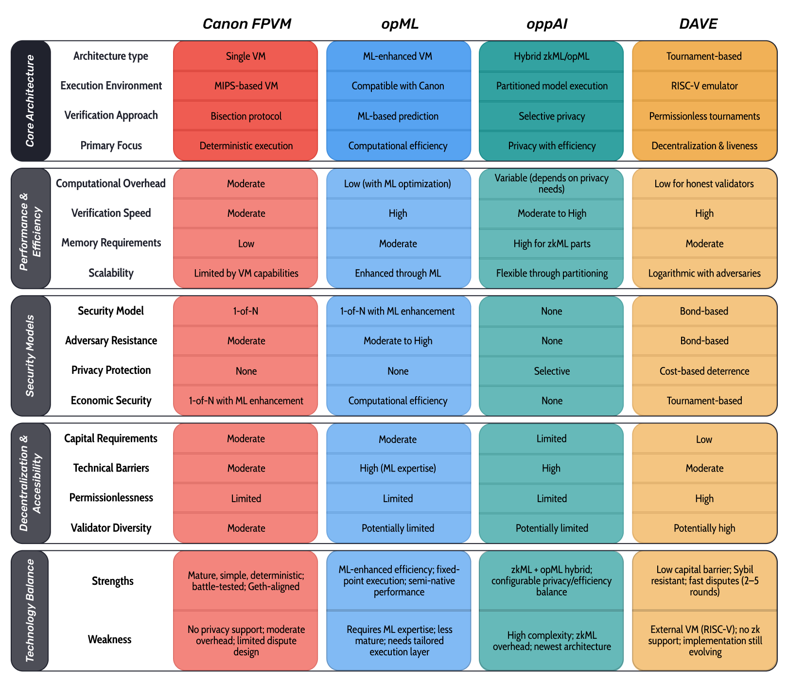

# Milestone 2: FPVM Comparative Analysis

Originally titled **“2. Research on oppAI compatibility with the OP Stack,”** this milestone was later renamed to **“2. FPVM Comparative Analysis”** to better reflect the broader scope of our investigation. While the initial focus centered on **oppAI** and **opML**, our research expanded to include a full evaluation of **Optimism’s Canon FPVM** and **Cartesi’s DAVE**—both foundational and alternative approaches to fault proof architecture. This milestone presents a structured comparison of these four mechanisms, each tackling a different facet of the fault proof challenge, from deterministic execution and computational efficiency to privacy-preserving inference and decentralized dispute resolution.

Our primary objective is to analyze the tradeoffs in architecture, performance, security, and accessibility, and to propose integration pathways that strengthen the OP Stack’s fault proof system. This comparative research is intended not only as a conceptual evaluation but as a **blueprint for the OPcity prototype**, guiding future technical contributions to the OP Stack and aligning with the broader mission of building decentralized, modular, and verifiable infrastructure.

## **Core Architecture Comparison**

These systems represent three main verification paradigms. Optimism’s Canon FPVM relies on deterministic execution using a lightweight MIPS VM and binary bisection games. opML enhances this by integrating ML-based prediction to streamline verification. oppAI extends opML by adding selective zkML to protect privacy-sensitive components. Meanwhile, Cartesi’s DAVE diverges with a tournament-based architecture running on a full RISC-V emulator, prioritizing permissionless participation and Sybil resistance.

1. **Execution Environment**:
    - Optimism uses a MIPS-based VM for its simplicity and determinism
    - Cartesi employs a more powerful RISC-V emulator with two-layer implementation
    - opML works within existing VMs but adds ML capabilities
    - oppAI partitions execution between zkML and opML components
2. **Verification Approach**:
    - Optimism uses a traditional bisection protocol to narrow disputes
    - opML enhances verification with machine learning predictions
    - oppAI selectively applies zero-knowledge proofs for privacy-critical components
    - DAVE implements tournament-style verification to improve decentralization
3. **State Representation**:
    - All systems use Merkle trees for state representation, but with different implementations
    - Optimism and Cartesi focus on complete state transitions
    - opML and oppAI allow for partial verification of specific components

<figure>
  
</figure>

## **Performance and Efficiency Analysis**

While Canon FPVM sets a reliable baseline, its simplicity constrains scalability. opML reduces computational load via ML-enhanced execution, offering performance improvements without altering core architecture. oppAI introduces more variable overhead due to zkML, but allows developers to balance privacy and efficiency by configuring which sub-models require zero-knowledge proofs. DAVE’s structure ensures that honest participants incur low costs even in worst-case scenarios, making it well-suited for decentralized validator environments.

1. **Computational Requirements**:
    - Optimism's Canon requires full execution of disputed transactions
    - opML reduces computation through predictive models
    - oppAI optimizes by applying heavy computation only to privacy-sensitive parts
    - DAVE minimizes honest validator costs regardless of adversary resources
2. **Verification Time**:
    - Optimism's verification time scales with computation complexity
    - opML potentially accelerates verification through ML predictions
    - oppAI's verification time varies based on privacy requirements
    - DAVE guarantees resolution in 2-5 challenge periods regardless of adversary count
3. **Resource Asymmetry**:
    - DAVE provides the strongest resource asymmetry, giving honest validators exponential advantage
    - opML offers efficiency advantages through prediction
    - oppAI balances resources based on privacy needs
    - Optimism requires similar resources for all participants

## **Security Model Comparison**

All systems adhere to a 1-of-N honesty assumption—where a single honest verifier can enforce correctness. Canon and opML rely on traditional bond-based incentives. oppAI innovates by making attack costs dynamic, based on the proportion of the model using zkML. DAVE provides the most robust Sybil resistance and censorship resilience, minimizing reliance on high bonds by leveraging logarithmic dispute scaling and permissionless participation.

1. **Adversary Models**:
    - All systems use a 1-of-N security model where a single honest validator can enforce correctness
    - DAVE specifically addresses Sybil attacks through its tournament structure
    - oppAI adds privacy considerations to the security model
    - opML potentially improves detection of sophisticated attacks
2. **Economic Security**:
    - Optimism relies on bonds to ensure honest behavior
    - DAVE minimizes bond requirements while maintaining security
    - oppAI introduces variable costs based on privacy needs
    - opML maintains the economic model of its host system
3. **Censorship Resistance**:
    - DAVE explicitly addresses censorship, requiring censorship for more than one challenge period to break consensus
    - Other systems have less explicit censorship resistance guarantees

## **Decentralization and Accessibility**

Cartesi’s DAVE leads in terms of decentralization, with its low capital requirements and open validator access encouraging broader participation. Canon maintains moderate requirements, while opML and oppAI, despite their technical innovation, face participation challenges due to higher complexity and expertise requirements—particularly in machine learning and zero-knowledge systems.

1. **Capital Requirements**:
    - DAVE explicitly minimizes capital requirements (3 ETH vs. 3,600 ETH for Arbitrum's BoLD)
    - Optimism has moderate requirements
    - oppAI and opML inherit requirements from their base systems
2. **Technical Barriers**:
    - opML and oppAI introduce additional complexity through ML components
    - DAVE and Optimism have more straightforward verification processes
    - All systems require some technical expertise to participate effectively
3. **Validator Diversity**:
    - DAVE's low capital requirements potentially enable greater validator diversity
    - ML-based approaches might limit participation to those with ML expertise
    - All systems benefit from diverse validator sets for security

## **Integration Opportunities and Synergies**

Several integration pathways could merge the best features of these mechanisms into a next-generation fault proof system. For example, pairing Canon FPVM with opML’s prediction layer could optimize dispute prioritization without modifying the core VM. Adding oppAI’s privacy-preserving zkML submodules would extend Canon’s use cases to sensitive applications like AI oracles. Most transformative would be adopting DAVE’s tournament-style dispute resolution, enabling permissionless participation with lower bonds and faster resolution—making Canon-based fault proofs more robust and accessible.

More ambitious would be a **multi-system integration**—combining Canon’s deterministic foundation, opML’s efficiency, oppAI’s privacy, and DAVE’s decentralization. While technically demanding, this could yield a modular fault proof architecture tailored for emerging rollup demands, from governance security to machine-learning-powered agents

### **Optimism Canon FPVM + opML**

**Potential Integration**:

- Enhance Canon FPVM with ML-based prediction for faster verification
- Use ML to identify likely dispute points before full verification
- Maintain Canon's deterministic execution while improving efficiency

**Implementation Approach**:

- Add ML prediction layer to Canon without modifying core execution
- Train models on historical dispute patterns
- Use predictions to prioritize verification steps

**Benefits**:

- Faster dispute resolution
- Reduced computational overhead
- Maintained security guarantees

### **Optimism Canon FPVM + oppAI**

**Potential Integration**:

- Add privacy capabilities to Canon through selective zkML
- Partition sensitive computations for privacy protection
- Maintain efficiency for non-sensitive operations

**Implementation Approach**:

- Implement model partitioning within Canon
- Add zkML verification for privacy-critical components
- Develop clear interfaces between zkML and opML parts

**Benefits**:

- Enhanced privacy for sensitive operations
- Maintained efficiency for standard operations
- New use cases for private computation

### **Optimism Canon FPVM + Cartesi's DAVE**

**Potential Integration**:

- Adopt DAVE's tournament approach for Canon's dispute resolution
- Maintain Canon's execution environment while improving the challenge mechanism
- Reduce capital requirements for participation

**Implementation Approach**:

- Implement tournament-style challenges within Optimism's framework
- Adapt Canon to work with logarithmic dispute resolution
- Maintain compatibility with existing Optimism deployments

**Benefits**:

- Improved decentralization through lower capital requirements
- Enhanced resistance to Sybil attacks
- Faster dispute resolution

### **Multi-System Integration**

**Comprehensive Approach**:

- Combine elements from all four systems for a next-generation fault proof system
- Use Canon's deterministic execution as the foundation
- Enhance with opML's efficiency improvements
- Add oppAI's privacy capabilities for sensitive operations
- Implement DAVE's tournament structure for dispute resolution

**Implementation Challenges**:

- Complexity of combining multiple novel approaches
- Ensuring security guarantees are maintained
- Managing the increased technical barriers to participation

**Potential Benefits**:

- Best-in-class performance across all metrics
- Support for diverse use cases including privacy-sensitive applications
- Improved accessibility and decentralization

## Conclusion

While Canon FPVM provides the deterministic foundation for state validation in the OP Stack, opML introduces machine learning-driven optimizations that reduce overhead and improve execution speed. oppAI extends this with a hybrid zkML/opML approach that brings selective privacy to verifiable AI computations, and DAVE’s tournament-based protocol raises the bar for decentralization, liveness, and Sybil resistance.

Rather than selecting a single solution, our analysis supports a modular integration of these technologies as the optimal path forward. By synthesizing their complementary strengths and mitigating their individual tradeoffs, we envision a **next-generation fault proof system** that is efficient, private, accessible, and secure—one capable of meeting the evolving needs of Ethereum rollups and complex decentralized applications.

This vision forms the **design framework for the OPcity prototype**, a research-driven implementation of an advanced fault proof system built on the OP Stack. Our blueprint is structured across four interoperable layers:

1. **Execution Layer**: Modified Canon FPVM with RISC-V compatibility
    - Deterministic execution environment based on Canon FPVM
    - Extended instruction set supporting both MIPS and RISC-V operations
    - Unified state representation using enhanced Merkle trees
    - Compatibility layer for existing applications
2. **Intelligence Layer**: ML-enhanced prediction and optimization engine
    - Predictive models for identifying potential dispute points
    - Optimization algorithms for efficient execution paths
    - Lightweight DNN library for in-VM machine learning
    - Training framework for continuous improvement
3. **Privacy Layer**: Selective zero-knowledge proof system
    - Model partitioning framework for separating privacy-sensitive components
    - Zero-knowledge proof generation for protected components
    - Efficient verification of ZK proofs on-chain
    - Economic security model for privacy protection
4. **Verification Layer**: Tournament-based dispute resolution system
    - Permissionless tournament structure for dispute resolution
    - Logarithmic scaling with adversary count
    - Low capital requirements for participation
    - Guaranteed dispute resolution timeframes

Together, these layers interact through clean, modular interfaces, enabling phased integration and future extensibility. This composable approach aligns with the principles of the OP Stack and supports OPcity’s long-term goal: to contribute a production-ready, decentralized fault proof architecture that strengthens Ethereum’s rollup ecosystem and expands its utility to civic infrastructure, public goods, and autonomous organizations.