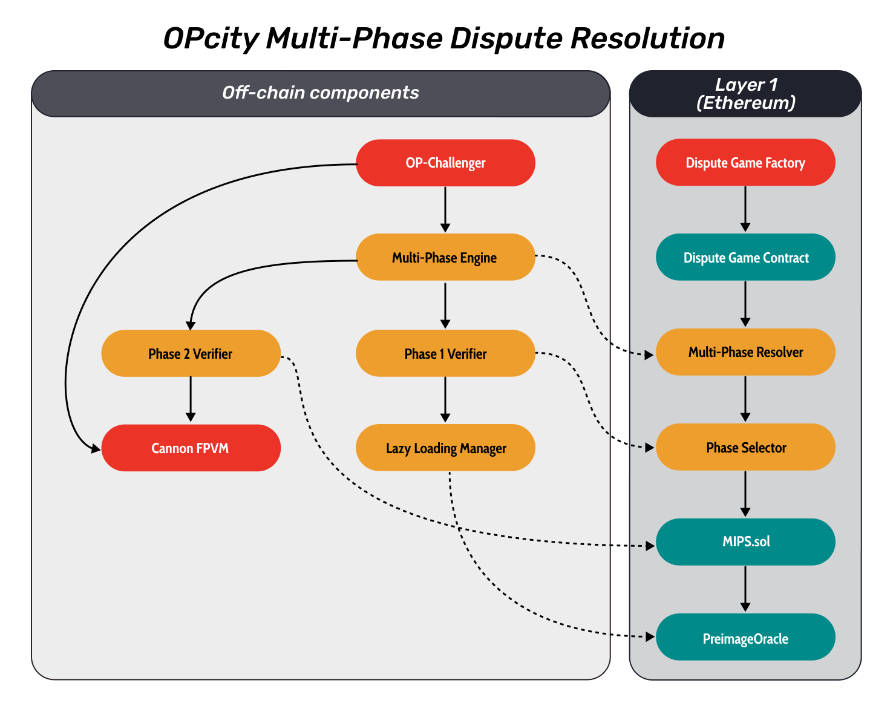
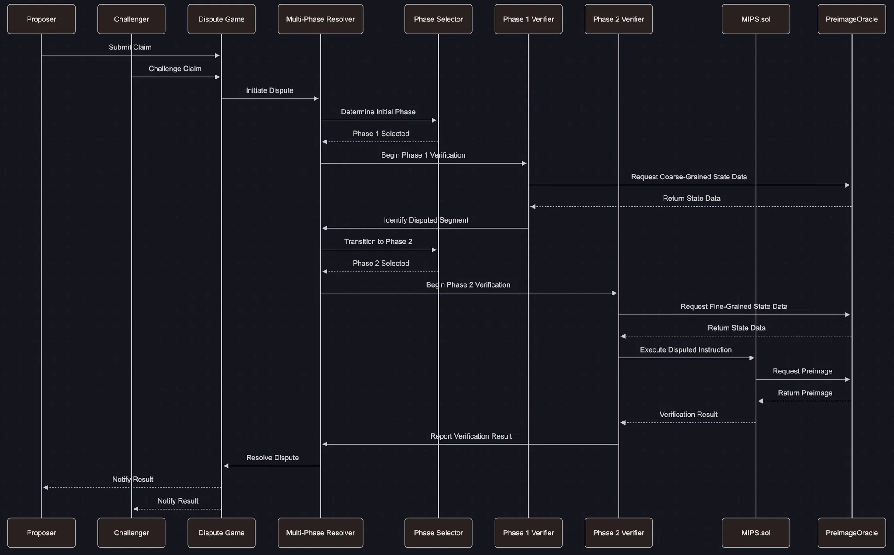
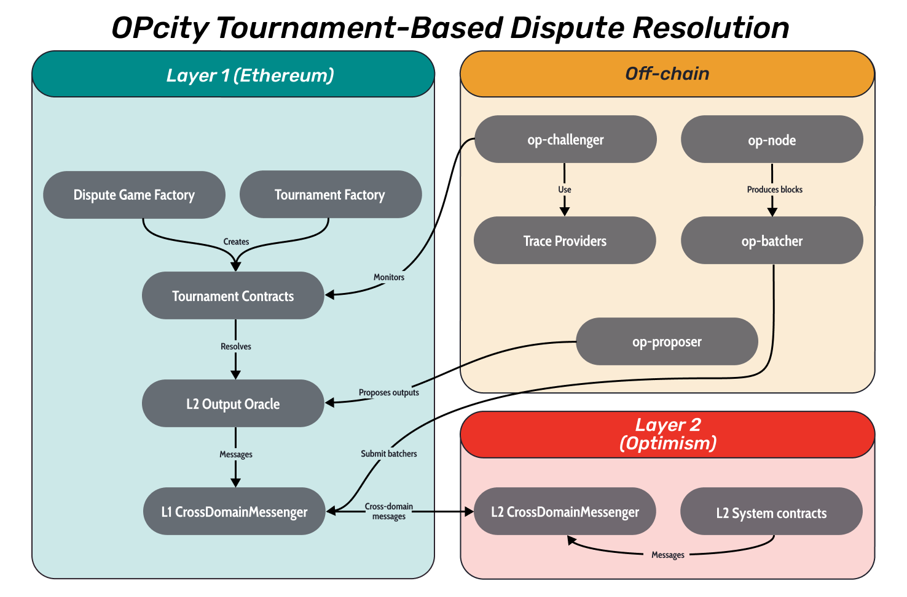
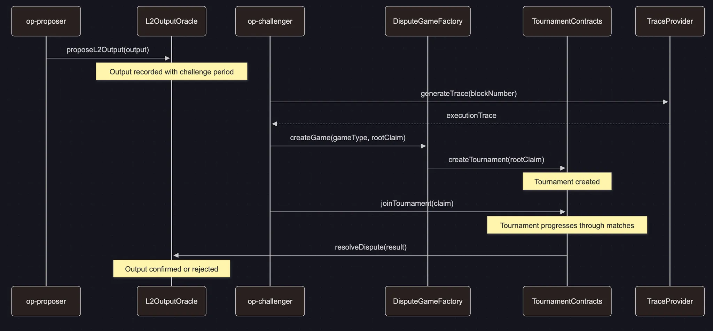

# 1. OPcity overview

This *Development Report* documents the engineering process behind the OPcity Fault Proofs system, a functional prototype implemented on the OP Stack. The system architecture integrates modular components influenced by state-of-the-art approaches from projects such as Canon FPVM, opML, and DAVE.

The initial system design was structured around four interoperable layers: Execution, Intelligence, Privacy, and Verification. Each layer introduced specialized capabilities, ranging from RISC-V-compatible deterministic execution and predictive optimization to selective zero-knowledge privacy and adversarial dispute resolution. However, for this development phase, the implementation scope was deliberately constrained to a minimal but impactful subset of eight features that could be tested, validated, and benchmarked in real environments.

While the Privacy Layer was originally conceived to introduce zero-knowledge proof support and model partitioning, its implementation has been deferred to a future phase. Similarly, the planned extension of the Execution Layer to support RISC-V alongside MIPS remains a future milestone, intended to enhance compatibility and performance across diverse virtual machine environments. This decision helps maintain focus on verifiable system correctness and core protocol stability.

The OPcity project started as the exploration to integrate machine learning within the fault proof system. Drawing inspiration from opML’s multi-phase fraud-proof mechanism and Canon FPVM’s interactive dispute model, we aimed to investigate whether ML inference could enhance dispute resolution by introducing adaptive state transitions or predictive optimizations.

However, our research and experimentation revealed that no current ML component meaningfully improves the core performance or correctness of fault proof systems. As a result, no machine learning-specific features from opML were implemented in this phase. Nevertheless, structural enhancements introduced by opML—such as the multi-phase dispute resolution and the lazy loading manager—were retained and integrated into the OPcity prototype. These features contribute to improved modularity and computational efficiency without requiring probabilistic or non-deterministic processes. The computational complexity, unpredictability, and lack of deterministic guarantees in ML models conflict with the strict reproducibility requirements of fault-proof execution environments.

Our evaluation found that our opML-based implementation is not strictly superior to existing fault proof systems. However, it offers meaningful trade-offs in modularity, granularity, and execution strategy, making it a compelling experimental path. As part of this exploration, we focused specifically on multi-phase fault proof systems inspired by both opML and DAVE. As a result, the OPcity prototype incorporates two distinct multi-phase dispute resolution mechanisms—each fully compatible with the current OP Stack—that demonstrate different approaches to layered dispute workflows and verifier coordination.

## Original Proposed Modifications

The initial OPcity framework proposed a unified fault proof system capable of integrating deterministic machine learning inferences directly into the Canon FPVM architecture. While these proposed modifications were not implemented due to the incompatibility of ML with the deterministic constraints of fault proof systems, they provided a valuable conceptual foundation for assessing system’s extensibility. 

- **Memory Management and System Modeling**
    
    Proposed extensions for memory management, such as ML-related batching, caching, and dynamic loading, were not pursued due to the lack of a compelling ML integration path. The FPVM continues to employ deterministic memory structures consistent with its canonical specification.
    
- **Syscalls and I/O Extensions**
    
    No additional syscalls or I/O structures for ML model interaction were added. The current system maintains compatibility with standard OP Stack data pipelines and syscall interfaces.
    
- **Formal Verification and Error Propagation**
    
    With ML components excluded, formal verification efforts focused exclusively on the deterministic and adversarial game logic of the FPVM. This narrowed scope allowed for more rigorous validation of dispute behavior and reduced the complexity of exception handling.
    

## **Implemented Modifications**

The actual modifications in the OPcity Stack prototype represent a pragmatic adaptation of the original design objectives into features compatible with the OP Stack fault proof pipeline. These features aim to extend execution scalability, dispute resolution flexibility, and performance optimizations, all while preserving determinism and reproducibility.

At the core of the system is **Optimism’s Canon FPVM**, which functions as the base execution and dispute environment. All other enhancements, including the multi-phase dispute resolution mechanisms inspired by opML and DAVE, are layered on top of this canonical foundation to ensure compatibility and reusability within the OP Stack.

### **Base Layer from Optimism’s Canon FPVM**

1. **OP-cannon:** The core execution engine responsible for running and verifying the Layer 2 transition state using the Canon FPVM framework.
2. **OP-challenger:** The dispute mechanism client that interacts with the OP-cannon by initiating challenges against invalid state transitions during fault proof validation.
3. **Multi-threaded dispute resolution:** An extension that enables concurrent processing of multiple disputes within the Canon FPVM environment, improving throughput and enabling parallel challenge game execution.

### **opML inspired Multi-Phase mechanism**

1. **Multi-phase dispute resolution:** A layered challenge mechanism implemented over the Canon FPVM that segments disputes into coarse-grained and fine-grained phases, reducing verification complexity while maintaining deterministic execution.
2. **Lazy loading manager:** A memory optimization component that loads data on demand rather than upfront, reducing memory consumtion and improving efficiency, particularly during Phase 1 state bisection.

### **DAVE inspired Tournament-based mechanism**

1. **Tournament structure:** A permissionless, hierarchical challenge process layered atop Canon FPVM, where disputes escalate through succesive rounds before reaching final resolution.
2. **Parallel dispute games:** Enables multiple independent fault dispute games to run simultaneously within the same underlying Canon environment, enhancing scalability and reducing bottlenecks.
3. **Incentive mechanisms:** Incentives economic alignment to ensure honest behavior across dispute participants, through rewards and penalties schemes tied to correct or incorrect resolution outcomes.
4. **Cross-architecture trace verification (RISC-V support):**
    
    The DAVE implementation introduces a modular off-chain trace system that supports both MIPS (used by Cannon) and RISC-V (used in Cartesi-style VMs). This is achieved through a unified interface defined in trace_provider.go, with RISC-V trace generation implemented in riscv_trace_provider.go. These components allow the op-challenger to produce execution traces and witness proofs for either architecture, enabling **architecture-agnostic dispute resolution** within the same tournament flow. The system is designed to be extendable for future virtual machines, laying the groundwork for flexible, future-proof fraud proof systems in rollup ecosystems.
    

### **Future Considerations: Privacy**

The Privacy Layer, initially outlined in the project blueprint, is intended to incorporate selective zero-knowledge proofs and model partitioning to enable protected computations. These features will improve the system’s capacity to handle sensitive inputs and outputs in a verifiable yet private manner. This upgrade will enable the OPcity FPVM broader compatibility with computation models and aligns with emerging trends in modular virtual machines.

The following sections of this report detail the development process, technical architecture, and testing methodology. This report serves as both a record of implementation and a contribution to the broader rollup ecosystem, offering insights for future work on scalable and modular fault proof systems.

# 2. OPcity’s Fault Proof system design

This section outlines a system design for enhancing Optimism’s fault proof system by integrating two complementary dispute resolution mechanisms: a **multi-phase protocol inspired by opML** and a **tournament-based model adapted from Cartesi’s DAVE. Notably,** both ~~~~implemented without any machine learning components or native execution dependencies. This combined approach aims to improve the efficiency, scalability, and resource utilization of Optimism’s fault proof architecture while preserving its core security guarantees.

Optimism’s current system relies on a single-phase bisection protocol within the Cannon Fault Proof Virtual Machine (FPVM), which can become resource-intensive and suboptimal ~~~~for resolving ~~~~complex or large-scale disputes. To address this limitation, OPcity introduces a **multi-phase resolution framework** that segments the dispute process  into distinct phases—beginning with coarse-grained segment validation and narrowing down to instruction-level verification only when necessary. This structure improves modularity and allows partial verification paths to be short-circuited when possible~~,~~ reducing redundant onchain computation.

In parallel, OPcity incorporates a **tournament-style resolution layer** inspired by DAVE. This design allows multiple independent dispute games to evolve concurrently and escalate through structured arbitration rounds. Disputes are resolved via adversarial interactions, where honest participants are incentivized, while dishonest behavior is penalized through staking and penalties. The tournament structure promotes asynchronous convergence, and enables high-throughput dispute resolution across a decentralized verifier network.

Both the multi-phase and tournament-based mechanisms are layered atop the existing Cannon FPVM environment and remain fully compatible with OP Stack components such as the Dispute Game Protocol and the Preimage Oracle. Together, these enhancements provide a scalable and modular framework for fault proofs, with well-defined integration points and implementation milestones aligned with OP Stack evolution.

## **System Goals**

The primary objetives of this system design are to:

1. Improve the efficiency of dispute resolution in Optimism's fault proof system
2. Reduce computational and memory overhead during the dispute resolution
3. Enhance scalability for complex state transitions
4. Maintain or improve security guarantees
5. Ensure seamless compatibility with the existing OP Stack components

## Proposed OPcity Architecture

The OPcity architecture extends the foundational components of Optimism’s fault proof system by integrating two advanced dispute resolution mechanisms: a **multi-phase challenge protocol inspired by opML** and a **tournament-based resolution model adapted from Cartesi’s DAVE**. Both mechanisms are built atop the Canon FPVM and maintain fully compatiblle with the OP Stack’s core infrastructure, including the Dispute Game Protocol, Preimage Oracle, and Cannon verifier. 

While both mechanisms share the same core goals—modular verification, efficient state narrowing, and decentralized resolution—they with well-defined integration points and implementation milestones aligned with OP Stack in dispute granularity, execution path, and verifier interaction.

The opML-inspired mechamism segments disputes into hierarchical verification phases, enabling progressively granular resolution. In contrast, the DAVE mechanism models dispute resolution as a permissionless tournament, where multiple challenges can evolve and converge asynchronously. Together, these mechamisms form a modular and extensible architecture for fault proof verification, capable of addressing a wide range of dispute patterns in high-throughput rollup environments.

### **Optimism's Fault Proof System**

Optimism's current fault proof system employs a modular design centered around the Cannon Fault Proof Virtual Machine (FPVM) and a dispute game protocol. The key components include:

1. **Fault Proof Program (FPP)**
    
    The FPP is responsible for executing and verifying the correctness of state transitions. It identifies discrepancies between the claimed and actual states, serving as the core logic for fault detection.
    
2. **Cannon FPVM**
    
    Cannon is the default FPVM used in Optimism's dispute resolution process. It emulates a minimal Linux environment on the MIPS32 architecture to generate execution traces and witness proofs for disputed instructions. It consists of:
    
    - **Onchain `MIPS.sol`**: A Solidity-based verifier that executes a single MIPS instruction to confirm the correctness of an offchain proof.
    - **Offchain `mipsevm`**: A Go based emulator of the MIPS environment, capable of producing proofs for any instruction.
3. **Dispute Game Protocol**
    
    The current dispute game protocol involves a single-phase bisection process where disputes over state transitions are bisected down to a single instruction. The process includes:
    
    - Identifying the root instruction of disagreement via a bisection game.
    - Generating a witness proof containing all data needed for onchain execution.
    - Executing the instruction onchain in `MIPS.sol` to verify the result.
4. **PreimageOracle**
    
    The PreimageOracle interface maps hash-based claims to their corresponding preimages, which are essential for validating the correctness of state transitions. It supports multiple key types and supplies required preimages for hash claims used in dispute games.
    

### **opML inspired Multi-Phase mechanism**

The opML framework introduces a multi-phase dispute resolution protocol that segments the verification process into multiple stages, each optimized for different computational environments and data granularities. The OPcity design integrates:

1. **Phase Segmentation**
    
    The dispute resolution process is segmented into multiple phases:
    
    - **Phase 1**: Performs coarse-grained verification of large computation segments.
    - **Phase 2**: Conducts fine-grained analysis to isolate the specific erroneous step within a smaller, disputed segment.
2. **Enhanced Bisection Protocol**
    
    An iterative process that progressively narrows the disputed computation segment:
    
    - In Phase 1, the verifier challenges large computation chunks.
    - When a discrepancy is detected, the challenge is refined to a smaller segment.
    - The process continues until the dispute is localized to a single instruction or micro-operation
3. **State Transition and Merkle Trees**
    
    The system models computation as a state transition function, with Merkle trees representing the VM states at each step, enabling efficient verification of complex state transitions.
    

The diagram below ilustrates the interaction between onchain and off-chain components within the **opML-inspired Multi-Phase mechanism** of the OPcity architecture. It highlights how different modules coordinate across trust boundaries to enable scalable, deterministic, and phase-separated fault proofs.

**Color Key:**

- 🟥 **Red components**: Core components from **Optimism’s Canon FPVM**
- 🟦 **Blue components**: **Modified components** adapted to support multi-phase logic
- 🟨 **Yellow components**: **New components** introduced by the OPcity implementation

<figure>
  
</figure>

The following sequence diagram presents the complete procedural flow of a dispute within the **opML-inspired Multi-Phase system** in OPcity. It complements the component-level architecture diagram by detailing message passing, verification boundaries, and phase transitions, while aligning with the canonical rules defined in the protocol specification.

<figure>
  
</figure>

**Multi-phase Dispute Resolution Flow:**

**1. Dispute Initiation**

- The **Proposer** submits a state transition claim.
- The **Challenger** submits a challenge against the claim, triggering the creation of a DisputeGame instance.
- The Multi-Phase Resolver initializes the dispute process and queries the Phase Selector.
1. **Phase 1: Coarse-Grained Verification**
    - If the Phase Selector determines the dispute spans a large segment, **Phase 1 is selected**.
    - The Phase 1 Verifier begins by requesting **coarse-grained state data** from MIPS.sol and validating it using Merkle tree proofs.
    - Claims and challenges in this phase follow the format of:

```
struct Phase1Claim {
    bytes32 stateRoot;
    uint256 startIndex;
    uint256 endIndex;
    bytes32 claimHash;
}
```

```
struct Phase1Challenge {
    uint256 challengeIndex;
    bytes32 expectedStateRoot;
    bytes32 challengerBond;
}
```

- The verifier performs **recursive bisection** of the disputed range. At each step, Merkle proofs are exchanged, and state roots are verified.
- Once a segment of disagreement is identified and narrowed below the **PHASE_TRANSITION_THRESHOLD**, the system prepares for Phase 2.
1. **Transition to Phase 2**
    - The Multi-Phase Resolver invokes transitionToPhase2(), preserving the current state context and segment boundaries.
    - The Phase Selector updates the dispute state and notifies relevant components of the phase shift.

```
transitionToPhase2(disputeId, segmentStart, segmentEnd, segmentStateRoot);
```

This ensures:

- State roots and segment boundaries are preserved.
- Bonds and roles remain intact.
- Phase context is correctly recorded.
1. **Phase 2: Fine-Grained Verification**
    - The Phase 2 Verifier requests **fine-grained state data** and performs bisection at the instruction level.
    - Claims and challenges in this phase follow:

```
struct Phase2Claim {
    bytes32 preStateRoot;
    bytes32 postStateRoot;
    uint256 instructionIndex;
    bytes32 witnessHash;
}
```

```
struct Phase2Challenge {
    uint256 instructionIndex;
    bytes32 expectedPostStateRoot;
    bytes32 challengerBond;
}
```

- Once the disputed instruction is isolated, it is executed using MIPS.sol, with the result compared to the claimed post-state.
- The PreimageOracle may be queried to resolve any missing hashed values used in the instruction.

```
(success, postStateRoot) = MIPS.executeInstruction(preStateRoot, instructionIndex, witnessData);
```

- A match between computed and claimed state results in **Proposer victory**; otherwise, the **Challenger prevails**.

**5. Dispute Resolution**

- Once a result is obtained, it is submitted to the Multi-Phase Resolver.
- The Dispute Game contract emits a final result event and notifies both the Proposer and Challenger of the outcome.

**opML Multi-Phase Mechanism: Trade-offs Summary**

The **opML-inspired multi-phase dispute resolution** introduces notable improvements in scalability, modularity, and efficiency. However, these benefits come with trade-offs that must be carefully managed to maintain system integrity, security, and OP Stack compatibility.

 **Performance vs. Security**

- **✅ Improved performance** through selective execution avoids full VM runs in every dispute.
- **⚠️ Trade-off:** Increased complexity in handling phase transitions and state consistency.
- **📌 Mitigation:** Formal verification of transition logic and rigorous testing of lazy-loaded state segments ensures security without sacrificing speed.

**Complexity vs. Efficiency**

- **✅ Modular components** and memory optimization (via Lazy Loading Manager) improve efficiency and resource use.
- **⚠️ Trade-off:** Increased system complexity and higher integration/testing burden.
- **📌 Mitigation:** Interfaces are clearly defined, with strict separation of concerns and exhaustive unit/integration testing per phase.

**Compatibility vs. Innovation**

- **✅ Maintains compatibility** with core OP Stack components (e.g., Dispute Game, Preimage Oracle, MIPS.sol).
- **⚠️ Trade-off:** Limits the scope of optimization and innovation when working within legacy structures.
- **📌 Mitigation:** New components (e.g., MultiPhaseResolver, PhaseSelector) were designed for minimal disruption, with migration paths and interface-based extensibility

### **DAVE’s Tournament-Based Dispute Resolution**

The DAVE (Decentralized Adversarial Verification Engine) framework introduces a scalable, permissionless tournament model for fault proof resolution. Unlike bisection-based protocols, DAVE enables multiple, concurrent challenge games to evolve in parallel through modular arbitration rounds. Key components of this approach include:

1. **Tournament Structure**
    
    Dispute resolution is structured as a multi-round tournament, where participants engage in a controlled structured escalation:
    
    - Initial claims are submitted and stored onchain.
    - Challengers may initiate parallel dispute branches by submitting counter-claims.
    - Rounds proceed iteratively until only one valid dispute path remains, which determines the final result.
2. **Parallel Dispute Games**
    
    DAVE supports simultaneous execution of multiple independent fault proof games:
    
    - Each dispute instance runs in isolation, reducing contention.
    - A shared arbitration layer tracks progress and enforces round-based resolution.
    - Disputes converge asynchronously toward resolution without global coordination bottlenecks.
3. **Incentivized Resolution Layer**
    
    The protocol integrates a game-theoretic mechanism to ensure honest behaviour:
    
    - Participants are required to stake collateral when submitting or challenging claims
    - Honest actors are rewarded upon successful resolution
    - Malicious or incorrect claims result are penalized via slashing and exclusion from future participation
4. **Modular Dispute Contracts**
    
    The dispute coordination logic is handled through composable smart contracts:
    
    - Tracks state progression across rounds.
    - Manages dispute game lifecycles and challenge resolution outcomes.
    - Designed to plug into existing OP Stack protocols without requiring structural changes
5. **RISC-V Trace Provider Support**
    
    DAVE off-chain components introduce a **RISC-V-compatible trace and proof generation**, enabling architecture-agnostic verification ~~flows~~:
    
    - riscv_trace_provider.go delivers execution traces, witness proofs, and state transitions for RISC-V-based disputes
    - trace_provider.go abstracts architecture details, enabling unified interaction with MIPS and RISC-V traces
    - types.go defines standardized interfaces and types to allow smooth emulator interoperability and system-wide extensibility
    
    This implementation allows the OPcity-DAVE module to support cross-architecture tournament-style fraud proof games, paving the way for more expressive and future-proof virtual machine support within the fault dispute resolution. 
    
    The diagram below visualizes the **integration of the DAVE tournament-based dispute resolution system** into the broader OP Stack architecture. It illustrates how newly implemented components—such as Tournament Contracts, the Tournament Factory, and the off-chain Trace Providers—interact across Ethereum Layer 1, the OP Stack’s off-chain infrastructure, and Layer 2.
    

<figure>
  
</figure>

The following sequence diagram illustrates the lifecycle of a dispute within the **DAVE (Decentralized Adversarial Verification Engine)** system, as implemented in the OPcity prototype. It shows how a proposed L2 output can be challenged via a tournament game deployed onchain, how execution traces are retrieved off-chain, and how dispute matches are processed until a final result confirms or rejects the output.

<figure>
  
</figure>

**Tournament-based Dispute Resolution Flow:**

**1. L2 Output Proposal**

The op-proposer submits a state root claim via proposeL2Output(output) to the L2OutputOracle. This iniates the challenge period:

```
function proposeL2Output(bytes32 outputRoot, uint256 l2BlockNumber, ... ) external {
    require(_withinChallengeWindow(l2BlockNumber), "Challenge window closed");
    outputs.push(OutputProposal({
        outputRoot: outputRoot,
        ...
    }));
}
```

**2. Challenge and Game Initialization**

If challenged, the op-challenger initiates a dispute:

```
function createGame(GameType gameType, bytes32 rootClaim) external returns (address) {
    address game = _deployGame(gameType, rootClaim);
    emit GameCreated(gameType, rootClaim, game);
    return game;
}
```

To generate the trace:

```
// From trace_provider.go
func (p *RISCTraceProvider) GenerateTrace(blockNumber uint64) ([]Instruction, error) {
    ...
    return trace, nil
}
```

Then the tournament is created onchain:

```
function createTournament(bytes32 rootClaim) external onlyFactory {
    ...
    tournaments[rootClaim] = Tournament({ ... });
    emit TournamentCreated(rootClaim);
}
```

**3. Tournament Progression**

Participants use joinTournament(claim) to engage in the bracket:

```
function joinTournament(bytes32 claim) external payable {
    require(msg.value == BOND_AMOUNT, "Invalid bond");
    _addPlayerToBracket(msg.sender, claim);
}
```

Tournament logic enforces match progression:

```
function resolveMatch(uint256 matchId) external {
    Match storage m = matches[matchId];
    bytes32 winner = _evaluateMatch(m.claimA, m.claimB);
    m.winner = winner;
    emit MatchResolved(matchId, winner);
}
```

**4. Dispute Resolution**

Once the tournament concludes:

```
function resolveDispute(bytes32 result) external onlyTournament {
    Output storage o = outputs[dispute.outputIndex];
    if (result == o.outputRoot) {
        o.status = Confirmed;
    } else {
        o.status = Rejected;
    }
    emit OutputResolved(dispute.outputIndex, o.status);
}
```

**Supporting Off-Chain Components**

The DAVE system depends on modular, architecture-agnostic off-chain services:

- trace_provider.go: Supplies MIPS and RISC-V traces.
- agent.go, manager.go, player.go: Automate agent actions and tournament lifecycle.
- match_monitor.go: Optimizes match selection and monitoring.
- riscv_trace_provider.go: Generates step-level traces for Cartesi-style VM execution.

# 3. OPcity Implementation

The third milestone of the OPcity project delivers a fully functional prototype that integrates two complementary fault proof mechanisms into the OP Stack: a **multi-phase dispute resolution system inspired by opML** and a **tournament-based resolution framework adapted from Cartesi’s DAVE**. This implementation extends the canonical **Cannon FPVM architecture** while preserving deterministic execution and protocol compatibility.

While the full documentation, system design files, and implementation artifacts are maintained in the [OPcity repository](https://github.com/zenbitETH/OPcity), it was necessary to fork the [Optimism monorepo](https://github.com/zenbitETH/optimism) in order to enable core fault proof components—such as the dispute game contracts, FPVM interfaces, and challenger logic—and to build functional extensions fully compatible with the OP Stack. This approach ensured that both mechanisms could be developed, tested, and benchmarked in a real-world rollup execution environment without compromising modularity or core system integrity.

Together, they showcase how opML’s phase-based refinement and DAVE’s economically incentivized tournaments can coexist within a cohesive protocol, enabling **scalable, parallel, and architecture-agnostic fault resolution**. All components were developed with strict attachment to **reproducibility, determinism, and OP Stack integration standards**.

## Milestone 3: OPcity Proof of Concept

### [Feature/opML] Multi-phase Dispute Resolution

**Closed Issues / Pull Request** 

**Zenbit/OPcity:**

- [[opML] Multi-phase Dispute resolution #38](https://github.com/zenbitETH/OPcity/issues/38)

 **Zenbit/Optimism:**

- [[opML] Multi-phase Dispute resolution #1](https://github.com/zenbitETH/optimism/pull/1/files)

**Files changed on Zenbit/Optimism**

1. [op-challenger/game/fault/types/position.go](https://github.com/zenbitETH/optimism/pull/1/files#diff-f57b7285cf271035289fc51f2ee786e6fcd4339fb05b09f303925e9ce6b309f4)
    
    The commit exports the parent method of the Position type by renaming it from `parent()` to `Parent()`, and updates all internal references to use the new name. In Go language, this enables other packages access to the parent position of a Position instance by make it public the access.
    
2. [packages/contracts-bedrock/interfaces/dispute/ICanonFPVM.sol](https://github.com/zenbitETH/optimism/pull/1/files#diff-18e0d7f015a0c947aaa17d18a0485467893c3959c1d9fe3a38bb290bca4c374b)
    
    `ICanonFPVM.sol` introduces a critical interface for handling instruction, execution and verification in the fault proof mechanism, forming the foundation for dispute resolution logic in the protocol.
    
3. [packages/contracts-bedrock/interfaces/dispute/IMultiPhaseResolver.sol](https://github.com/zenbitETH/optimism/pull/1/files#diff-f8f121cbca8d9722165f5b0c62b02bd38f2788dfa8e4b3bcd0c47869ade5f363)
    
    `IMultiPhaseResolver.sol` is an interface for managing, tracking, and resolving disputes across a two-phase process. It includes all necessary protocol events and function signatures for managing multi-phase dispute resolution, for robust, onchain challenge-response games.
    
4. [packages/contracts-bedrock/interfaces/dispute/IPhaseSelector.sol](https://github.com/zenbitETH/optimism/pull/1/files#diff-bc6e4866dbd3e1945b8bd559e16c18025ae34ab3c3c529e83482f9581b70baef)
    
    `IPhaseSelector.sol` is an interface that provides a standardized interaction with a contract that manages dispute resolution phases, including:
    
    - Selecting the appropiate phase.
    - Verifying state roots for dispute segments.
    - Managing and querying the transitions thresholds.
    
    It is intended for use in more complex dispute resolution mechanisms, likely found in rollup or optimistic execution environments.
    
5. [packages/contracts-bedrock/src/dispute/MultiPhaseResolver.sol](https://github.com/zenbitETH/optimism/pull/1/files#diff-47f86e722c4a810647901cd779d8bcb6e7ebf6ac1de4757dc55d1a77f953dec3)
    
    `MultiPhaseResolver.sol` is a contract that implements a structured, two-phase process to resolve disagreements about state roots, allowing for efficient narrowing of disputes and final resolution through instruction execution. It is modular, leveraging external contracts for verification and execution at each step.
    
    **Key Features**
    
    - **`createDispute`:** Starts a new dispute between a proposer and a challenger.
    - **`submitPhase1Claim/challengePhase1Claim/bisectPhase1Claim`:** Allow participants to submit claims, challenge, and bisect segments during Phase 1.
    - **`transitionToPhase2 / _autoTransitionToPhase2:**` Assigns the dispute to Phase 2 when the segment is sufficiently narrow.
    - **`submitPhase2Claim/challengePhase2Claim:`** Handles claims and challenges at the instruction level in Phase 2.
    - **`executeDisputedInstruction:**` Executes a disputed instruction using an external FPVM (Fraud Proof Virtual Machine) and resolves the dispute based on the result.
    - **`resolveDispute / _resolveDispute:**` Marks the dispute as resolved and records the winner.
    - **`getDisputeDetails / getBisectionStep:**` View functions to retrieve dispute and bisection details.
    - **Modifiers & Access Control:** Only the proposer or challenger can interact with dispute functions. Certain functions are restricted to specific dispute phases.
    
    **External Integrations**
    
    - **Phase Selector:** Verifies segment state roots.
    - **Cannon FPVM:** Executes and verifies disputed instructions.
    - **Fault Dispute Game:** Notified when a dispute is resolved.
6. [packages/contracts-bedrock/src/dispute/PhaseSelector.sol](https://github.com/zenbitETH/optimism/pull/1/files#diff-cf328974fe32e1c7e83a20ed95f9929b219275c2e207e605fdc58b6c755caaca)
    
    `PhaseSelector.sol`  is a utility contract designed to route disputes to different resolution phases based on complexity and manages verified segment state roots, with update controls restricted to the contract owner
    
    **Key Features**
    
    - **Phase Management:** Determines whether a dispute should be handled in Phase 1 or Phase 2, based on the complexity of the dispute and a configurable threshold.
    - **State Root Verification: V**erifies and registers state roots associated to dispute segments.
    - **Configurable Thresholds: Enables** the contract owner to update the threshold that triggers a transition between dispute phases.
    - **Access Control:** Only the contract owner can register verified state roots and update the phase ~~transition~~ threshold (leveraging OpenZeppelin’s Ownable).

### [Feature/opML] **Off-chain Components**

**Closed Issues / Pull Request** 

**Zenbit/OPcity:**

- [[opML]Off-chain components #39](https://github.com/zenbitETH/OPcity/issues/39)
- [[opML] Lazy Loading Manager #40](https://github.com/zenbitETH/OPcity/issues/40)

 **Zenbit/Optimism:**

- [[opML] Off-chain Components #2](https://github.com/zenbitETH/optimism/pull/2)

**Files changed on Zenbit/Optimism**

1. [op-challenger/game/fault/types/position.go](https://github.com/zenbitETH/optimism/pull/2/files#diff-f57b7285cf271035289fc51f2ee786e6fcd4339fb05b09f303925e9ce6b309f4)
    
    `position.go` makes the `parent` method publicly accessible by renaming it to `Parent` .
    
2. [op-challenger/game/multiphase/engine.go](https://github.com/zenbitETH/optimism/pull/2/files#diff-87032126350a750537167bda2c0f17fc14f7bbe236cd484fd54228de0f0aa548)
    
    `engine.go` introduces an extensible dispute game engine for managing multiphase workflows, with support for smart contract interactions.
    
3. [op-challenger/game/multiphase/lazy_loading_manager.go](https://github.com/zenbitETH/optimism/pull/2/files#diff-d5c38fa47a0f9db420b1e55fe748f3a55a3bf873476426f550540f3ceedbcfa3)
    
    `lazy_loading_manager.go` Implements an efficient, thread-safe, and memory-conscious loading of state data needed for game dispute resolution, using a combination of caching and lazy loading from onchain resources. It is designed to optimize memory and performance during dispute resolution by:
    
    - Reducing redundant blockchain state fetches ~~from the blockchain.~~
    - Managing memory usage via a capped, LRU-evicted in-memory cache.
    - Providing monitoring statistics to evaluate cache efficiency.
4. [op-challenger/game/multiphase/phase1_verifier.go](https://github.com/zenbitETH/optimism/pull/2/files#diff-28717613a06af3e094c2d0982f5ca3e22b1e270cc28a4c61b9ce3cad96a83df8)
    
    `phase1_verifier.go` implements a scalable, mechanism for identifying and validatingstate discrepancies over large segments through:
    
    - Bisecting the segment recursively (divide-and-conquer search).
    - Using a lazy-loading cache to speed up state retrieval.
    - Falling back to local state computation (with Cannon VM) when needed.
    - Isolating the segment needing more detailed (phase 2) verification.
    
    This approach speeds up dispute resolution in optimistic rollup games, minimizing onchain computation and network calls.
    
5. [op-challenger/game/multiphase/phase2_verifier.go](https://github.com/zenbitETH/optimism/pull/2/files#diff-dbd2acdb024b519ac7db440d1cc179e884fa457eff0a8d06a10439f96c3eccd1)
    
    `phase2_verifier.go` provides the logic required to:
    
    - Precisely pinpoint the faulty instruction within a disputed state segment.
    - Verify the validity of each transition using deterministic VM execution.
    - Generate cryptographic witness data for use in protocol-level dispute resolution.
    
    This is a critical component for secure, efficient, and transparent optimistic rollup fault proofs and dispute games.
    

6. [op-challenger/game/multiphase/phase_selector.go](https://github.com/zenbitETH/optimism/pull/2/files#diff-9533d5b317a2d81f986b6acad73a5157045223449d69c14970c95599cb1e0768)

`phase_selector.go` Implements automated logic top to determine which phase of verification should be used for Optimistic dispute resolution. This is based on:

- Checking onchain game outcomes for the relevant state segment.
- Selectic fast, segment-based checking if a finalized game supports the state root.
- Otherwise, requiring slower, fine-grained instruction verification.

This helps optimize the dispute process by avoiding unnecessary detailed checks when recent onchain results can be reused.

### [Feature/DAVE] Tournament based Contracts

This feature enables robust, permissionless, and highly modular tournament-based dispute games for fraud proof systems, representing a significant advancement toward~~s~~ scalable, parallelizable, and economically secure dispute resolution on OP Stack/Cartesi. The new contracts and interfaces collectively cover everything from low-level game status and type management to high-level deployment, game logic, and factory-driven extensibility.

**Closed Issues / Pull Request**

**Zenbit/OPcity:**

- [[DAVE] Tournament structure #41](https://github.com/zenbitETH/OPcity/issues/41)
- [[DAVE] Parallel Dispute Games #42](https://github.com/zenbitETH/OPcity/issues/42)
- [[DAVE] Incentive Mechanism #43](https://github.com/zenbitETH/OPcity/issues/43)

 **Zenbit/Optimism:**

- [[DAVE] Tournament based Contracts #3](https://github.com/zenbitETH/optimism/pull/3/files#top)

**Files changed on Zenbit/Optimism**

1. [packages/contracts-bedrock/interfaces/dispute/IDisputeGameDAVE.sol](https://github.com/zenbitETH/optimism/pull/3/files#diff-d422ee06c1ff194cb42043fed97782b4ae4f23af046bc8c55c7821179b4cfeb7)
    
    `IDisputeGameDAVE.sol`  defines the required methods and events for any contract implementing a DAVE-based dispute game within the Cartesi/optimism ecosystem, enabling modular, tournament-style fraud proof games.
    
2. [packages/contracts-bedrock/interfaces/dispute/ITournamentGame.sol](https://github.com/zenbitETH/optimism/pull/3/files#diff-250b603158e794c1b90ea6e4a94be23bd008fa274f8199f97cfac3bb561202fd)
    
    `ITournamentGame.sol` specifies the structure and  ~~~~functions of tournament-style dispute games in a blockchain context. It defines how participants join, how matches are formed and resolved, and how rewards are distributed, along with a set of events for tracking progress and errors to enforce correct behavior.
    
3. [packages/contracts-bedrock/src/dispute/DisputeGameFactoryExtension.sol](https://github.com/zenbitETH/optimism/pull/3/files#diff-e2a44aaf15c9a359fec41aa657d47c8462e487c01da0e7e0d237e3ee9213dd66)
    
    `DisputeGameFactoryExtension.sol` is a contract for deploying, tracking, and managing dispute games of multiple types onchain, including both standard and tournament-based games. It ensures that each game is unique, can be easily looked up, and that only authorized contracts or users can register or create games. It supports extensibility by registering new game types. Tournament games are handled specially by integrating with a dedicated TournamentFactory.
    
4. [packages/contracts-bedrock/src/dispute/Tournament.sol](https://github.com/zenbitETH/optimism/pull/3/files#diff-e77cbed1e59cdf775a24f264dde718df8494d3d392806e934ae0816575610dad)
    
    `Tournament.sol` is a smart contract that implements a multi-round, power-of-two tournament for dispute resolution, where participants join with a bond and a claim, progressing through via head-to-head matches. At the end, the winner claims the total bond pool. The contract enforces fair participation, time constraints, and valid state transitions, making it suitable for robust, permissionless dispute resolution in systems like Cartesi DAVE.
    
5. [packages/contracts-bedrock/src/dispute/TournamentFactory.sol](https://github.com/zenbitETH/optimism/pull/3/files#diff-fcc303c145b4592f614a7f338c79e32a0a8ceef6167497af52264bddac74cfb3)
    
    `TournamentFactory.sol` is an upgradeable factory contract for deploying and managing tournament-based dispute games. It supports both standard and custom tournament parameters, clones or deploys new contracts as needed, ensures system registration with a central factory, and provides easy querying and management of all tournaments. This is a foundational component for scalable, and modular onchain dispute resolution systems.
    
6. [packages/contracts-bedrock/src/dispute/TournamentGame.sol](https://github.com/zenbitETH/optimism/pull/3/files#diff-624a0adb8fd03226ae0b454b7591aa19ddb342bc06b58960353825edb20873ff)
    
    `TournamentGame.sol` is a secure~~,~~ and extensible smart contract designed to manage bracketed, tournament-style onchain dispute games with real economic incentives. It tracks every participant, match, and round; enforces timeouts and bonds; and guarantees only the legitimate winner can claim the pooled bond. This makes it well-suited for high-stakes fraud-proof protocols such as Cartesi DAVE.
    
7. [packages/contracts-bedrock/src/dispute/lib/GameTypes.sol](https://github.com/zenbitETH/optimism/pull/3/files#diff-6406356f27eae6b578490a8bc85fb050b331bb50062fa35bb13888e88b8279db)
    
    `GameTypes.sol` is a utility library that defines type identifiers (as constants) and a status enum for dispute games. It ensures consistency and interoperability when referencing game types and their statuses across different smart contracts in both the OP Stack and Cartesi DAVE ecosystem.
    
    ### [Feature/DAVE] **Off-chain components**
    
    **Closed Issues / Pull Request**
    
    **Zenbit/OPcity:**
    
    - [[DAVE] Entire DAVE PoC #48](https://github.com/zenbitETH/OPcity/pull/48)
    
     **Zenbit/Optimism:**
    
    - [[DAVE] Off-chain components implementation #4](https://github.com/zenbitETH/optimism/pull/4)
    
    **Files changed on Zenbit/Optimism**
    
    1. [op-challenger/game/tournament/agent.go](https://github.com/zenbitETH/optimism/pull/4/files#diff-a17bb3f214b80359528ebee9e1ba6a02072408ea9f758d47ddb151339f2a613f)
        
        `agent.go`  defines the core logic of an automated agent that interacts with the blockchain-based tournament system: joining tournaments, participating in matches, and managing game progression through to completion. It's modular, testable, and built to react dynamically to onchain events and timeouts.
        
    2. [op-challenger/game/tournament/contracts.go](https://github.com/zenbitETH/optimism/pull/4/files#diff-8bfcedf079004c9b88e8d35a1e6a7f51009b8f5a7fa5c2a1536b6a6549a99cf3)
        
        `contracts.go` abstracts and simplifies all onchain interactions related to tournament dispute games. It provides efficient, thread-safe, execution and high-level access to the tournament game contract, including both state queries and transaction submissions, ~~with~~ built-in caching and error handling.
        
    3. [op-challenger/game/tournament/manager.go](https://github.com/zenbitETH/optimism/pull/4/files#diff-de265cb20c8d76361b09dee479f8cf050b0cc7dbf1b68e9854ebd9076034d215)
        
        `manager.go` centralizes all state and interaction logic for tournament dispute games. It provides robust, efficient, and extensible interfaces for game state management, participation, match resolution, and metrics reporting, with special attention to concurrency, caching, and blockchain interaction patterns.
        
    4. [op-challenger/game/tournament/match_monitor.go](https://github.com/zenbitETH/optimism/pull/4/files#diff-76f359b628e67f24444c12b65ce7b5700531b2116921885005d74282ba2fdec4)
        
        `match_monitor.go` is a concurrency-safe, cache-aware component tracking active matches in a tournament. It helps to prioritize which matches require attention, and provides deadline/complexity utilities. It is essential for automating and optimizing dispute resolution flows in live tournament environments.
        
    5. [op-challenger/game/tournament/player.go](https://github.com/zenbitETH/optimism/pull/4/files#diff-3c197fa6df2d23f194d6108cadf739fd01173ebe617cdc40edebd6af5bc63984)
        
        `player.go` is a strategic, high-level participant in Cartesi tournament-based dispute games. It automates:
        
        - Game participation,
        - Match handling,
        - Proof generation and validation,
        - Strategic decision making.
        
        The Player coordinates with lower-level components (Agent, Manager), adheres to resource/concurrency limits, and is designed for robust, autonomous operation in blockchain-based dispute games.
        
    6. [op-challenger/game/tournament/riscv_trace_provider.go](https://github.com/zenbitETH/optimism/pull/4/files#diff-d66191eb122a84acbfb8614b0b40adae67768f3ba08ef2a76d9b004282940f90)
        
        `riscv_trace_provider.go` plugs into the dispute game framework, to provide execution traces, proofs, and step-wise state transitions in a standardized way, allowing to swap in different machine architectures (here, RISC-V).
        
    7. [op-challenger/game/tournament/riscv_trace_provider_test.go](https://github.com/zenbitETH/optimism/pull/4/files#diff-a0f1c6a2f9a7f06e47c0933fd3caf6c0532214db3d3f3b82b3dac1713d79961d)
        
        `riscv_trace_provider_test.go` serves as a comprehensive test suit of the `RISCVTraceProvider`’s API surface. It ensures all methods are present, callable, and return the expected results or errors under normal conditions. This is especially valuable given the current placeholder implementations: it establishes a baseline for future development, preserving API correctness. It:
        
        - Tests all public methods of `RISCVTraceProvider`.
        - Verifies input/output correctness and error handling.
        - Validates configuration management and the full mock emulator lifecycle.
        - Confirms the provider is robust for future development and real integration.
    8. [op-challenger/game/tournament/trace_provider.go](https://github.com/zenbitETH/optimism/pull/4/files#diff-741ec8fb55962674693420ca2c7133d4ddf41b4f68be0e08d064e8772a434149)
        
        `trace_provider.go` is  a unified interface for trace and proof handling in tournament-style dispute games, supporting step-by-stepxecution trace generation and verification across multiple VM architectures. Key capabilities include details.
        
        - Unified provider for trace/proof in Cartesi DAVE tournaments.
        - Support for both MIPS64 (Cannon) and RISC-V (Cartesi) architectures.
        - Built-in caching and thread safety for performance.
        - Modular and design extendable to future architectures.
        - Simplified and demo-oriented proof output, with logging for observability.
    9. [op-challenger/game/tournament/types.go](https://github.com/zenbitETH/optimism/pull/4/files#diff-cd33a345a4d5476c1666d18a3640dc3cde56d925906212bda6c47307c449933a)
        
        `types.go`  is a foundational layer for the tournament dispute game system that defines interfaces and types for trace providers, tournament contracts, transactions, tournament logic (matches, nodes), metrics, and RISC-V emulator configuration. It enables the rest of the system to build strongly-typed, architecture-agnostic, and contract-aware logic for fault proof tournaments.