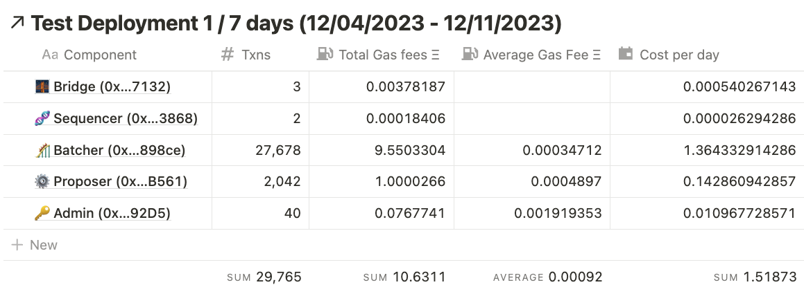
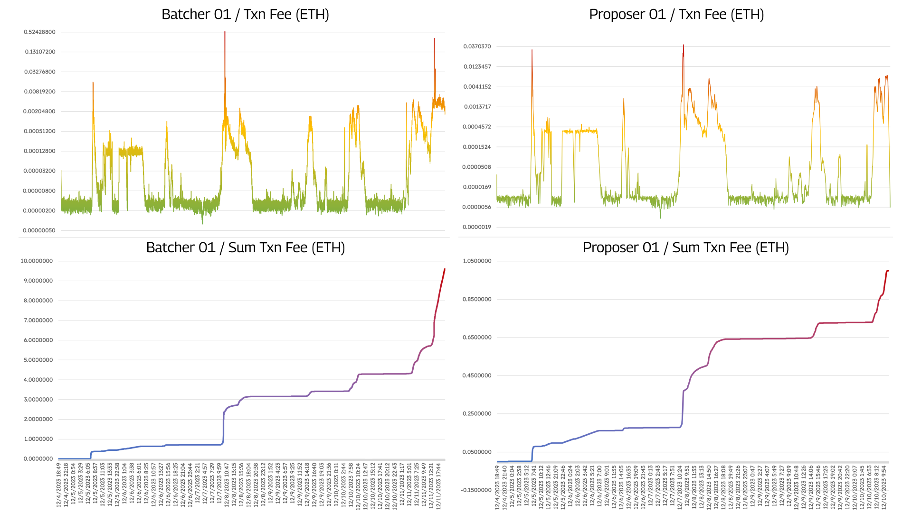

# Introduction
From December 4th to 11th, 2023, we conducted an explorative evaluation of the operational cost performance of the OP stack within a testnet environment, focusing specifically on the gas spending by the batcher and proposer components. This testing phase was strategically scheduled before the Dencun, Ecotone, and Fjord upgrades, ensuring we were prepared for the advanced features such as span batches, data blobs, and fault proofs that were not yet implemented.

During our 7-day deployment of the OP stack on the Sepolia Testnet, we observed a significant number of transactions generated by the batcher (~27,000) and substantial gas expenditure (~9.5 ETH). This activity occurred despite the absence of additional user or contract interactions, likely due to RPC call limits, which triggered a chain reaction of empty blocks from the sequencer to the batcher. This highlighted the critical need to address scalability issues within the OP stack to efficiently support high throughput and varied user interactions.

# 1 Test a OP rollup in a VM for 7 days

We have use a Virtual Machine in Google Cloud to deploy an OP rollup with the following configuration: 

>Machine type: e2-standard-2
Cores: 2 vCPU
Memory: 8 GB

After connecting to a Sepolia node through Alchemy, installing dependencies, and building the `Optimism Monorepo` and `op-geth`, we created the four accounts that manage the rollup operation:

- The [`Admin`](https://sepolia.etherscan.io/address/0x3c90fda98697e8a8e3a2280e91e37978af6892d5) account can upgrade contracts.
- The [`Batcher`](https://sepolia.etherscan.io/address/0x0baf402794dacb56e5b9d3ae30a269a65e6898ce) account which publishes Sequencer transaction data to L1.
- The [`Proposer`](https://sepolia.etherscan.io/address/0x2deebf69cafeab907d94e6788ffc850090ccb561) account which publishes L2 transaction results to L1.
- The [`Sequencer`](https://sepolia.etherscan.io/address/0x565d75374d2df1e55553ca931f3c0527b2c93868) account signs blocks on the p2p network.

Along with these accounts a [`Bridge`](https://sepolia.etherscan.io/address/0x2139ac2d92de1f4166e9b130a1ac2567dac77132) contract is created in order to transfer funds into the rollup.

# Preliminary Findings

While investigating the operation of the OP stack as a potential solution to this issue, we faced multiple limitations relating to the cost of operation of the batcher contract and the constraints of relying on either a RPC-as-a-service or a Rollup-as-a-service platform. We found this issue during a 7-day rollup deployment from the OP stack in the Sepolia Testnet, where the main highlight is the high number of transactions generated by the batcher (~27,000) and gas spent on these (~9.5 ETH). This performance was only for the default rollup activity, without considering any additional user or contract interaction, which may be caused by the limit in RPC calls from the provider (alchemy) that trigger a chain reaction of empty blocks from the sequencer to the batcher, accelerating the transaction and gas fee rate. 

Upon comparing the data with the [OP Sepolia batcher](https://sepolia.etherscan.io/address/0x8F23BB38F531600e5d8FDDaAEC41F13FaB46E98c), there is a significant difference in the number of transactions made during the same dates (~11,000 or 40% from the 7-day reference run) but not so with the higher gas spent (~12 ETH), which makes sense with the use of the testnet by a high volume of actual users and contracts. However, it may not be able to fulfill the Superchain vision of having multiple chains derived from the OP stack that may not have the same user volume or chains with high throughput primarily used for non-DeFi applications and do not rely on sequencer revenue to be profitable.
<figure>
  
</figure>

<figure>
  
</figure>