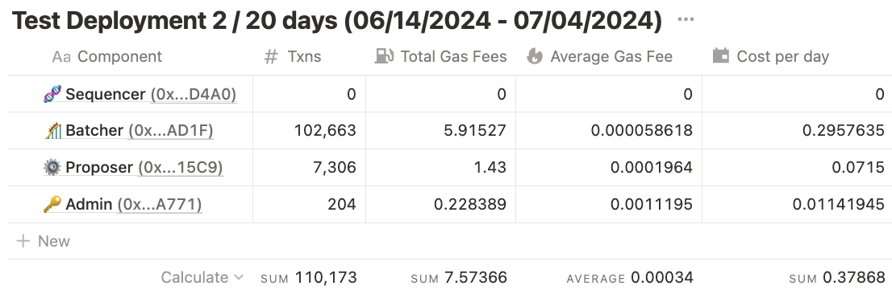
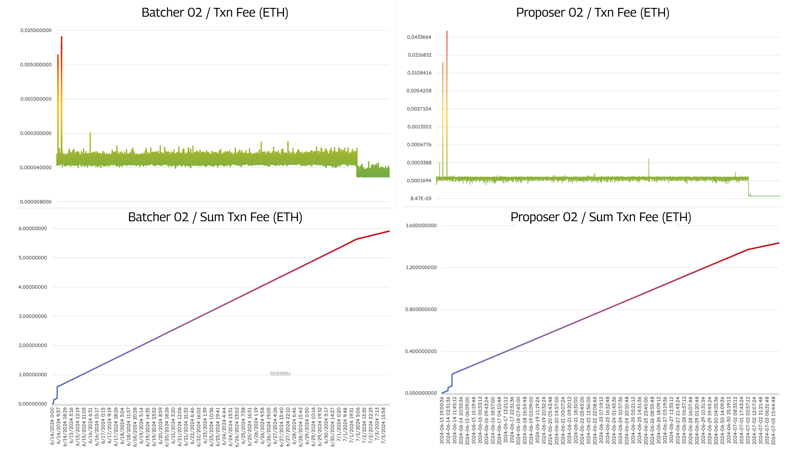

During the first test deployment, we identified that using a third-party RPC provider sets a limit on the network calls, generating issues in the batcher posting data correctly and increasing the gas fees cost due to RPC's lack of communication. To address this issue, we have set up a node in the office to provide a reliable source of RPC calls. To address this issue, we have set up a node in the office to provide a reliable source of RPC calls. This crucial step will allow us to observe and measure the impact on the number of transactions and the gas fees paid for each. The spin-up process is in the previous section and this [OP City repository folder](https://github.com/zenbitETH/OPcity/tree/main/node-setup).

After setting up a Holesky node, we deployed a rollup from the OP stack in that testnet using the V7.0.0 Fjord and the `calldata` method to post transactions from the Batcher and Proposer. This test deployment last 20 days and occurred after [multiple network updates](https://docs.optimism.io/builders/node-operators/network-upgrades), including the span batches, compatibility of data blobs, and other optimizations that notably impacted the rollup operation cost from the December test. Using the same data posting method from the December test, during the first seven days, the Total Gas Fees used on the default **rollup operation transactions were reduced by ~75%**, from 10.63 to 2.59 ETH, while the **cost per day went from 1.5 to 0.37 ETH**. 

The data from the rollup addresses are available here:

- Sequencer address [**(0x...D4A0)**](https://holesky.etherscan.io/address/0x50987039A15c83C4090eD5ecfda9E7F07160D4a0)
- Batcher address [**(0x...AD1F)**](https://holesky.etherscan.io/address/0xab110dA2064AC0B44c08D71A3D8148BBB0C3aD1F)
- Proposer address [**(0x...15C9)**](https://holesky.etherscan.io/address/0x0F10759D26F07a5D9e7F4BC0b54d1e4CAAEd15C9)
- Admin address [**(0x...A771)**](https://holesky.etherscan.io/address/0xC4481aa21AeAcAD3cCFe6252c6fe2f161A47A771)

<figure>
  
</figure>

<figure>
  
</figure>