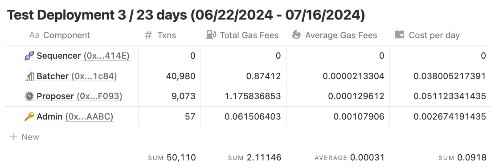
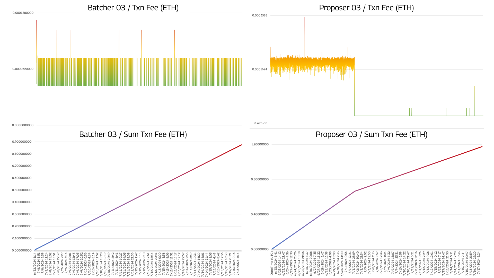

While the reduction in the Total Gas Fees using `Calldata` is significant, the implementation of `data blobs` as a data posting method enables an alternative that can significantly impact the rollup operation cost. To prove it, we deployed a third testnet rollup a week later using the same `V7.0.0.0` and `data blobs` as the data posting method to compare with. By comparing the performance on both configurations, we identified:

1. A notable reduction in the number of transactions made by the `Batcher` and `Proposer` addresses with around **50% less activity** (+100k txn with `calldata` vs 50k txn with `data blobs`)
2. ~**65% fewer gas fees** used by the rollup (2.59 from `calldata` vs 0.64 ETH from `data blobs` per 7-days operation and **0.37 vs 0.09 ETH per day** respectively)

The data from the rollup addresses are available here:

- Sequencer address [**(0x...414E)**](https://holesky.etherscan.io/address/0x31Fa6A26e15B0Bc0E94F6Ebd7272aA2aDFa0414E)
- Batcher address [**(0x...1c84)**](https://holesky.etherscan.io/address/0xD96E551434D90822C35d2d74D634061b89411c84)
- Proposer address [**(0x...F093)**](https://holesky.etherscan.io/address/0x091D7Eb026534CA5B2a108aa9D290D81EBb9F093)
- Admin address [**(0x...AABC)**](https://holesky.etherscan.io/address/0xE5015ef20530467F923a1074f10Ca9576D9daaBc)

<figure>
  
</figure>
<figure>
  
</figure>