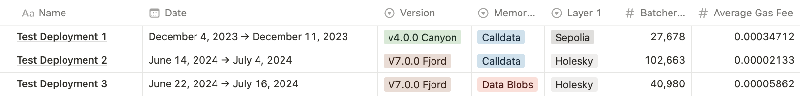

## OPstack Test Deployments
This section presents the results of three test deployments conducted in December 2023 and two in June 2024. Our findings highlight a significant reduction in batcher and proposer operation costs when using the *OP Stack V4.0.0 Canyon* in December, compared to the dual deployment conducted in June 2024 with *OP Stack V7.0.0. Fjord.*

The main finding between versions is a notable reduction in the Total Gas Fees used by the rollup, with the `V7.0.0` **reducing ~75% of the operation cost** compared with the `V4.0.0` from December. The June benchmarks also compared `calldata` methods versus `data blobs` for registering data in Layer 1, revealing that **data blobs consume approximately 60% fewer** resources than call data.

<figure>
  
</figure>