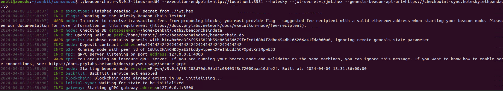

### Consensus layer conclusions

Pre-requisites: `git, bazel`
Ensure bazel 5.3.+ is installed.

To derive the checkpoint sync url from the chain pass this flags:

```bash
./prysm.sh beacon-chain --verbosity=debug \
--jwt-secret=<path> \
--execution-endpoint=http://localhost:8551 \
--holesky \
--genesis-beacon-api-url=https://checkpoint-sync.holesky.ethpandaops.io \
--minimum-peers-per-subnet=0
```

<figure>
  
</figure>

Using bazel:

```bash
mkdir -p prysm-dir
export genesis=$PWD/genesis.ssz
export prysmdir=$PWD/prysm-datadir
export config=$PWD/config.yaml
git clone https://github.com/prysmaticlabs/prysm.git
cd prysm
bazel build //cmd/beacon-chain:beacon-chain
```

From the custom_config_data/prysm folder start the beaconchain client:

```bash
bazel run //cmd/beacon-chain -- \
    --accept-terms-of-use=true \
    --holesky \
    --datadir=$prysmdir  \
    --execution-endpoint=http://localhost:8551 \
    --jwt-secret=/tmp/jwtsecret \
    --suggested-fee-recipient=<Enter-eth-address-here> #If validators enabled
```

To import validator keys:

```bash
bazel run //validator:validator -- accounts import \
  --accept-terms-of-use \
  --wallet-dir=$prysmdir/validator-data \
  --keys-dir=<path/to/validator/keys>
```

To start the validator client, make sure you have created a secret file (containing with your secret info in) and call it prysm-dir/validator-data/secret.txt. Then it will not prompt you at each startup.

```bash
bazel run //cmd/validator -- \
  --accept-terms-of-use=true \
  --holesky \
  --datadir=$prysmdir \
  --beacon-rpc-provider=http://localhost:4000 \
  --wallet-dir=$prysmdir/validator-data  \
  --wallet-password-file=$prysmdir/validator-data/secret.txt \
  --suggested-fee-recipient=<Enter-eth-address-here>
```

### Reference and Resources

1. [Etheruem Notes on Holesky](https://notes.ethereum.org/@launchpad/holesky)
2. [Backup and Restore](https://geth.ethereum.org/docs/fundamentals/backup-restore)
