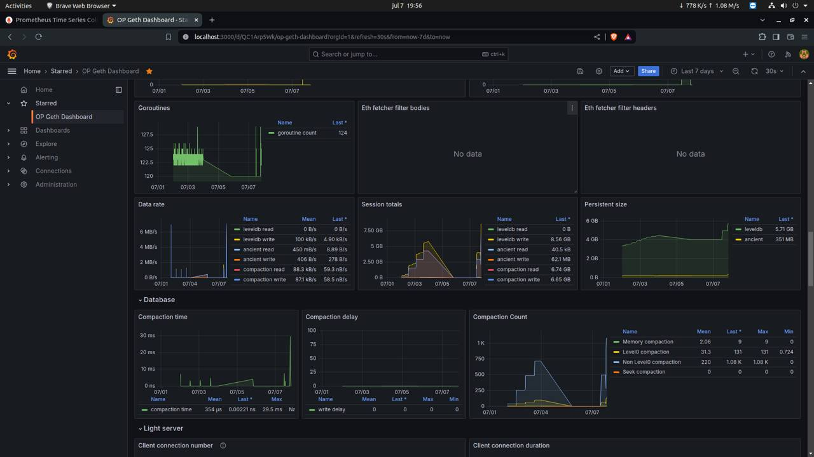

# Intro

This guide describes the steps taken to set up Grafana dashboards to track node performance for both the op-node and op-geth. This guide is based on the instructions provided by the Geth team in *“Monitoring Geth with Influx DB and Grafana”* (https://geth.ethereum.org/docs/monitoring/dashboards), with necessary variations to apply it to op-geth, as well as Optimism team in their *“Node Metrics and Monitoring”* guide (https://docs.optimism.io/builders/node-operators/management/metrics).

# Prerequisites

To complete the steps in this guide, It’s important to have:

- a running **Geth** instance
- a running **Prysm** instance (or any other CL node)
- a running **OP-Geth** instance
- a running **OP-Node** instance
- **InfluxDB** installed and set up. You can check their download page here (https://www.influxdata.com/downloads/)
- **Grafana** installed and set up. You can check their download page here (https://grafana.com/grafana/download)
- (OPTIONAL) **Prometheus** installed and set-up. You can check their download page here (https://prometheus.io/download/). In this guide, we will show how to run it using a Docker image at https://hub.docker.com/r/prom/prometheus.

# Enable metrics on the OP-Node

<aside>
💡 Reference: https://docs.optimism.io/builders/node-operators/management/metrics

</aside>

Let’s start by enabling the metrics on the OP-Node. This requires to add a flag `--metrics.enabled` when running the `op-node` execution command.

Metrics are formatted for use with Prometheus and exposed via a metrics endpoint. The default metrics endpoint is `http://localhost:7300/metrics`.

## **Setting up Prometheus**

Let’s now set-up Prometheus to make sure metrics are correctly retrieved. First, we need to create a new yml file to include the prometheus configuration.

This is an example of `prometheus.yml` created for the op-node configuration

```bash
global:
  scrape_interval: 15s
  evaluation_interval: 15s

scrape_configs:
  - job_name: 'op-node'
    scrape_interval: 10s
    metrics_path: /metrics
    static_configs:
      - targets: ['127.0.0.1:7300']
        labels:
          chain: optimism
```

I created a separate folder inside the optimism repo called `prometheus` and added the `prometheus.yml` inside.

Next step is to run a Docker environment with `prom/prometheus` using the following command

```bash
docker run \
		--network host \
    -p 9090:9090 \
    -v /path/to/prometheus:/etc/prometheus \
    prom/prometheus:latest
```

Now, open `http://localhost:9090` in your web browser to check the endpoint status. You should expect to see something like this 


# Enable metrics on the OP-Geth

<aside>
💡 Reference: https://geth.ethereum.org/docs/monitoring/dashboards, https://docs.optimism.io/builders/node-operators/configuration/execution-config#metricsinfluxdb

</aside>

First, let’s create a new database in our **InfluxDB** to collect the metrics by the op-geth. Open the InfluxDB shell with an admin user

```bash
influx -username 'admin' -password 'adminpw'
```

Now, you have accessed the InfluxDB shell. Create a new database instance to store op-geth metrics

```bash
create database opgeth
```

Let’s now enable the metrics in our **`op-geth`** execution command by adding the below flags to it

```bash
--metrics true --metrics.influxdb true --metrics.influxdb.database "opgeth" --metrics.influxdb.endpoint "http://0.0.0.0:8086/" --metrics.influxdb.username "admin" --metrics.influxdb.password "adminpw"
```

You can check that the metrics are correctly being sent to the `opgeth` database instance by using again the Influx DB shell and running the below command. 

```jsx
use opgeth
show measurements
```

# Setting up Grafana

With both metrics enabled, the next step is to configure dashboards on Grafana to visualize node performance. After installing Grafana, start it by running this command. Grafana UI will be reachable at `localhost:3000`

```bash
sudo systemctl start grafana-server
```

## Setting up dashboard for OP-Node

After accessing the Grafana home page, click on the "Data sources" icon and then click on "Prometheus". Add the following configurations (the remaining parameters can remain the default ones).

```bash
URL: http://localhost:9090
```

With the data source ready, the next step is to set up the dashboard. On the left bar, click on the "Dashboards" icon, then "Add Visualization"

## Setting up dashboard for OP-Geth

After accessing the Grafana home page, click on the "Data sources" icon and then click on "InfluxDB". Add the following configurations (the remaining parameters can remain the default ones).

```bash
HTTP
  URL: http://localhost:8086
  Access: Server (default)
  Whitelisted cookies: None (leave blank)
InfluxDB Details
  Database: opgeth
  User: admin
  Password: adminpw
  HTTP Method: GET
```

With the data source ready, the next step is to set up the dashboard. On the left bar, click on the "Dashboards" icon, then "Import". Paste this dashboard template link: https://grafana.com/grafana/dashboards/13877/

Your OP-Geth node dashboard is now ready!

  <figure>
      
    </figure>